# Backend Communication Design Pattern

## Request & Response Classic - Simple and Everywhere

### What is Request-Response?

Imagine you're at a restaurant. You (the **client**) order a dish from the menu. The waiter takes your order (the **request**) to the kitchen (the **server**). The kitchen prepares your dish and gives it back to you (the **response**). This simple interaction is the essence of the Request-Response pattern.

In backend engineering, the flow is analogous:

1. **The Client Sends a Request**: The client (a web browser, mobile app, or another service) sends a message to the server, known as a request.
2. **The Server Processes the Request**: The server receives and parses the request to understand what the client wants. This involves figuring out the request's boundaries (where it starts and ends) and then executing the necessary logic (e.g., querying a database, performing a calculation).
3. **The Server Sends a Response**: Once processing is complete, the server formulates a response message.
4. **The Client Consumes the Response**: The client receives and parses the response to use the information, for example, by rendering a webpage or updating the UI.

This pattern is classic, elegant, and you'll find it virtually everywhere in backend systems.

### Real-World Examples

The Request-Response model is the backbone for many protocols and systems you use daily:

- **Web Browsing (HTTP)**: When you visit a website, your browser sends an HTTP request and receives an HTTP response with the page's content.
- **APIs (REST, GraphQL, SOAP)**: Mobile and web applications communicate with backend services by sending API requests to fetch or submit data.
- **DNS (Domain Name System)**: Your computer sends a DNS request to find the IP address for a domain name like `google.com`.
- **Database Queries (SQL)**: An application sends an SQL query (a request) to a database server, which executes it and returns the results (a response).
- **RPC (Remote Procedure Call)**: A client executes a function that appears local but is actually a request sent to and executed on a remote server.

### Keywords to Remember

- **Request/Response**: The two fundamental message types in the exchange.
- **Client/Server**: The two parties involved in the communication.
- **Protocol**: The set of rules that both client and server agree on to communicate effectively (e.g., HTTP). A request's structure is defined by the protocol.
- **Boundary**: It's critical for the server to know where a request begins and ends, especially when multiple requests might be sent over the same connection.
- **Parsing**: The process of reading and understanding the structure of a request or response. The cost of parsing can be significant (e.g., XML is generally slower to parse than JSON).

### Pros and Cons

While powerful, this pattern isn't a silver bullet.

**Pros:**

- **Simplicity**: The model is straightforward to understand, implement, and debug.
- **Scalability**: It's easy to scale horizontally by adding more servers behind a load balancer.
- **Stateless Nature**: In its purest form (like with REST), each request is independent and contains all the information the server needs. This makes scaling and fault tolerance simpler.

**Cons:**

This model is not ideal for every scenario:

- **Real-time Applications**: For applications like chat or live notifications, the client would have to constantly ask the server "Is there anything new?" (a technique called polling). This is inefficient and introduces latency.
- **Long-Running Jobs**: If a request takes a long time to process (e.g., uploading and transcoding a large video), the client is blocked and waiting. If the client disconnects, the state of the job can be lost.
- **Chattiness**: For complex UIs that need data from multiple sources, the client may have to make many separate requests, which can be slow. GraphQL was developed in part to solve this issue.

### Conclusion

The Request-Response pattern is a core, must-know concept in backend engineering. It excels in scenarios where the client initiates a distinct action and requires a specific response from the server.

For use cases requiring real-time updates or handling long, asynchronous tasks, you should explore other communication patterns like **Push (WebSockets, Server-Sent Events)**, **Polling (Short/Long)**, or **Publish/Subscribe**.

## Synchronous vs Asynchronous - Can I do work while waiting?

### Synchronous - "Wait Until I'm Done!"

This is the traditional, straightforward way of execution. When you execute a synchronous task, your program **stops and waits** for that task to complete before moving on to the next line of code.

- **Definition:** The caller sends a request and **blocks**, unable to execute any further code until a response is received. The caller and receiver are "in sync".
- **Real-World Analogy:** You're in a meeting and you ask a colleague a question. It would be awkward to ignore them and start another task; you wait for their answer. That's synchronous communication.
- **Code Example (File I/O):**

  ```js
  // --- Synchronous Code ---
  console.log('1. Starting file read...');

  // This operation BLOCKS the entire program. Nothing else can run.
  // The program is taken off the CPU while waiting for the OS to read from disk.
  const data = fs.readFileSync('largefile.txt');

  console.log('3. File read complete!'); // This line only runs AFTER the file is fully read.
  console.log('4. Starting next task...');
  ```

  The output order will always be `1`, `3`, `4`. The program is blocked at the `readFileSync` call.

### Asynchronous - "You Go Ahead, I'll Let You Know!"

This is a more modern and efficient approach for many backend tasks. When you execute an asynchronous task, your program **does not wait**. It kicks off the operation and immediately moves on to the next task.

- **Definition:** The caller sends a request but is **not blocked**; it can continue to execute other code while waiting for a response. The caller and receiver are not necessarily in sync. When the task is done, it notifies the main program, often via a callback, promise, or another mechanism.
- **Real-World Analogy:** You send an email. You don't stare at your screen waiting for a reply. You move on to other work, and you'll be notified when the reply arrives. That's asynchronous communication.
- **Code Example (File I/O):**

  ```js
  // --- Asynchronous Code ---
  console.log('1. Starting file read...'); // The main program is NOT blocked and continues immediately.

  // Kicks off the file read and provides a "callback" function to run upon completion.
  fs.readFile('largefile.txt', (err, data) => {
    // This function is called LATER, when the OS has finished reading the file.
    console.log('3. File read complete!');
  });

  console.log('2. Starting next task...'); // This line runs IMMEDIATELY.
  ```

  The output order will be `1`, `2`, `3`. The program continues to execute while the file is being read in the background.

### Visualizing the Difference

This simple Gantt chart illustrates the difference in the execution timeline.

```mermaid
gantt
    title Execution Flow Comparison
    dateFormat  X
    axisFormat %Ssec
    section Synchronous
    File Read (Blocking)  :done, 0, 5
    Other Work            :5, 4
    section Asynchronous
    File Read (Non-Blocking) :crit, 0, 5
    Other Work               :0, 4
```



### Keywords to Remember

- **Synchronous (Sync)**: Sequential, one-at-a-time, orderly.
- **Asynchronous (Async)**: Concurrent, not necessarily in order.
- **Blocking vs. Non-Blocking**: This is the core technical difference. Sync code is blocking; Async code is non-blocking.
- **I/O (Input/Output)**: Operations like file access, network requests, and database calls. These are prime candidates for asynchronous handling because they involve waiting.
- **Thread / Event Loop**: The underlying mechanisms that enable asynchronous behavior. For example, Node.js uses a single-threaded event loop to manage async operations without blocking the main thread. Other times, a new thread is spun up to handle the blocking work, keeping the main thread free.
- **Callback / Promise / Async-Await**: Common programming constructs used to manage asynchronous code and handle results when they become available.

### Practical Examples in Backend Engineering

This concept is everywhere in backend systems:

1. **Backend Architecture (Async Processing)**: When a client submits a long-running job (like video processing), the server can immediately respond with a "Job ID" and place the job in a queue. The job is then processed asynchronously by a worker service. This prevents the client from being blocked.
2. **Databases**:
   - **Asynchronous Commits**: In Postgres, you can configure commits to return "success" to the client immediately, without waiting for the data to be physically flushed to disk. The disk write happens asynchronously in the background.
   - **Asynchronous Replication**: When writing to a primary database, the data is replicated to secondary databases. In async mode, the primary database doesn't wait for confirmation from the secondaries, reducing write latency.
3. **Operating System**:
   - **Asynchronous I/O**: Modern Linux provides mechanisms like epoll and io_uring that allow a server to handle thousands of network connections efficiently without needing a thread for each one.
   - **Async File System fsync**: When an application writes a file, the OS often caches it in memory and writes it to the disk asynchronously later to improve performance.
