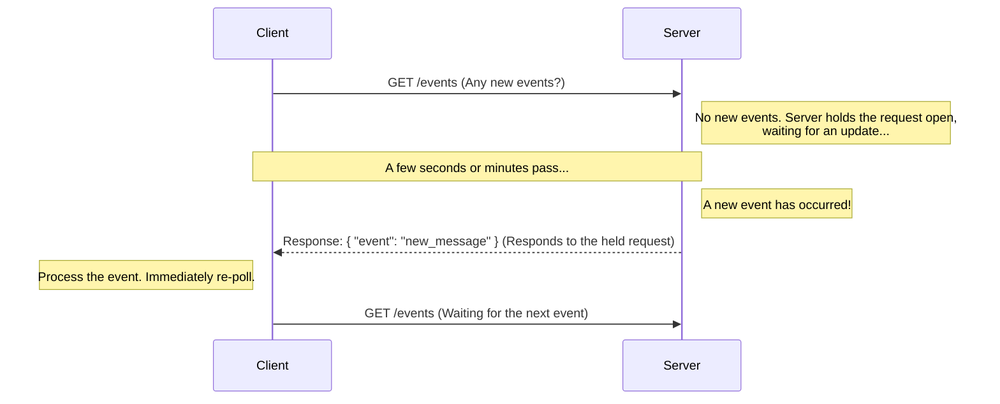

# Long Polling

> **"Request is taking long, I'll check with you later"**  
> **"But talk to me only when it's ready"**

## What is Long Polling?

> Request is taking long, I’ll check with you later
> But talk to me only when it's ready

## What is Long Polling

Long Polling is a more optimized version of the polling technique. It's designed to solve the primary drawback of Short Polling: its "chattiness" and inefficiency. The core idea is simple yet powerful: "I'll ask for an update, but **don't talk to me until it's ready**."

## How Long Polling Works

The process starts similarly to short polling but diverges at the server's response behavior.

1. **Initial Request (Optional)**: A client might send an initial request to start a job and get a `Job ID`.
2. **Client Sends a "Poll" Request**: The client sends a request asking for new data (e.g., "Are there any new messages?").
3. **Server "Holds" the Request (The Key Trick)**: This is the crucial difference.
   - If the server has no new data, it **does not respond immediately**.  Instead, it holds the client's request open, waiting.
   - The server waits until it either has new data to send or a timeout period is reached.
4. **Server Responds When Data is Available**: As soon as new data arrives, the server sends a response using the request it was holding.
5. **Immediate Re-Poll**: After receiving a response, the client immediately sends a new long poll request to wait for the *next* update.

This "hold-and-wait" mechanism eliminates the thousands of useless "no, not yet" responses that plague short polling.

- **Real-World Analogy**: Instead of a child asking "Are we there yet?" every five seconds (short polling), it's like a patient friend asking, "Let me know when you're ready to go." They then wait quietly. You (the server) only reply once you're actually ready.

## Flow Diagram

This diagram illustrates the "hold-and-wait" behavior of the server.



## Real-World Examples

- **Apache Kafka**: This is the most famous user of this pattern. Kafka consumers use long polling to fetch messages from topics. A consumer's request for data is held open by the Kafka broker until new messages are available or a timeout is reached. This prevents consumers from constantly hammering the broker, which is why Kafka chose this model over a push-based one that could overwhelm consumers.
- **Notification Systems**: A more efficient way to deliver notifications. A client sends one long poll request to a /notifications endpoint, and the server only responds when a new notification for that user is generated.
- **Chat Applications**: While WebSockets are often preferred, long polling is a very viable and much more efficient alternative to short polling for receiving new chat messages.

### Code Example: Long Polling Job Status Server

Here's a clear implementation of the Long Polling pattern that demonstrates the exact 4-step process:

```typescript
// ===== LONG POLLING IMPLEMENTATION: Job Status Checker =====
// This demonstrates the Long Polling pattern where:
// 1. Client sends a request asking for job status updates
// 2. Server HOLDS the request open until job status changes or timeout
// 3. Server responds immediately when status changes
// 4. Client immediately sends a new long poll request

import express from 'express';

const app = express();
app.use(express.json());

// ===== STEP 1: JOB STORAGE =====
interface Job {
  id: string;
  status: 'pending' | 'processing' | 'completed' | 'failed';
  progress: number;
  result?: string;
  lastUpdated: Date;
}

interface WaitingClient {
  res: express.Response;
  jobId: string;
  lastKnownStatus: string;
  timeout: ReturnType<typeof setTimeout>;
}

const jobs: Record<string, Job> = {};
const waitingClients: WaitingClient[] = [];

// ===== STEP 2: CREATE JOB ENDPOINT =====
app.post('/create-job', (req, res) => {
  const jobId = `job_${Date.now()}_${Math.random().toString(36).substr(2, 9)}`;
  
  jobs[jobId] = {
    id: jobId,
    status: 'pending',
    progress: 0,
    lastUpdated: new Date()
  };
  
  // Start processing job asynchronously
  setTimeout(() => processJob(jobId), 1000);
  
  res.json({
    jobId: jobId,
    message: 'Job created successfully',
    pollEndpoint: `/poll-job-status?jobId=${jobId}`
  });
});

// ===== STEP 3: LONG POLL ENDPOINT (THE MAGIC) =====
// This is where Long Polling happens - server HOLDS the request
app.get('/poll-job-status', (req, res) => {
  const jobId = req.query.jobId as string;
  const lastKnownStatus = req.query.lastStatus as string || '';
  
  const currentJob = jobs[jobId];
  
  // STEP 3A: Check if status has changed since last poll
  if (hasJobStatusChanged(currentJob, lastKnownStatus)) {
    // Status changed! Respond immediately
    return res.json({
      jobId: jobId,
      status: currentJob.status,
      progress: currentJob.progress,
      immediate: true
    });
  }
  
  // STEP 3B: No status change - HOLD the request (Long Polling core behavior)
  console.log('⏳ No status change. HOLDING request open...');
  
  // Set timeout to prevent holding forever
  const timeout = setTimeout(() => {
    removeWaitingClient(jobId);
    res.json({
      jobId: jobId,
      status: currentJob.status,
      progress: currentJob.progress,
      timeout: true
    });
  }, 20000); // 20 second timeout
  
  // STEP 3C: Store this request to respond later when status changes
  waitingClients.push({
    res: res,
    jobId: jobId,
    lastKnownStatus: currentJob.status,
    timeout: timeout
  });
});

// ===== STEP 4: JOB PROCESSING SIMULATION =====
function processJob(jobId: string): void {
  const job = jobs[jobId];
  if (!job) return;
  
  // Simulate job processing stages
  const stages = [
    { status: 'processing' as const, progress: 50, delay: 3000 },
    { status: 'completed' as const, progress: 100, delay: 3000 }
  ];
  
  let currentStage = 0;
  
  function nextStage() {
    if (currentStage >= stages.length) return;
    
    const stage = stages[currentStage];
    job.status = stage.status;
    job.progress = stage.progress;
    job.lastUpdated = new Date();
    
    // STEP 4A: Notify all waiting clients about status change
    notifyWaitingClients(jobId);
    
    currentStage++;
    if (currentStage < stages.length) {
      setTimeout(nextStage, stage.delay);
    }
  }
  
  setTimeout(nextStage, 2000);
}

// ===== STEP 5: NOTIFY WAITING CLIENTS =====
// When job status changes, respond to ALL clients waiting for this job
function notifyWaitingClients(jobId: string): void {
  const job = jobs[jobId];
  const clientsForThisJob = waitingClients.filter(client => client.jobId === jobId);
  
  clientsForThisJob.forEach(client => {
    clearTimeout(client.timeout);
    
    // Respond to the held request
    client.res.json({
      jobId: jobId,
      status: job.status,
      progress: job.progress,
      statusChanged: true
    });
  });
  
  // Remove notified clients from waiting list
  for (let i = waitingClients.length - 1; i >= 0; i--) {
    if (waitingClients[i].jobId === jobId) {
      waitingClients.splice(i, 1);
    }
  }
}

// ===== UTILITY FUNCTIONS =====
function hasJobStatusChanged(job: Job, lastKnownStatus: string): boolean {
  return lastKnownStatus !== '' && job.status !== lastKnownStatus;
}

function removeWaitingClient(jobId: string): void {
  for (let i = waitingClients.length - 1; i >= 0; i--) {
    if (waitingClients[i].jobId === jobId) {
      clearTimeout(waitingClients[i].timeout);
      waitingClients.splice(i, 1);
      break;
    }
  }
}

app.listen(8080, () => {
  console.log('🚀 Long Polling Server running on http://localhost:8080');
});
```

**How this demonstrates the 4-step Long Polling pattern:**

1. **Client Asks for Updates (Step 3A)**: Client sends `/poll-job-status?jobId=X&lastStatus=pending`

2. **Server HOLDS Request (Step 3B)**: If no status change, server stores the request in `waitingClients[]` and does NOT respond immediately

3. **Server Responds When Data Changes (Step 4A)**: When job status changes in `processJob()`, `notifyWaitingClients()` immediately responds to all held requests

4. **Client Sends New Poll (Step 3)**: Client receives response and immediately sends a new poll request with updated `lastStatus`

**Testing the 4-step cycle:**

```bash
# Step 1: Create a job
curl -X POST http://localhost:8080/create-job
# Response: {"jobId":"job_1691234567890_abc123","pollEndpoint":"/poll-job-status?jobId=..."}

# Step 2: Poll for status changes (this will "hang" until status changes)
curl "http://localhost:8080/poll-job-status?jobId=job_1691234567890_abc123&lastStatus=pending"
# This request will wait ~5 seconds until job status changes to "processing"
# Response: {"jobId":"...","status":"processing","progress":50,"statusChanged":true}

# Step 3: Poll again for next status change
curl "http://localhost:8080/poll-job-status?jobId=job_1691234567890_abc123&lastStatus=processing"  
# This request will wait ~3 seconds until job status changes to "completed"
# Response: {"jobId":"...","status":"completed","progress":100,"statusChanged":true}
```

**Key Long Polling Characteristics Demonstrated:**

- **Request Holding**: Server stores client requests in `waitingClients[]` instead of responding immediately
- **Event-Driven Response**: Only responds when actual status changes occur
- **Immediate Notification**: All waiting clients get notified instantly when data changes
- **Continuous Polling**: Client immediately sends new poll requests after receiving responses
- **Timeout Protection**: 20-second timeout prevents infinite waiting

This implementation perfectly shows the "hold-and-wait" behavior that makes Long Polling much more efficient than Short Polling while maintaining the simplicity of the request-response model.

```typescript
// ===== LONG POLLING IMPLEMENTATION: Chat Message Server =====
// This demonstrates the Long Polling pattern where:
// 1. Client sends a request asking for new messages
// 2. Server HOLDS the request open until new messages arrive or timeout
// 3. Server responds immediately when data is available
// 4. Client immediately sends a new long poll request

import express from 'express';

const app = express();
app.use(express.json());

// ===== STEP 1: MESSAGE STORAGE =====
// In-memory storage for messages and waiting clients
interface Message {
  id: string;
  content: string;
  timestamp: Date;
}

interface PendingRequest {
  res: express.Response;
  lastMessageId: string;
  timeout: NodeJS.Timeout;
}

const messages: Message[] = [];
const pendingRequests: PendingRequest[] = [];

// ===== STEP 2: SEND MESSAGE ENDPOINT =====
// When someone sends a message, notify all waiting clients
app.post('/send-message', (req, res) => {
  const { content } = req.body;
  
  if (!content) {
    return res.status(400).json({ error: 'Message content is required' });
  }
  
  // Create new message
  const newMessage: Message = {
    id: `msg_${Date.now()}_${Math.random().toString(36).substr(2, 9)}`,
    content: content,
    timestamp: new Date()
  };
  
  messages.push(newMessage);
  console.log(`📩 New message: ${content}`);
  
  // LONG POLLING MAGIC: Respond to ALL waiting clients immediately
  notifyWaitingClients([newMessage]);
  
  res.json({
    success: true,
    messageId: newMessage.id,
    message: 'Message sent and all waiting clients notified'
  });
});

// ===== STEP 3: LONG POLL ENDPOINT =====
// Clients use this to wait for new messages (HOLD-AND-WAIT)
app.get('/poll-messages', (req, res) => {
  const lastMessageId = req.query.lastMessageId as string || '';
  
  // Check if there are already new messages since lastMessageId
  const newMessages = getNewMessagesSince(lastMessageId);
  
  if (newMessages.length > 0) {
    // If we have new messages, respond immediately
    console.log(`📤 Immediate response: ${newMessages.length} new messages`);
    return res.json({
      messages: newMessages,
      hasMore: true
    });
  }
  
  // NO NEW MESSAGES: Hold the request open (Long Polling core behavior)
  console.log(`⏳ No new messages. Holding request open for client...`);
  
  // Set timeout to prevent holding forever (essential for long polling)
  const timeout = setTimeout(() => {
    console.log(`⏰ Timeout reached. Responding to client with no new messages.`);
    removePendingRequest(req.query.lastMessageId as string);
    res.json({
      messages: [],
      hasMore: false,
      timeout: true
    });
  }, 30000); // 30 second timeout
  
  // Store this request to respond later when new messages arrive
  pendingRequests.push({
    res: res,
    lastMessageId: lastMessageId,
    timeout: timeout
  });
  
  console.log(`📋 Added client to waiting list. Total waiting: ${pendingRequests.length}`);
});

// ===== STEP 4: UTILITY FUNCTIONS =====
function getNewMessagesSince(lastMessageId: string): Message[] {
  if (!lastMessageId) {
    // Return last 10 messages if no lastMessageId provided
    return messages.slice(-10);
  }
  
  const lastIndex = messages.findIndex(msg => msg.id === lastMessageId);
  if (lastIndex === -1) {
    // If lastMessageId not found, return recent messages
    return messages.slice(-10);
  }
  
  // Return messages after the lastMessageId
  return messages.slice(lastIndex + 1);
}

function notifyWaitingClients(newMessages: Message[]): void {
  console.log(`🔔 Notifying ${pendingRequests.length} waiting clients`);
  
  // Send response to all clients who were waiting
  pendingRequests.forEach(pending => {
    clearTimeout(pending.timeout);
    
    // Get messages since this client's last message
    const relevantMessages = getNewMessagesSince(pending.lastMessageId);
    
    pending.res.json({
      messages: relevantMessages,
      hasMore: true
    });
  });
  
  // Clear all pending requests since we've responded to them
  pendingRequests.length = 0;
  console.log(`✅ All waiting clients notified and cleared`);
}

function removePendingRequest(lastMessageId: string): void {
  const index = pendingRequests.findIndex(req => req.lastMessageId === lastMessageId);
  if (index > -1) {
    clearTimeout(pendingRequests[index].timeout);
    pendingRequests.splice(index, 1);
  }
}

// ===== STEP 5: START SERVER =====
app.listen(8080, () => {
  console.log('🚀 Long Polling Chat Server running on http://localhost:8080');
  console.log('📖 Usage:');
  console.log('  POST /send-message with {"content": "your message"}');
  console.log('  GET /poll-messages?lastMessageId=<id> (will wait for new messages)');
});
```

**How this demonstrates Long Polling:**

1. **Hold-and-Wait Behavior (Step 3)**: When `/poll-messages` is called and no new messages exist, the server **does not respond immediately**. Instead, it stores the response object and waits.

2. **Immediate Notification (Step 2)**: When a new message arrives via `/send-message`, the server immediately responds to **all waiting clients** using their stored response objects.

3. **Timeout Protection**: Each held request has a 30-second timeout to prevent infinite waiting, which is essential for production long polling.

4. **Efficient Resource Usage**: Unlike short polling, clients make very few requests—they only poll again after receiving a response.

**Testing with curl commands:**

```bash
# Terminal 1: Start long polling (this will "hang" waiting for messages)
curl "http://localhost:8080/poll-messages"

# Terminal 2: Send a message (this will trigger Terminal 1 to respond immediately)
curl -X POST http://localhost:8080/send-message \
  -H "Content-Type: application/json" \
  -d '{"content": "Hello from long polling!"}'

# Terminal 1 will immediately receive:
# {"messages":[{"id":"msg_...","content":"Hello from long polling!","timestamp":"..."}],"hasMore":true}

# Terminal 3: Start another long poll with lastMessageId
curl "http://localhost:8080/poll-messages?lastMessageId=msg_..."
```

**Key Long Polling Characteristics Demonstrated:**

- **Server holds requests**: No immediate response when no data is available
- **Immediate response on data**: All waiting clients get notified instantly when new data arrives
- **Timeout mechanism**: Prevents infinite waiting with 30-second timeout
- **Efficient**: Dramatically fewer requests compared to short polling
- **Near real-time**: Very small latency between data arrival and client notification

This implementation shows how Long Polling reduces the "chattiness" of Short Polling while providing near real-time updates without the complexity of WebSockets.

## Keywords to Remember

- **Long Polling**: A polling technique where the server holds a client's request open until data is available.
- **Hold-and-Wait**: The core server-side mechanism of not responding immediately.
- **Reduced Chattiness**: The primary advantage over short polling.
- **Server-Side Wait**: The responsibility of "waiting" is shifted from the client (in its application logic) to the server (by holding the connection).
- **Timeout**: An essential mechanism on both client and server to prevent a request from being held indefinitely.

## Long Polling vs Other Communication Patterns

| Feature | Long Polling | Short Polling | Push Model | Server-Sent Events |
|---------|--------------|---------------|------------|-------------------|
| **Request Behavior** | Hold until data available | Immediate response | N/A (persistent connection) | N/A (persistent connection) |
| **Server State** | Maintains request queue | Stateless | Maintains connection state | Maintains connection state |
| **Efficiency** | High (reduced requests) | Low (frequent polling) | Highest (no polling) | High (single connection) |
| **Timeout Handling** | Essential (prevents hanging) | Not needed | Connection-based | Automatic reconnection |
| **Client Complexity** | Medium (handle timeouts) | Low | High (WebSocket management) | Low (EventSource API) |
| **Bandwidth Usage** | Low (fewer requests) | High (constant polling) | Very low (only data) | Low (event stream) |
| **Latency** | Very low (held requests) | High (polling intervals) | Immediate | Immediate |

## Pros and Cons

Long polling offers a great balance but still has trade-offs.

### ✅ Pros

- **Less Chatty and Backend-Friendly**: It dramatically reduces the number of requests, saving network bandwidth and server resources.
- **Client Can Still Disconnect**: Like short polling, this model is resilient to client disconnections.
- **Near Real-Time**: Provides very low latency updates while maintaining request-response simplicity.
- **Efficient Resource Usage**: Server only responds when there's actual data to send.
- **HTTP-Compatible**: Works with existing web infrastructure and tools.

### ❌ Cons

- **Not Truly Real-Time**: There is a small latency gap between when a client receives a response and sends the next poll request. New data arriving in this gap won't be delivered instantly.
- **Slightly More Complex**: Managing held connections and timeouts on the server side adds a layer of complexity compared to short polling.
- **Server Resource Usage**: Held connections consume server memory and can limit concurrent handling.
- **Timeout Management**: Requires careful timeout handling to prevent resource leaks.

## When to Use Long Polling

### ✅ Perfect For

- **Notification systems** where immediate delivery is important but not critical
- **Chat applications** as a simpler alternative to WebSockets
- **Live dashboards** with moderate update frequencies
- **Job status monitoring** for tasks that change state infrequently
- **Message queue consumers** (like Apache Kafka) where you want efficient message fetching
- **Comment systems** or social feeds where updates should appear quickly
- **Systems requiring better efficiency** than short polling but simpler than WebSockets

### ❌ Not Suitable For

- **Very high-frequency updates** where WebSockets would be more appropriate
- **Bidirectional communication** where client needs to send data frequently
- **Applications requiring guaranteed real-time delivery** with zero latency gaps
- **Simple status checks** where short polling's simplicity is preferred
- **Mobile applications** where battery life is critical due to held connections

## Conclusion

Long polling is an excellent optimization over short polling, offering near-real-time updates without overwhelming the system with unnecessary requests. It represents a fantastic middle-ground, providing much of the efficiency of a push model without the added complexity of managing persistent protocols like WebSockets. It's a highly effective pattern used in major distributed systems for good reason.
