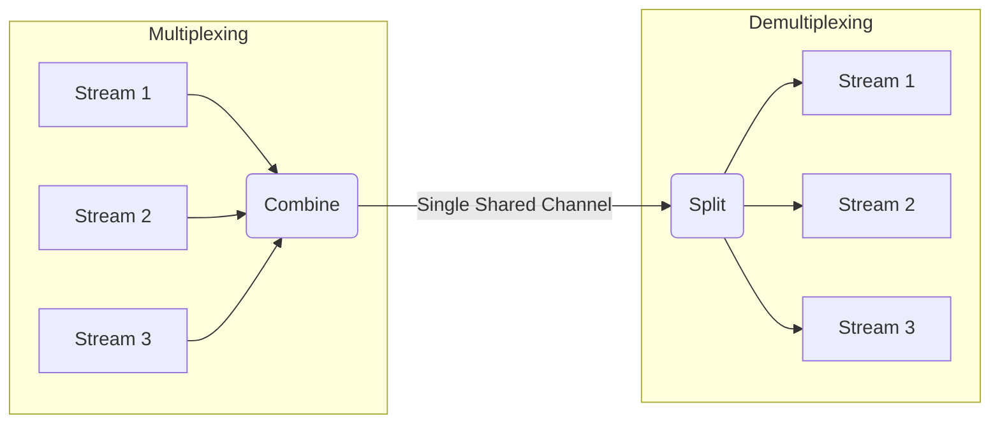
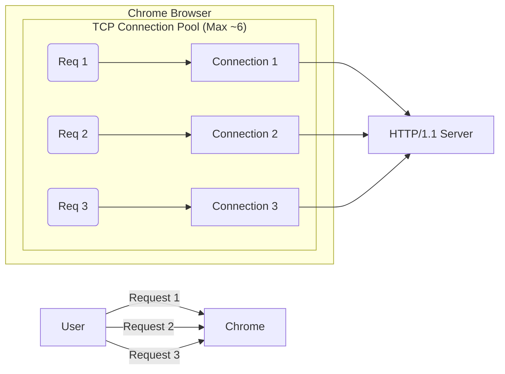
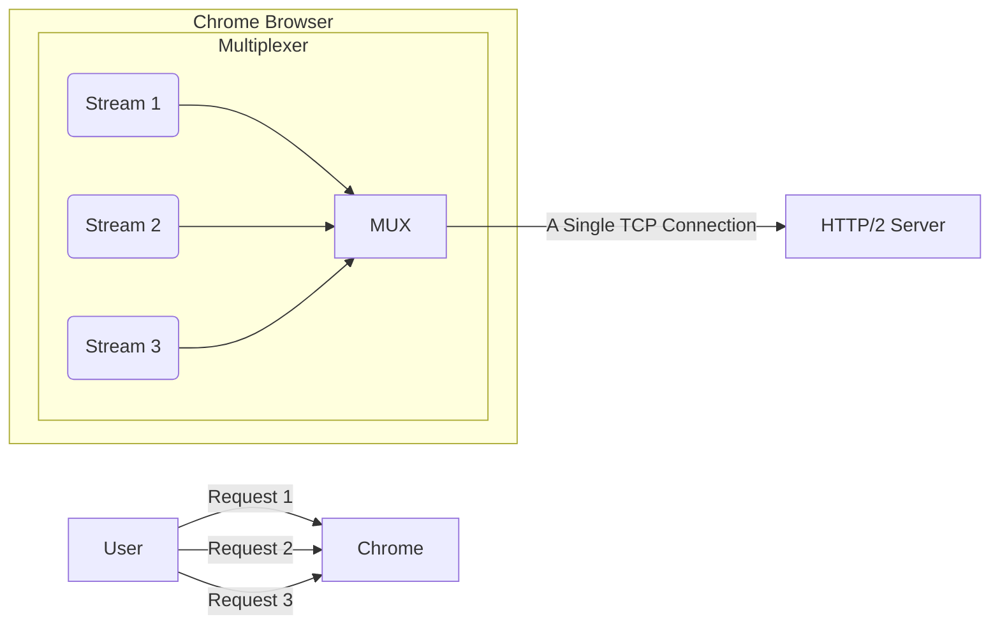
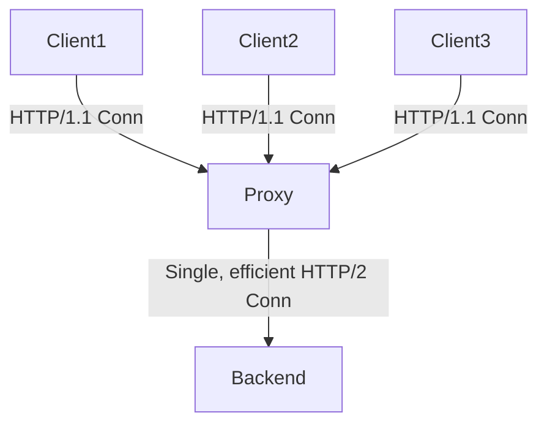
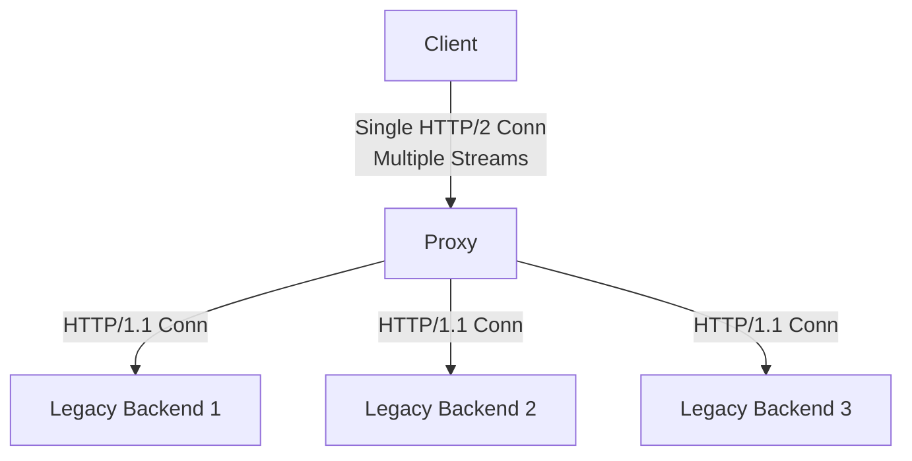
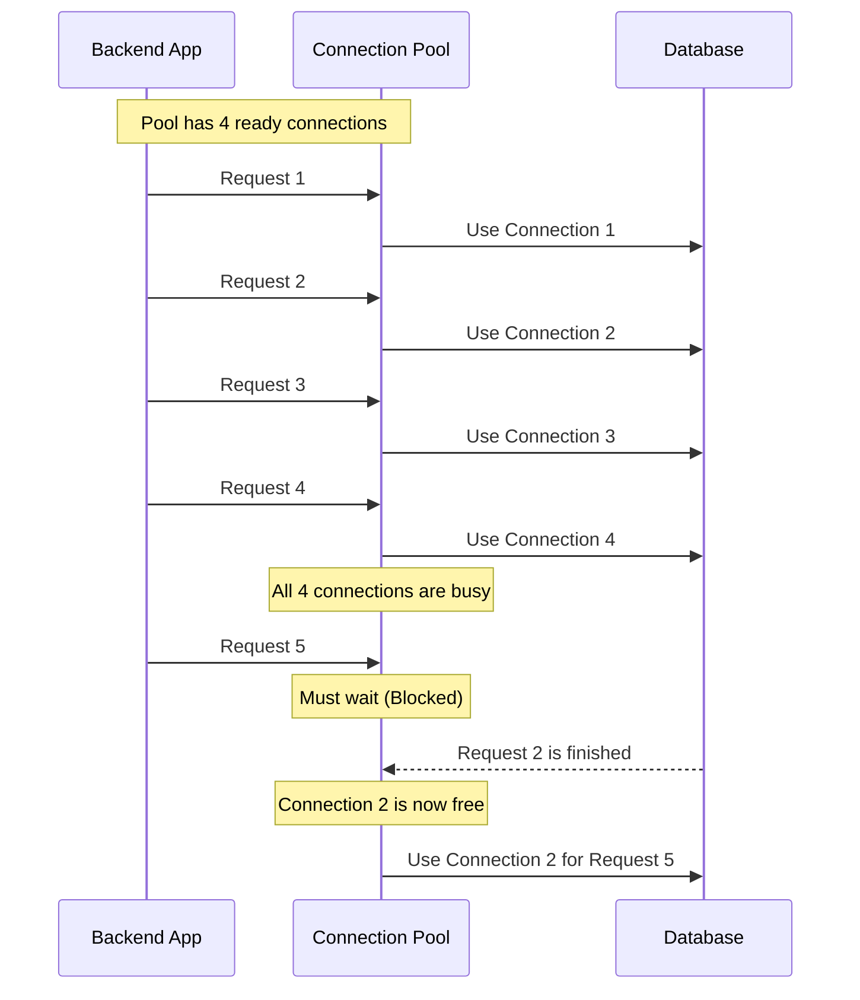

# Multiplexing vs Demultiplexing in Backend Engineering

Multiplexing and Demultiplexing are fundamental networking concepts with critical, real-world applications in backend engineering. Understanding them is key to grasping why technologies like HTTP/2 are efficient and how patterns like connection pooling work.

## Overview

These concepts are everywhere in modern backend systems - from HTTP/2 protocol improvements to database connection management. Let's break them down with detailed explanations, practical examples, and visual diagrams.

> **Key Insight**: These patterns are essential for optimizing performance and resource utilization in distributed systems.

## The Core Concepts: Mux & Demux

Let's start with the fundamental definitions:

### Multiplexing (Mux)

**Definition**: The process of combining multiple separate data streams into one single channel.

**Analogy**: Multiple lanes of traffic merging to go through a single tunnel.

**Real-world Example**: HTTP/2 combining multiple web requests into one TCP connection.

### Demultiplexing (Demux)

**Definition**: The reverse process of splitting data from one single channel back into its multiple original streams.

**Analogy**: Cars exiting the tunnel and fanning out into their respective lanes to reach different destinations.

**Real-world Example**: A database connection pool distributing requests across multiple database connections.

### Basic Concept Diagram

### Visual Representation



### Key Benefits

| Technique | Primary Benefit | Use Case |
|-----------|----------------|----------|
| **Multiplexing** | Resource efficiency | HTTP/2, fiber optic cables |
| **Demultiplexing** | Load distribution | Connection pools, load balancers |

## Part 1: Application in Web Protocols - HTTP/1.1 vs HTTP/2

This is the most classic example of multiplexing in action, showing the evolution from HTTP/1.1 to HTTP/2.

### HTTP/1.1: Browser-Level Demultiplexing

In HTTP/1.1, each request/response cycle ideally requires its own TCP connection. To speed things up, browsers demultiplex your requests across multiple parallel connections (usually limited to 6 per domain).

#### HTTP/1.1 Architecture Diagram



#### The HTTP/1.1 Problem

**Head-of-Line Blocking**: When you have more than 6 requests, subsequent requests are blocked until one of the connections becomes free.

#### Code Example: HTTP/1.1 Connection Management

```javascript
// HTTP/1.1 - Multiple connections required
const http = require('http');

async function makeMultipleRequests() {
  // Each request needs its own connection
  const requests = [
    http.get('http://api.example.com/users'),
    http.get('http://api.example.com/posts'),
    http.get('http://api.example.com/comments'),
    http.get('http://api.example.com/categories'),
    http.get('http://api.example.com/tags'),
    http.get('http://api.example.com/settings'),
    // 7th request - blocked until a connection is free!
    http.get('http://api.example.com/profile')
  ];
  
  return Promise.all(requests);
}
```

### HTTP/2: True Multiplexing

HTTP/2 solves this by using multiplexing. It allows multiple logical request and response streams to be sent concurrently over a single TCP connection.

#### HTTP/2 Architecture Diagram



#### Benefits of HTTP/2 Multiplexing

- **Eliminates Head-of-Line Blocking** at the HTTP level
- **Saves resources** by maintaining only one TCP connection
- **Significantly improves page load speeds**
- **Better bandwidth utilization**
- **Lower latency** for multiple requests

#### Code Example: HTTP/2 Implementation

```javascript
// HTTP/2 - Single connection, multiple streams
const http2 = require('http2');

async function makeMultipleRequestsHTTP2() {
  // Create a single HTTP/2 session
  const session = http2.connect('https://api.example.com');
  
  // All requests use the same connection but different streams
  const requests = [
    session.request({ ':path': '/users' }),
    session.request({ ':path': '/posts' }),
    session.request({ ':path': '/comments' }),
    session.request({ ':path': '/categories' }),
    session.request({ ':path': '/tags' }),
    session.request({ ':path': '/settings' }),
    session.request({ ':path': '/profile' }) // No blocking!
  ];
  
  return Promise.all(requests.map(req => 
    new Promise(resolve => {
      let data = '';
      req.on('data', chunk => data += chunk);
      req.on('end', () => resolve(data));
    })
  ));
}
```

#### Performance Comparison

| Metric | HTTP/1.1 | HTTP/2 |
|--------|-----------|---------|
| **Max Concurrent Requests** | 6 per domain | Unlimited* |
| **Connection Overhead** | High (multiple TCP) | Low (single TCP) |
| **Head-of-Line Blocking** | Yes | No (at HTTP level) |
| **Server Push Support** | No | Yes |
| **Header Compression** | No | Yes (HPACK) |

*Limited by server configuration and client resources

## Part 2: Application in Backend Architecture - Proxies

Reverse Proxies like NGINX or Envoy use these techniques to manage traffic efficiently, acting as intelligent intermediaries between clients and backend services.

### Multiplexing on the Backend (HTTP/1.1 → HTTP/2)

A proxy can receive multiple older HTTP/1.1 connections from various clients and multiplex them into a single, more efficient HTTP/2 connection to talk to a modern backend service.

#### Architecture Diagram



#### Benefits

- **Legacy client support** while using modern backend protocols
- **Reduced backend connections**
- **Better resource utilization**
- **Simplified backend architecture**

#### NGINX Configuration Example

```nginx
upstream backend {
    server backend1.example.com:443;
    server backend2.example.com:443;
}

server {
    listen 80 http2;
    location / {
        proxy_pass https://backend;
        proxy_http_version 2.0;
        # Multiplexing multiple client connections into HTTP/2
    }
}
```

### Demultiplexing on the Backend (HTTP/2 → HTTP/1.1)

Conversely, a proxy can receive a single HTTP/2 connection from a modern client and demultiplex the streams into multiple, separate HTTP/1.1 connections to communicate with legacy backend services.

#### Demultiplexing Architecture Diagram



#### Use Cases

- **Gradual migration** from legacy systems
- **Microservices integration** with mixed protocol support
- **Load balancing** across heterogeneous backends

#### Real-World Proxy Example

```javascript
// Envoy proxy configuration (simplified)
const envoyConfig = {
  static_resources: {
    listeners: [{
      address: { socket_address: { address: "0.0.0.0", port_value: 8080 }},
      filter_chains: [{
        filters: [{
          name: "envoy.filters.network.http_connection_manager",
          typed_config: {
            http_filters: [{ name: "envoy.filters.http.router" }],
            route_config: {
              virtual_hosts: [{
                name: "backend",
                domains: ["*"],
                routes: [{
                  match: { prefix: "/" },
                  route: { 
                    cluster: "legacy_backends",
                    // Demultiplexing HTTP/2 streams to HTTP/1.1
                  }
                }]
              }]
            }
          }
        }]
      }]
    }]
  }
};
```

## Part 3: Application in Databases - Connection Pooling

Connection Pooling is fundamentally a form of demultiplexing, where multiple application requests are distributed across a limited set of database connections.

### Concept

Instead of creating a new database connection for every request (which is very slow), the backend application maintains a "pool" of pre-established connections. When a request needs the database, it borrows a free connection from the pool.

### Why Connection Pooling Matters

| Without Pooling | With Pooling |
|----------------|--------------|
| ❌ New connection per request | ✅ Reuse existing connections |
| ❌ High latency (TCP handshake) | ✅ Low latency (immediate use) |
| ❌ Database resource exhaustion | ✅ Controlled resource usage |
| ❌ Poor performance under load | ✅ Predictable performance |

### Connection Pool Workflow



### Implementation Examples

#### Node.js with PostgreSQL

```javascript
const { Pool } = require('pg');

// Create a connection pool
const pool = new Pool({
  user: 'dbuser',
  host: 'database.server.com',
  database: 'mydb',
  password: 'secretpassword',
  port: 5432,
  max: 10, // Maximum number of connections
  idleTimeoutMillis: 30000, // Close idle connections after 30s
  connectionTimeoutMillis: 2000, // Timeout after 2s if no connection available
});

// Demultiplexing: Multiple requests use the same pool
async function handleMultipleRequests() {
  const requests = [
    getUserData(1),
    getUserData(2),
    getUserData(3),
    getUserData(4),
    getUserData(5), // Will wait if pool is full
  ];
  
  return Promise.all(requests);
}

async function getUserData(userId) {
  // This will use any available connection from the pool
  const client = await pool.connect();
  try {
    const result = await client.query('SELECT * FROM users WHERE id = $1', [userId]);
    return result.rows[0];
  } finally {
    client.release(); // Return connection to pool
  }
}
```

#### Java with HikariCP

```java
// HikariCP configuration
HikariConfig config = new HikariConfig();
config.setJdbcUrl("jdbc:postgresql://localhost/mydb");
config.setUsername("dbuser");
config.setPassword("secretpassword");
config.setMaximumPoolSize(10); // Pool size
config.setMinimumIdle(2);      // Minimum idle connections
config.setIdleTimeout(300000); // 5 minutes

HikariDataSource dataSource = new HikariDataSource(config);

// Using the pool (demultiplexing)
public User getUserData(int userId) throws SQLException {
    try (Connection conn = dataSource.getConnection();
         PreparedStatement stmt = conn.prepareStatement("SELECT * FROM users WHERE id = ?")) {
        
        stmt.setInt(1, userId);
        ResultSet rs = stmt.executeQuery();
        
        if (rs.next()) {
            return new User(rs.getInt("id"), rs.getString("name"));
        }
        return null;
    }
    // Connection automatically returned to pool
}
```

### In-depth Explanation

- **The backend application** receives various requests from clients
- **It demultiplexes** these database-bound tasks across the different connections available in the pool
- **If all connections** in the pool are busy, new requests are blocked, creating a bottleneck if the pool size is too small for the traffic load
- **Pool management** handles connection lifecycle, health checks, and resource cleanup

### Connection Pool Tuning

#### Key Parameters

| Parameter | Description | Typical Values |
|-----------|-------------|----------------|
| **Max Pool Size** | Maximum connections | 10-50 (depends on DB limits) |
| **Min Pool Size** | Always-ready connections | 2-5 |
| **Connection Timeout** | Wait time for available connection | 1-5 seconds |
| **Idle Timeout** | Close unused connections after | 5-30 minutes |
| **Max Lifetime** | Force connection renewal | 30-60 minutes |

#### Monitoring and Metrics

```javascript
// Pool monitoring example
pool.on('connect', (client) => {
  console.log('New client connected');
});

pool.on('error', (err) => {
  console.error('Database pool error:', err);
});

// Get pool status
const poolStatus = {
  totalCount: pool.totalCount,
  idleCount: pool.idleCount,
  waitingCount: pool.waitingCount
};

console.log('Pool status:', poolStatus);
```

## Advanced Multiplexing Concepts

### Time Division Multiplexing (TDM)

Each stream gets a dedicated time slot on the shared channel.

**Example**: CPU scheduling, where different processes get time slices.

### Frequency Division Multiplexing (FDM)

Each stream gets a dedicated frequency band on the shared channel.

**Example**: Radio stations, cellular networks.

### Statistical Multiplexing

Dynamic allocation based on demand rather than fixed allocation.

**Example**: HTTP/2 streams, network packet switching.

## Real-World Applications Beyond Web

### Message Queues

```javascript
// RabbitMQ - Multiplexing messages into queues
const amqp = require('amqplib');

async function setupMessageMultiplexing() {
  const connection = await amqp.connect('amqp://localhost');
  const channel = await connection.createChannel();
  
  // Multiple producers (multiplexing)
  await Promise.all([
    channel.sendToQueue('task_queue', Buffer.from('Task 1')),
    channel.sendToQueue('task_queue', Buffer.from('Task 2')),
    channel.sendToQueue('task_queue', Buffer.from('Task 3')),
  ]);
  
  // Single consumer (demultiplexing)
  channel.consume('task_queue', (msg) => {
    console.log('Processing:', msg.content.toString());
  });
}
```

### WebSocket Multiplexing

```javascript
// WebSocket subprotocol multiplexing
const WebSocket = require('ws');

class MultiplexedWebSocket {
  constructor(url) {
    this.ws = new WebSocket(url);
    this.channels = new Map();
    
    this.ws.on('message', (data) => {
      const { channel, payload } = JSON.parse(data);
      this.demultiplex(channel, payload);
    });
  }
  
  // Multiplexing: Combine multiple logical channels
  send(channel, payload) {
    this.ws.send(JSON.stringify({ channel, payload }));
  }
  
  // Demultiplexing: Route to appropriate handlers
  demultiplex(channel, payload) {
    const handler = this.channels.get(channel);
    if (handler) handler(payload);
  }
  
  subscribe(channel, handler) {
    this.channels.set(channel, handler);
  }
}

// Usage
const mws = new MultiplexedWebSocket('ws://localhost:8080');
mws.subscribe('chat', (msg) => console.log('Chat:', msg));
mws.subscribe('notifications', (msg) => console.log('Notification:', msg));

mws.send('chat', { user: 'Alice', message: 'Hello!' });
mws.send('notifications', { type: 'info', text: 'New message' });
```

## Key Keywords to Remember

- **Multiplexing (Mux)**: Combining many into one. Prime example: HTTP/2.
- **Demultiplexing (Demux)**: Splitting one into many. Prime examples: Connection Pooling, a browser's HTTP/1.1 behavior.
- **Stream**: A logical flow of data (like a single request/response) within an HTTP/2 connection.
- **Connection Pool**: A cache of pre-established network connections that can be reused.
- **Blocking**: When a request cannot proceed because a necessary resource (like a connection) is unavailable.
- **Head-of-Line Blocking**: When one slow request blocks others behind it.
- **Proxy**: An intermediary server that forwards requests between clients and servers.
- **TDM/FDM**: Time/Frequency Division Multiplexing - different approaches to sharing resources.

## Performance Impact Comparison

| Technique | Latency | Throughput | Resource Usage | Complexity |
|-----------|---------|------------|----------------|-------------|
| **HTTP/1.1** | High | Low | High | Low |
| **HTTP/2 Multiplexing** | Low | High | Low | Medium |
| **Connection Pooling** | Medium | High | Medium | Medium |
| **Proxy Multiplexing** | Low | Very High | Low | High |

## Best Practices

### When to Use Multiplexing

1. **High-frequency, small requests** (API calls, microservices)
2. **Resource-constrained environments** (mobile, IoT)
3. **Modern protocols support** (HTTP/2, gRPC)
4. **Single client, multiple services**

### When to Use Demultiplexing

1. **Resource pooling** (database connections, thread pools)
2. **Load balancing** across multiple backends
3. **Legacy system integration**
4. **Fan-out scenarios** (one request → multiple services)

### Implementation Guidelines

```yaml
# Configuration best practices
connection_pool:
  min_size: 2          # Always-ready connections
  max_size: 20         # Limit based on database capacity
  timeout: 5000ms      # Don't wait too long
  idle_timeout: 300s   # Clean up unused connections

http2:
  max_streams: 100     # Concurrent stream limit
  frame_size: 16384    # Optimize for your payload size
  header_compression: true  # Always enable HPACK

proxy:
  upstream_timeout: 30s
  keep_alive: true
  connection_pooling: enabled
```

## Conclusion

Multiplexing and Demultiplexing are not just abstract networking terms; they are practical concepts that dictate the performance and behavior of many modern backend systems.

### Key Takeaways

- **Understanding Multiplexing** clarifies the value proposition of HTTP/2 and why it's superior to HTTP/1.1
- **Understanding Demultiplexing** clarifies how connection pooling works and why browsers have connection limits
- **These patterns are everywhere**: from database connections to message queues to proxy servers
- **Performance matters**: Proper implementation can dramatically improve system efficiency

### Modern Architecture Recommendations

1. **Adopt HTTP/2** for all client-server communication
2. **Implement connection pooling** for all database and external service calls
3. **Use proxy servers** to bridge protocol differences and optimize traffic
4. **Monitor resource utilization** to properly tune pool sizes and timeouts
5. **Design for multiplexing** when building new services

### Next Steps

- Experiment with HTTP/2 in your applications
- Implement connection pooling if you haven't already
- Monitor and tune your pool configurations
- Consider proxy solutions for complex architectures

Grasping these concepts will enable you to make better architectural decisions and optimize your systems more effectively. The investment in understanding these fundamentals pays dividends in system performance and scalability.
