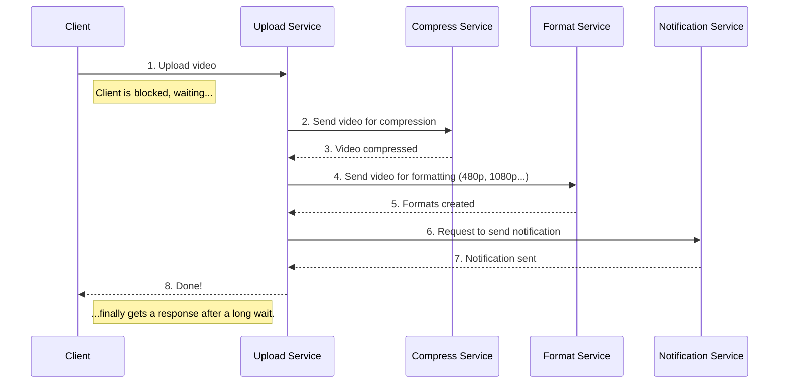
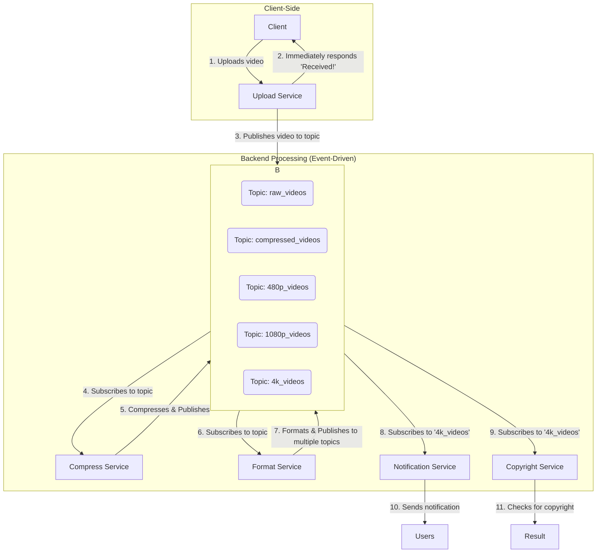

# Publish-Subscribe Pattern in Backend Engineering

The Publish/Subscribe (Pub/Sub) pattern is a powerful messaging architecture for modern backend systems, especially in microservices environments. It allows services to communicate asynchronously and in a decoupled manner, solving many challenges posed by traditional Request-Response models.

## Overview

**Core Concept**: One publisher, many readers - a messaging pattern where producers of information (publishers) don't send messages directly to specific consumers (subscribers). Instead, they publish messages to an intermediary system that distributes them to interested parties.

### Analogy

Think of a YouTube channel subscription system:

- **You (Subscriber)** don't need to contact the creator (Publisher) directly
- **Creator (Publisher)** uploads a new video (publishes a message)  
- **YouTube (Broker)** automatically notifies you and all other subscribers
- **Multiple subscribers** can receive the same content simultaneously

> **Key Insight**: This pattern enables loose coupling and scalable, event-driven architectures.

## Part 1: The Problem with Request-Response in Complex Workflows

Let's examine a real-world scenario: YouTube video processing workflow. If we build this using a simple, sequential Request-Response chain, it quickly becomes problematic.

### Sequential Request-Response Architecture



### Problems with This Approach

#### 1. High Coupling

- Services are tightly chained together
- If the Compress Service fails, the entire workflow breaks
- Adding a new step (like Copyright Service) requires modifying the Upload Service

#### 2. Blocking Client Experience

- Client is forced to wait until every single step completes
- Poor user experience with long response times
- No feedback during processing

#### 3. Lack of Resilience

- Single point of failure anywhere breaks the entire process
- No retry mechanisms for failed steps
- Difficult error recovery

#### 4. Poor Scalability

- Tasks must run sequentially, not in parallel
- Notification Service and Copyright Service could run simultaneously
- Cannot distribute load across multiple instances easily

### Code Example: Problematic Request-Response Chain

```javascript
// Problematic sequential approach
app.post('/upload-video', async (req, res) => {
  try {
    // Client waits for ALL of this to complete
    const videoId = await uploadService.save(req.file);
    
    // Each step blocks the next
    const compressedVideo = await compressionService.compress(videoId);
    const formats = await formatService.createFormats(compressedVideo);
    await notificationService.notifyUsers(videoId);
    await copyrightService.checkCopyright(videoId);
    
    // Client finally gets response after minutes!
    res.json({ success: true, videoId });
  } catch (error) {
    // If ANY step fails, entire operation fails
    res.status(500).json({ error: 'Upload failed' });
  }
});
```

### Performance Impact

| Metric | Sequential Approach | Impact |
|--------|-------------------|---------|
| **Response Time** | Sum of all steps (5-10+ minutes) | ❌ Poor UX |
| **Failure Rate** | High (any step can break chain) | ❌ Unreliable |
| **Scalability** | Limited by slowest step | ❌ Bottlenecks |
| **Resource Usage** | Inefficient (idle waiting) | ❌ Wasteful |

## Part 2: The Publish/Subscribe Solution

Now, let's re-architect the same workflow using the Pub/Sub pattern for a dramatically improved architecture.

### Key Components

- **Publisher**: A service that sends messages (e.g., Upload Service publishes "new video available")
- **Subscriber/Consumer**: A service that receives messages (e.g., Compress Service subscribes to "new video available")
- **Broker/Message Queue**: The intermediary system that routes messages (e.g., RabbitMQ, Apache Kafka, Redis)
- **Topic/Channel**: A named channel for categorizing messages (e.g., "raw_videos", "compressed_videos")

### Pub/Sub Architecture Diagram



### Code Example: Pub/Sub Implementation

#### Publisher (Upload Service)

```javascript
const amqp = require('amqplib');

class UploadService {
  constructor() {
    this.connection = null;
    this.channel = null;
  }
  
  async initialize() {
    this.connection = await amqp.connect('amqp://localhost');
    this.channel = await this.connection.createChannel();
    
    // Declare the topic for raw videos
    await this.channel.assertExchange('video_processing', 'topic');
  }
  
  async uploadVideo(req, res) {
    try {
      // 1. Save video file (quick operation)
      const videoId = await this.saveVideoFile(req.file);
      
      // 2. Immediately respond to client
      res.json({ 
        success: true, 
        videoId, 
        message: 'Video uploaded successfully! Processing started.' 
      });
      
      // 3. Publish event for background processing
      const message = {
        videoId,
        filePath: `/uploads/${videoId}.mp4`,
        uploadedAt: new Date().toISOString(),
        metadata: {
          originalName: req.file.originalname,
          size: req.file.size
        }
      };
      
      await this.channel.publish(
        'video_processing',
        'video.uploaded',
        Buffer.from(JSON.stringify(message))
      );
      
      console.log(`Published video upload event: ${videoId}`);
      
    } catch (error) {
      res.status(500).json({ error: 'Upload failed' });
    }
  }
}
```

#### Subscriber (Compression Service)

```javascript
class CompressionService {
  constructor() {
    this.connection = null;
    this.channel = null;
  }
  
  async initialize() {
    this.connection = await amqp.connect('amqp://localhost');
    this.channel = await this.connection.createChannel();
    
    await this.channel.assertExchange('video_processing', 'topic');
    
    // Create exclusive queue for this service
    const queue = await this.channel.assertQueue('', { exclusive: true });
    
    // Subscribe to video upload events
    await this.channel.bindQueue(queue.queue, 'video_processing', 'video.uploaded');
    
    // Start consuming messages
    this.channel.consume(queue.queue, this.processVideo.bind(this));
  }
  
  async processVideo(msg) {
    try {
      const videoData = JSON.parse(msg.content.toString());
      console.log(`Compressing video: ${videoData.videoId}`);
      
      // Simulate compression work
      await this.compressVideo(videoData);
      
      // Publish compressed video event
      const compressedMessage = {
        ...videoData,
        compressedAt: new Date().toISOString(),
        compressedPath: `/compressed/${videoData.videoId}.mp4`
      };
      
      await this.channel.publish(
        'video_processing',
        'video.compressed',
        Buffer.from(JSON.stringify(compressedMessage))
      );
      
      // Acknowledge message processing
      this.channel.ack(msg);
      
    } catch (error) {
      console.error('Compression failed:', error);
      // Reject and requeue for retry
      this.channel.nack(msg, false, true);
    }
  }
  
  async compressVideo(videoData) {
    // Simulate actual compression work
    return new Promise(resolve => setTimeout(resolve, 5000));
  }
}
```

### In-depth Explanation

- **Client interaction ends immediately**: Upload Service provides instant confirmation, client is free to move on
- **Asynchronous processing**: Upload Service publishes to `video.uploaded` topic and its job is done
- **Auto-delivery**: Compression Service automatically receives the message from the broker
- **Chain continuation**: After compressing, Compression Service publishes to `video.compressed` topic
- **Parallel processing**: Both Notification Service and Copyright Service can subscribe to `video.processed` topic and run independently

### Benefits Comparison

| Aspect | Request-Response Chain | Pub/Sub Pattern |
|--------|----------------------|-----------------|
| **Client Response Time** | 5-10+ minutes | < 1 second |
| **Failure Isolation** | ❌ Cascade failures | ✅ Isolated failures |
| **Scalability** | ❌ Sequential bottlenecks | ✅ Parallel processing |
| **Service Coupling** | ❌ Tight coupling | ✅ Loose coupling |
| **Adding New Features** | ❌ Modify existing code | ✅ Add new subscribers |
| **Error Recovery** | ❌ Manual intervention | ✅ Automatic retry |

## Message Broker Technologies

### Popular Message Brokers

| Broker | Best For | Strengths | Use Cases |
|--------|----------|-----------|-----------|
| **Apache Kafka** | High throughput, streaming | Excellent performance, persistence | Event streaming, analytics |
| **RabbitMQ** | Complex routing, reliability | Feature-rich, robust | Task queues, microservices |
| **Redis Pub/Sub** | Simple, fast messaging | Low latency, easy setup | Real-time notifications |
| **Amazon SQS** | Cloud-native, managed | No maintenance, scalable | AWS environments |
| **Apache Pulsar** | Multi-tenancy, geo-replication | Advanced features | Enterprise messaging |

### Message Broker Comparison

#### Apache Kafka Example

```javascript
const kafka = require('kafkajs');

const client = kafka({
  clientId: 'video-processing-app',
  brokers: ['localhost:9092']
});

const producer = client.producer();
const consumer = client.consumer({ groupId: 'compression-group' });

// Producer
await producer.send({
  topic: 'video-uploads',
  messages: [{
    key: videoId,
    value: JSON.stringify(videoData),
    partition: 0 // Optional: for ordering
  }]
});

// Consumer
await consumer.subscribe({ topic: 'video-uploads' });
await consumer.run({
  eachMessage: async ({ topic, partition, message }) => {
    const videoData = JSON.parse(message.value.toString());
    await processVideo(videoData);
  }
});
```

#### Redis Pub/Sub Example

```javascript
const redis = require('redis');
const publisher = redis.createClient();
const subscriber = redis.createClient();

// Publisher
await publisher.publish('video:uploaded', JSON.stringify({
  videoId: '123',
  status: 'uploaded'
}));

// Subscriber
await subscriber.subscribe('video:uploaded');
subscriber.on('message', (channel, message) => {
  const data = JSON.parse(message);
  console.log(`Received on ${channel}:`, data);
});
```

## Advanced Pub/Sub Patterns

### 1. Fan-Out Pattern

One message triggers multiple independent processes:

```javascript
// Single upload event triggers multiple services
await publisher.publish('video.uploaded', videoData);

// Multiple subscribers process independently:
// - Compression Service
// - Thumbnail Generator
// - Copyright Checker
// - Analytics Service
// - Notification Service
```

### 2. Message Filtering

Subscribers can filter messages based on content:

```javascript
// Publisher with metadata
await publisher.publish('video.uploaded', {
  videoId: '123',
  category: 'gaming',
  duration: 1800,
  quality: '4k'
});

// Subscriber with filtering
consumer.run({
  eachMessage: async ({ message }) => {
    const data = JSON.parse(message.value);
    
    // Only process gaming videos > 30 minutes
    if (data.category === 'gaming' && data.duration > 1800) {
      await processVideo(data);
    }
  }
});
```

### 3. Message Ordering

Ensuring messages are processed in the correct order:

```javascript
// Kafka partitioning for ordering
await producer.send({
  topic: 'video-processing',
  messages: [{
    key: videoId, // Messages with same key go to same partition
    value: JSON.stringify(videoData)
  }]
});
```

### 4. Dead Letter Queues

Handling failed message processing:

```javascript
class MessageProcessor {
  async processMessage(message) {
    try {
      await this.handleMessage(message);
      this.channel.ack(message);
    } catch (error) {
      console.error('Processing failed:', error);
      
      // Check retry count
      const retryCount = message.properties.headers['x-retry-count'] || 0;
      
      if (retryCount < 3) {
        // Retry with exponential backoff
        setTimeout(() => {
          this.channel.publish('video-processing', 'video.uploaded', 
            message.content, {
              headers: { 'x-retry-count': retryCount + 1 }
            });
        }, Math.pow(2, retryCount) * 1000);
      } else {
        // Send to dead letter queue for manual intervention
        this.channel.publish('dead-letter-queue', 'failed.message', 
          message.content);
      }
      
      this.channel.ack(message);
    }
  }
}
```

## Key Keywords to Remember

- **Publish/Subscribe (Pub/Sub)**: An indirect messaging pattern using a central broker
- **Publisher**: The sender of a message (e.g., Upload Service)
- **Subscriber/Consumer**: The receiver of a message (e.g., Compression Service)
- **Broker/Message Queue**: The intermediary system (e.g., Kafka, RabbitMQ)
- **Topic/Channel**: A category or feed name for messages
- **Decoupling**: Services are not directly aware of each other, making the system flexible
- **Event-Driven Architecture**: Services react to events (messages) rather than direct commands
- **Fan-Out**: One message triggers multiple independent processes
- **Dead Letter Queue**: Storage for messages that failed processing
- **Message Ordering**: Ensuring messages are processed in the correct sequence

## Pros and Cons Analysis

### Pros

- **Scales with Multiple Receivers**: Easy to add new subscribers (e.g., Analytics Service) without changing existing services
- **Loose Coupling**: Services are completely independent of one another
- **Asynchronous Operation**: Publishers can send messages without waiting for subscribers
- **Increased Resilience**: If one service is down, others continue functioning normally
- **Parallel Processing**: Multiple services can process the same event simultaneously
- **Easy Feature Addition**: New functionality requires only adding new subscribers

### Cons

- **Message Delivery Guarantees**: Ensuring exactly-once delivery is complex (related to "Two Generals' Problem")
- **Added Complexity**: Must operate and maintain a message broker infrastructure
- **Debugging Challenges**: Tracing request flow through multiple decoupled services is difficult
- **Network Saturation**: Constant polling can lead to network congestion
- **Eventual Consistency**: Data consistency across services becomes more complex
- **Monitoring Complexity**: Need to track message flows across multiple services

### When to Use Pub/Sub

#### ✅ Good Use Cases

- **Microservices Architecture**: Decoupling services in distributed systems
- **Event-Driven Systems**: User actions trigger multiple background processes
- **Real-time Notifications**: Broadcasting updates to multiple clients
- **Data Pipeline Processing**: ETL operations with multiple transformation steps
- **Analytics and Logging**: Fan-out pattern for data collection
- **Workflow Orchestration**: Complex business processes with multiple steps

#### ❌ Not Ideal For

- **Simple CRUD Operations**: Direct database operations don't need pub/sub
- **Synchronous Requirements**: When immediate response is required
- **Strong Consistency Needs**: When ACID transactions are mandatory
- **Low-latency Requirements**: When every millisecond counts
- **Small, Simple Applications**: Overhead may not be justified

## Implementation Best Practices

### 1. Message Design

```javascript
// Good: Well-structured message
{
  "eventType": "video.uploaded",
  "eventId": "uuid-12345",
  "timestamp": "2025-08-10T10:30:00Z",
  "version": "1.0",
  "data": {
    "videoId": "video-789",
    "userId": "user-456",
    "metadata": {
      "duration": 1800,
      "quality": "4k",
      "category": "gaming"
    }
  },
  "source": "upload-service"
}
```

### 2. Error Handling Strategy

```javascript
const retryConfig = {
  maxRetries: 3,
  backoffMultiplier: 2,
  deadLetterQueue: 'failed-messages'
};

async function processWithRetry(message, processor) {
  for (let attempt = 1; attempt <= retryConfig.maxRetries; attempt++) {
    try {
      await processor(message);
      return; // Success
    } catch (error) {
      if (attempt === retryConfig.maxRetries) {
        await sendToDeadLetterQueue(message, error);
        throw error;
      }
      
      const delay = Math.pow(retryConfig.backoffMultiplier, attempt - 1) * 1000;
      await sleep(delay);
    }
  }
}
```

### 3. Monitoring and Observability

```javascript
const metrics = {
  messagesPublished: 0,
  messagesConsumed: 0,
  processingErrors: 0,
  averageProcessingTime: 0
};

// Track message processing
async function processMessage(message) {
  const startTime = Date.now();
  
  try {
    await handleMessage(message);
    metrics.messagesConsumed++;
  } catch (error) {
    metrics.processingErrors++;
    throw error;
  } finally {
    const processingTime = Date.now() - startTime;
    metrics.averageProcessingTime = 
      (metrics.averageProcessingTime + processingTime) / 2;
  }
}
```

## Conclusion

The Publish/Subscribe pattern is an incredibly powerful tool for building scalable, flexible, and resilient distributed systems. It is the backbone of modern microservices architecture, enabling services to be decoupled and evolve independently.

### Key Takeaways

1. **Immediate User Experience**: Clients get instant responses instead of waiting for long processing chains
2. **Fault Isolation**: Failed services don't bring down the entire system
3. **Horizontal Scalability**: Easy to add new features and services without modifying existing code
4. **Parallel Processing**: Multiple services can work simultaneously on the same event
5. **Event-Driven Architecture**: Foundation for reactive, responsive systems

### Modern Architecture Impact

The shift from synchronous request-response chains to asynchronous pub/sub messaging represents a fundamental change in how we build distributed systems:

| Traditional Approach | Modern Pub/Sub Approach |
|---------------------|-------------------------|
| Monolithic processing chains | Distributed event processing |
| Tight service coupling | Loose service coupling |
| Cascade failures | Isolated failures |
| Sequential processing | Parallel processing |
| Manual scaling | Automatic scaling |
| Poor user experience | Excellent user experience |

### Real-World Success Stories

- **Netflix**: Uses pub/sub for their recommendation engine and content delivery
- **Spotify**: Event-driven architecture for music streaming and playlist updates
- **Uber**: Real-time location tracking and driver matching
- **Slack**: Message delivery and notification systems
- **Amazon**: Order processing and inventory management

### Next Steps for Implementation

1. **Start Small**: Begin with one workflow that has clear async requirements
2. **Choose the Right Broker**: Evaluate based on your throughput and reliability needs
3. **Design Good Messages**: Create well-structured, versioned message schemas
4. **Implement Monitoring**: Track message flows and processing metrics
5. **Plan for Failures**: Design retry mechanisms and dead letter queues
6. **Test at Scale**: Validate your system under realistic load conditions

### Learning Path

1. **Experiment** with Redis Pub/Sub for simple use cases
2. **Implement** RabbitMQ for complex routing scenarios
3. **Scale up** to Apache Kafka for high-throughput systems
4. **Monitor** and optimize your message processing pipelines
5. **Evolve** your architecture as your system grows

While pub/sub introduces the complexity of message broker infrastructure, the benefits of improved scalability, resilience, and user experience make it essential for modern backend systems. The investment in understanding and implementing these patterns pays tremendous dividends in system performance and maintainability.

> **Remember**: Great architectures aren't built overnight. Start with simple pub/sub patterns and gradually evolve to more sophisticated event-driven systems as your needs grow.
