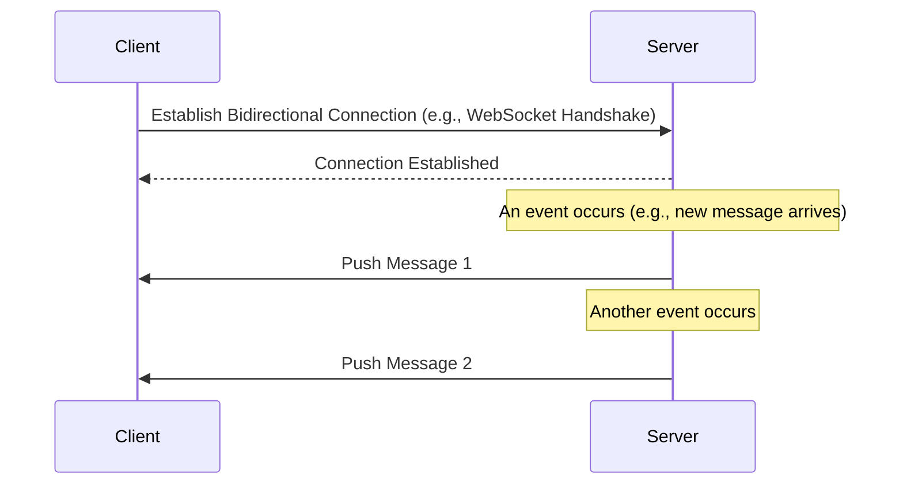

# Push

I want it as soon as possible

## What is the Push Model?

In a standard Request-Response model, the client must always ask, "Is there anything new?" This approach is not ideal for applications that require immediate updates, such as chat or live notifications. The client doesn't have the necessary information to know when to ask; the server is the one that has the new data when an event occurs.

The Push model flips this flow: the **server proactively 'pushes' data to the client** as soon as it's available.

- **Definition:** The client establishes an initial connection to the server. After that, the server can send data to the client at any time without the client needing to send a specific, preceding request for that data.
- **Real-World Analogy:** Think of a news app subscription. You subscribe once. Then, whenever breaking news occurs, the news agency (the server) immediately pushes an alert to your phone (the client). You don't have to open the app and refresh it every minute.

## Flow Diagram

This diagram illustrates how the server initiates the data transfer.



## Push Model Examples

The Push model is the foundation for many real-time applications:

- **Chat Applications**: When one user sends a message, the server immediately pushes it to the recipient(s). The demo in the provided material builds exactly this using WebSockets.
- **Live Notifications**: A social media server pushes a notification to your device the moment someone comments on your post.
- **Live Feeds & Dashboards**: A stock trading application pushes new price updates to all connected clients in real-time.
- **Message Queue Systems**: Systems like RabbitMQ use a push model where the broker pushes messages to registered consumers as soon as they arrive in the queue.

## Code Example: WebSocket Chat Server

Here's a practical implementation of the Push model using WebSockets to create a real-time chat server with detailed step-by-step comments:

```typescript
// ===== PUSH MODEL IMPLEMENTATION: WebSocket Chat Server =====
// This file demonstrates the Push communication pattern where:
// 1. Server can initiate data transfer to clients (server-initiated)
// 2. Real-time communication without client polling
// 3. Persistent bidirectional connections

import websocket from 'websocket';
import fs from 'node:fs';
import http from 'node:http';
import path from 'node:path';
import { fileURLToPath } from 'node:url';

// Get current file path for ES modules
const __filename = fileURLToPath(import.meta.url);
const __dirname = path.dirname(__filename);

// ===== STEP 1: CONNECTION MANAGEMENT =====
// Store all active WebSocket connections in an array
// This allows us to broadcast messages to all connected clients (Push Model core feature)
const connections: websocket.connection[] = [];

// ===== STEP 2: HYBRID HTTP + WEBSOCKET SERVER =====
// Create HTTP server that serves both:
// 1. Static files (client.html) - Traditional Request/Response pattern
// 2. WebSocket upgrade requests - Push pattern foundation
const httpServer = http.createServer((req, res) => {
  // Handle HTTP requests (Request/Response pattern)
  // Serve the HTML client file when users visit the root URL
  if (req.url === '/' || req.url === '/index.html') {
    res.setHeader('Content-Type', 'text/html');
    fs.readFile(path.join(__dirname, 'client.html'), (err, data) => {
      if (err) {
        res.writeHead(404);
        res.end('File not found');
        return;
      }
      res.writeHead(200);
      res.end(data);
    });
  } else {
    res.writeHead(404);
    res.end('Not found');
  }
});

// ===== STEP 3: WEBSOCKET SERVER SETUP =====
// This is where the Push Model magic happens!
// WebSocket provides the bidirectional, persistent connection needed for Push pattern
const WebSocketServer = websocket.server;
const wsServer = new WebSocketServer({
  httpServer: httpServer, // Attach to our HTTP server
  autoAcceptConnections: false, // Security: Manual connection approval
});

// ===== STEP 4: SECURITY LAYER =====
// Function to validate connection origins (prevent unauthorized access)
function originIsAllowed(origin: string): boolean {
  // Whitelist of allowed origins for security
  const allowedOrigins = [
    'http://localhost:8080',
    'http://127.0.0.1:8080',
    'null', // For file:// protocol during development
  ];
  return allowedOrigins.includes(origin) || !origin;
}

// ===== STEP 5: START THE SERVER =====
// Start listening on port 8080 for both HTTP and WebSocket connections
httpServer.listen(8080, () => {
  console.info('🚀 Server is running on http://localhost:8080');
  console.info('📡 WebSocket server is ready for connections');
  console.info('🌐 Open http://localhost:8080 in your browser to test');
});

// ===== STEP 6: HANDLE WEBSOCKET CONNECTION REQUESTS =====
// This is the heart of the Push Model implementation!
wsServer.on('request', (req) => {
  // ===== STEP 6A: SECURITY CHECK =====
  // Validate the origin before accepting connection
  if (!originIsAllowed(req.origin)) {
    req.reject();
    return;
  }

  // ===== STEP 6B: ACCEPT CONNECTION =====
  // Accept the WebSocket connection - establishing persistent bidirectional link
  const connection = req.accept(null, req.origin);

  // ===== STEP 6C: HANDLE INCOMING MESSAGES (PUSH TRIGGER) =====
  // When a client sends a message, we PUSH it to ALL other clients
  // This demonstrates the core Push Model: server-initiated communication
  connection.on('message', (msg) => {
    if (msg.type === 'utf8') {
      const message = msg.utf8Data;

      // 🚀 PUSH MODEL IN ACTION! 🚀
      // Server immediately pushes the message to ALL connected clients
      // Clients don't need to ask "any new messages?" - they get pushed automatically
      connections.forEach((conn) => {
        if (conn.connected) {
          conn.send(`User${connection.socket.remotePort} says: ${message}`);
        }
      });
    }
  });

  // ===== STEP 6D: HANDLE CONNECTION CLOSE =====
  // Clean up when a client disconnects and notify others
  connection.on('close', () => {
    // Remove disconnected connection from our active connections array
    const index = connections.indexOf(connection);
    if (index !== -1) {
      connections.splice(index, 1);
    }

    // 🚀 PUSH MODEL: Notify all remaining users about the departure
    // Server pushes "user left" notification without clients asking for it
    connections.forEach((conn) => {
      if (conn.connected) {
        conn.send(`User${connection.socket.remotePort} has left the chat`);
      }
    });
  });

  // ===== STEP 6E: CONNECTION MANAGEMENT =====
  // Add new connection to our active connections array
  connections.push(connection);

  // 🚀 PUSH MODEL: Notify existing users about new arrival
  // Server proactively pushes "user joined" notification to all existing clients
  connections.forEach((conn) => {
    if (conn.connected && conn !== connection) {
      conn.send(`User${connection.socket.remotePort} has joined the chat`);
    }
  });

  // 🚀 PUSH MODEL: Send welcome message to the new user
  // Server immediately pushes welcome info without client requesting it
  connection.send(
    `Welcome! You are User${connection.socket.remotePort}. There are ${connections.length} users online.`,
  );
});
```

**How this demonstrates the Push Model:**

1. **Server-Initiated Communication (Step 6C & 6E)**: When a user sends a message or joins/leaves, the server immediately pushes updates to all connected clients without them having to request it.

2. **Real-Time Updates (Throughout the flow)**: Messages and notifications are delivered instantly as soon as events occur on the server.

3. **Persistent Connections (Step 3 & 6B)**: Each client maintains an open WebSocket connection that allows the server to push data anytime.

4. **Event-Driven Architecture (Step 6)**: The server responds to events (new messages, connections, disconnections) by automatically broadcasting relevant updates to all clients.

5. **Hybrid Pattern Implementation (Step 2)**: The server combines traditional Request/Response (for serving HTML) with Push Model (for real-time chat functionality).

**Key Push Model Features Implemented:**

- **Connection Management**: Active connections stored in array for broadcasting
- **Security Layer**: Origin validation before accepting connections  
- **Bidirectional Communication**: Server can send to clients anytime after connection established
- **Automatic Cleanup**: Proper connection removal and user departure notifications
- **Welcome System**: Immediate feedback to new users with current online count

This implementation perfectly demonstrates how the Push model enables real-time communication in applications like chat systems, live notifications, collaborative tools, and any scenario requiring instant server-to-client updates.

**Testing the Implementation:**

1. Run the server: `node push-server.ts`
2. Open multiple browser tabs at `http://localhost:8080`  
3. Send messages from any tab → See them appear instantly in all other tabs
4. Close tabs → See "user left" notifications in remaining tabs
5. Open new tabs → See "user joined" notifications in existing tabs

## Push Model Keywords

- **Push Model**: A communication pattern where the server initiates data transfer to the client.
- **Server-Initiated**: The key characteristic where the server, not the client, decides when to send data.
- **Real-Time**: The primary benefit, enabling near-instantaneous data delivery.
- **Bidirectional Protocol**: A protocol that allows two-way communication over a single connection, such as WebSockets, is required for the push model to work effectively.
- **Persistent Connection**: The client and server must maintain an open connection for the server to be able to push data at any time.

## Push Model Pros and Cons

This model is powerful but has significant trade-offs.

**Pros:**

- **Real-Time**: This is the biggest advantage. Data is delivered with minimal latency as soon as an event occurs.

**Cons:**

- **Clients Must Be Online**: To receive a push, the client must maintain an active, persistent connection to the server. If the client is disconnected, it will miss the data.
- **Clients Can Be Overwhelmed**: The server pushes data without necessarily knowing if the client can handle the load. A high volume of messages can crash a lightweight client. Because of this, polling is often preferred for "light clients".
- **Scalability Challenges**: Managing state for potentially millions of persistent connections is a significant resource challenge for servers (in terms of memory and CPU).
- **Requires a Specific Protocol**: The push model necessitates a bidirectional protocol, unlike the more ubiquitous request-response protocols.

## Push Model Summary

The Push model is the go-to solution when your application requires instant, server-driven updates. It is the engine behind the real-time web. However, when implementing it, you must carefully consider the client's ability to handle the data load and the architectural challenges of managing a large number of stateful, persistent connections on the backend.
