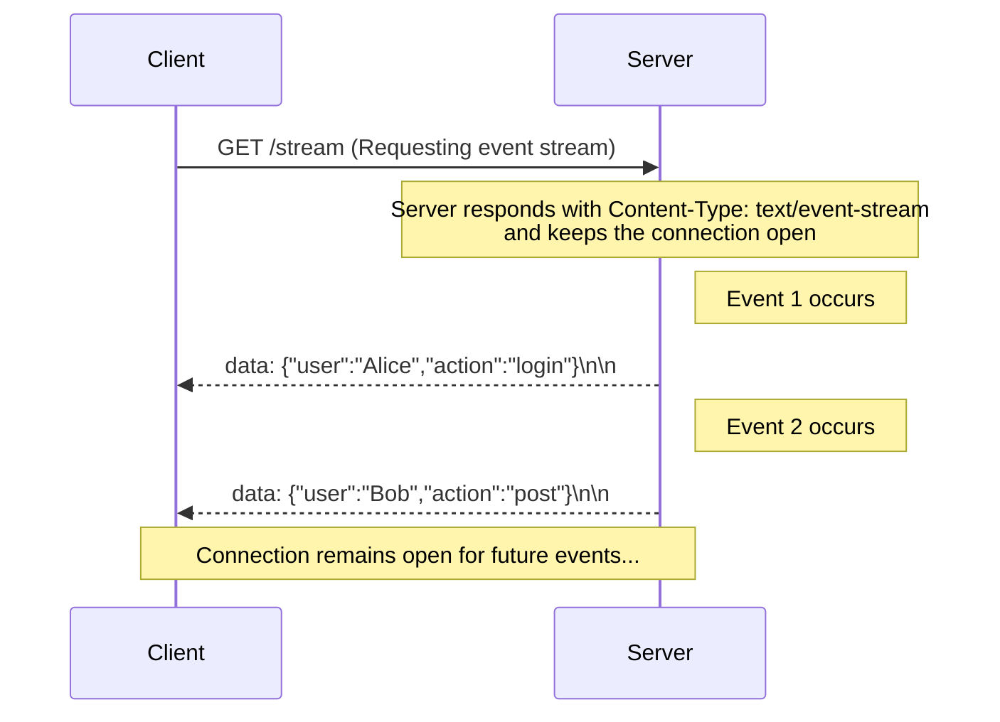

# Server-Sent Events (SSE)

> **One Request, One Very Long Response**

## What is Server-Sent Events?

Server-Sent Events (SSE) is a web standard that allows a server to push real-time data to a client over a single, long-lived HTTP connection. It's an elegant solution for **one-way, server-to-client communication**, offering a simpler alternative to WebSockets for specific use cases.

### Core Concept

**"One request, one very, very long response"** - The client makes a single HTTP request, and the server keeps the connection open indefinitely, streaming events as they occur.

## How Server-Sent Events Work

The magic of SSE lies in how it manipulates a standard HTTP response:

### Step-by-Step Process

1. **Client Initiates a Single Request**: A client (typically a web browser using the EventSource API) sends a standard HTTP GET request to a server endpoint.

2. **Server Sends a Special Header**: The server accepts the request and replies with a response that includes the special header `Content-Type: text/event-stream`.

3. **Connection Stays Open**: Critically, the server does not close the response. It keeps the HTTP connection open indefinitely.

4. **Server "Pushes" Events**: Whenever the server has new information, it writes a specially formatted string into the open response stream. Each message is considered an "event" and is typically prefixed with `data:`.

5. **Client Listens for Events**: The browser's EventSource API listens to this unending response stream, automatically parses each event, and triggers a message event in JavaScript that your application can handle.

### Real-World Analogy

Think of it like tuning into a live radio broadcast. You tune in once (make the initial request). The radio station (the server) then continuously broadcasts songs and news (the events) over that single frequency. You just listen passively without having to constantly re-tune.

## Flow Diagram

This diagram illustrates how multiple events are sent over the same, single connection:



## Real-World Examples

SSE is ideal for **unidirectional (one-way)** data flows from the server to the client:

### Common Use Cases

- **Live Notifications**: A social media site pushing "new comment" or "new like" notifications to a user's browser
- **Stock Tickers**: A financial dashboard displaying live stock price updates
- **Live Score Updates**: A sports website showing the score of a game in progress
- **Job Progress Updates**: A web UI showing the progress of a long-running backend task, with the server sending an event for each percentage point increase
- **Chat Applications**: Real-time message delivery (one-way from server to client)
- **Live Feeds**: News feeds, social media timelines, or activity streams

## Key Keywords to Remember

- **Server-Sent Events (SSE)**: The name of the standard
- **EventSource API**: The client-side JavaScript object used to subscribe to an SSE stream
- **text/event-stream**: The required Content-Type header that initiates the event stream
- **Unidirectional Stream**: Data flows only from the server to the client over the SSE connection
- **HTTP-Based**: It works entirely over the standard HTTP protocol, requiring no special server setup beyond what's needed for a normal web server

## Pros and Cons

SSE is elegant but has important limitations to consider.

### ✅ Pros

- **Real-Time**: Provides immediate server-to-client updates
- **HTTP-Compatible**: It's built on standard HTTP, making it easy to implement and compatible with most existing infrastructure
- **Automatic Reconnection**: The browser's EventSource API will automatically attempt to reconnect if the connection is dropped
- **Simpler than WebSockets**: For one-way data flow, SSE is significantly simpler to implement on both the client and server than a full bidirectional WebSocket connection
- **Built-in Browser Support**: Native support in all modern browsers
- **Easy to Debug**: Standard HTTP tools can be used for debugging

### ❌ Cons

- **Unidirectional**: This is the primary limitation. Data only flows from the server to the client. If the client needs to send data back, it must use a separate HTTP request
- **HTTP/1.1 Connection Limit**: This is a critical technical drawback. Browsers limit the number of concurrent connections to a single domain (often six). Because SSE holds one of these connections open indefinitely, you can easily exhaust the connection pool, blocking other requests for assets like CSS and JavaScript. This issue is largely resolved by HTTP/2, which allows for multiple streams over a single connection
- **Client Must Be Online**: To receive events, the client must have an active connection to the server
- **Potential for Client Overload**: Similar to any push model, if the server sends events too rapidly, it could overwhelm a client that is not equipped to handle the load
- **No Built-in Authentication**: SSE connections don't support custom headers after the initial request, making authentication challenging

## SSE vs Other Communication Patterns

| Feature | Server-Sent Events | Long Polling | Short Polling | WebSockets |
|---------|-------------------|--------------|---------------|------------|
| **Connection Type** | Single long-lived | Request-response cycles | Request-response cycles | Bidirectional persistent |
| **Data Direction** | Server → Client only | Server → Client only | Server → Client only | Bidirectional |
| **Real-time** | Yes (immediate) | Yes (with delays) | No (intervals) | Yes (immediate) |
| **Complexity** | Low | Medium | Low | High |
| **Browser Support** | Excellent | Excellent | Excellent | Excellent |
| **Resource Usage** | Low (one connection) | Medium (multiple requests) | High (frequent requests) | Low (one connection) |
| **Reconnection** | Automatic | Manual | Not needed | Manual |

## Implementation Example

### Basic SSE Server (Express.js)

```javascript
app.get('/events', (req, res) => {
  // Set SSE headers
  res.writeHead(200, {
    'Content-Type': 'text/event-stream',
    'Cache-Control': 'no-cache',
    'Connection': 'keep-alive',
    'Access-Control-Allow-Origin': '*'
  });

  // Send initial event
  res.write('data: {"message": "Connected to SSE stream"}\n\n');

  // Send events every 3 seconds
  const interval = setInterval(() => {
    const data = {
      timestamp: new Date().toISOString(),
      message: 'Live update from server'
    };
    res.write(`data: ${JSON.stringify(data)}\n\n`);
  }, 3000);

  // Clean up on client disconnect
  req.on('close', () => {
    clearInterval(interval);
    res.end();
  });
});
```

### Basic SSE Client

```javascript
const eventSource = new EventSource('/events');

eventSource.onmessage = function(event) {
  const data = JSON.parse(event.data);
  console.log('Received:', data);
  // Update UI with real-time data
};

eventSource.onerror = function(event) {
  console.error('SSE error:', event);
};

// Close connection when needed
// eventSource.close();
```

## When to Use SSE

### ✅ Perfect For

- **Live dashboards** with real-time metrics
- **Notification systems** for web applications
- **Live feeds** (news, social media, activity streams)
- **Progress tracking** for long-running operations
- **Real-time monitoring** systems
- **Live chat** (server-to-client messages only)

### ❌ Not Suitable For

- **Bidirectional communication** (use WebSockets instead)
- **File uploads** or large data transfers
- **Mobile applications** with intermittent connectivity
- **High-frequency data** that might overwhelm clients
- **Applications requiring request authentication** beyond initial connection

## Conclusion

Server-Sent Events (SSE) is a brilliant and efficient solution for **one-way, real-time communication** from a server to a client. It's the perfect choice when you need live updates but don't require the complexity of a bidirectional protocol like WebSockets.

### Key Takeaways

- **Simple to implement** compared to WebSockets
- **Automatic reconnection** handled by browser
- **HTTP-based** - works with existing infrastructure
- **Unidirectional only** - server to client communication
- **Connection limits** can be an issue with HTTP/1.1

Always be mindful of the browser connection limit, especially when operating over HTTP/1.1, and consider upgrading to HTTP/2 for production applications with multiple SSE streams.
