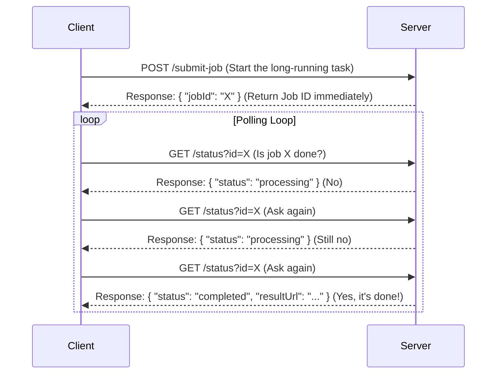

# Short Polling

> **"Request is taking a while, I'll check with you later"**

## What is Short Polling?

Short Polling is a communication pattern used when a client initiates a request that takes a long time for the server to process. Instead of making the client wait and hold a connection open, this pattern breaks the interaction into multiple, quick exchanges.

Here’s how it works:

1. **Initial Request**: The client sends a request to start a job (e.g., "process this video").
2. **Immediate Handle**: The server doesn't wait for the job to complete; instead, it immediately returns a 'handle'—typically a `Job ID` or `Task ID`.
3. **Asynchronous Processing**: The server begins processing the job asynchronously in the background.
4. **Client Polls for Status**: The client then uses this `Job ID` to repeatedly send new, short requests (the 'polls') to ask, "Is this job done yet?".
5. **Quick Server Response**: For each poll, the server provides a quick, immediate response, usually indicating the job's status (e.g., "processing" or "completed").

- **Real-World Analogy**: It's like a child on a long car ride repeatedly asking, "Are we there yet?" Each question is a "poll," and the parent (the server) gives a quick "No" until they finally arrive.

## Short Polling Flow Diagram

This diagram illustrates the distinct phases of the short polling process.



## Short Polling Examples

The Short Polling pattern is commonly used in various scenarios:

- **File/Video Processing**: A user uploads a file for conversion. The UI receives a job ID and then polls an endpoint to show a progress bar based on the status returned.
- **Build Status Checks**: In a CI/CD pipeline, a script can initiate a software build and then poll the API to check if the build has succeeded, failed, or is still in progress.
- **Order Processing Systems**: After a customer places an order, the UI can poll in the background to update the order status from "pending" to "confirmed" without requiring a page reload.

## Code Example: Short Polling Job Processing Server

Here's a practical implementation of the Short Polling pattern using Express.js to demonstrate how clients can submit long-running jobs and poll for their status:

```typescript
// ===== SHORT POLLING IMPLEMENTATION: Job Processing Server =====
// This demonstrates the Short Polling pattern where:
// 1. Client submits a long-running job and receives a Job ID immediately
// 2. Server processes the job asynchronously in the background
// 3. Client repeatedly polls the server to check job status

import express from 'express';

const app = express();

// ===== STEP 1: JOB STORAGE =====
// In-memory storage for job statuses (in production, use Redis or database)
interface Job {
  id: string;
  progress: number;
  status: 'processing' | 'completed' | 'failed';
  createdAt: Date;
}

const jobs: Record<string, Job> = {};

// ===== STEP 2: SUBMIT JOB ENDPOINT =====
// Client sends initial request to start a long-running job
// Server immediately returns Job ID without waiting for completion
app.post('/submit', (req, res) => {
  const jobId = `job_${Date.now()}_${Math.random().toString(36).substr(2, 9)}`;
  
  // Create job entry with initial status
  jobs[jobId] = {
    id: jobId,
    progress: 0,
    status: 'processing',
    createdAt: new Date()
  };
  
  // Start processing job asynchronously (non-blocking)
  startJobProcessing(jobId);
  
  // Return Job ID immediately - this is the "handle" for the client
  res.json({
    jobId: jobId,
    message: 'Job submitted successfully. Use this ID to check status.',
    statusEndpoint: `/check-status?jobId=${jobId}`
  });
});

// ===== STEP 3: STATUS CHECK ENDPOINT =====
// Client uses this endpoint to poll for job status
// This is where the "polling" happens - client repeatedly calls this
app.get('/check-status', (req, res) => {
  const jobId = req.query.jobId as string;
  
  if (!jobId) {
    return res.status(400).json({ error: 'jobId parameter is required' });
  }
  
  const job = jobs[jobId];
  if (!job) {
    return res.status(404).json({ error: 'Job not found', jobId: jobId });
  }
  
  // Return current job status - this is the quick response
  res.json({
    jobId: job.id,
    progress: job.progress,
    status: job.status,
    createdAt: job.createdAt,
    isComplete: job.status === 'completed' || job.status === 'failed'
  });
});

// ===== STEP 4: BACKGROUND JOB PROCESSING =====
// This simulates long-running work happening asynchronously
function startJobProcessing(jobId: string): void {
  const job = jobs[jobId];
  if (!job) return;
  
  // Simulate work by incrementing progress every 2 seconds
  const updateInterval = setInterval(() => {
    const currentJob = jobs[jobId];
    if (!currentJob) {
      clearInterval(updateInterval);
      return;
    }
    
    // Increment progress
    currentJob.progress += 20;
    
    if (currentJob.progress >= 100) {
      currentJob.progress = 100;
      currentJob.status = 'completed';
      clearInterval(updateInterval);
    }
  }, 2000); // Update every 2 seconds
}

// ===== STEP 5: START SERVER =====
app.listen(8080, () => {
  console.log('🚀 Short Polling Demo Server running on http://localhost:8080');
});
```

**How this demonstrates Short Polling:**

1. **Immediate Job ID Return (Step 2)**: When a client submits a job, the server immediately returns a Job ID without waiting for the job to complete. This prevents blocking the client.

2. **Asynchronous Processing (Step 4)**: The server processes the job in the background using `setInterval`, simulating real work like file processing or data analysis.

3. **Client-Driven Polling (Step 3)**: Clients must repeatedly call the `/check-status` endpoint to get updates. The server responds quickly with the current status.

4. **Stateful Job Management (Step 1)**: The server maintains job state in memory, allowing clients to disconnect and reconnect using the Job ID.

**Testing with curl commands:**

```bash
# Step 1: Submit a job and get Job ID
curl -X POST http://localhost:8080/submit

# Response: {"jobId":"job_1691234567890_abc123def","message":"Job submitted successfully..."}

# Step 2: Poll for status using the Job ID (repeat this multiple times)
curl "http://localhost:8080/check-status?jobId=job_1691234567890_abc123def"

# Responses will show progress: 0% -> 20% -> 40% -> 60% -> 80% -> 100%
# {"jobId":"...","progress":40,"status":"processing","isComplete":false}
# {"jobId":"...","progress":100,"status":"completed","isComplete":true}
```

**Key Short Polling Characteristics Demonstrated:**

- **Non-blocking submission**: Job submitted instantly with handle returned
- **Client responsibility**: Client must actively poll for updates
- **Quick server responses**: Each status check returns immediately
- **Chattiness**: Multiple requests needed to track job progress
- **Disconnect resilience**: Client can stop polling and resume later using Job ID

This implementation perfectly illustrates why Short Polling can become "chatty" - the client needs to make multiple requests to stay updated on job progress, but it provides a simple and reliable pattern for handling asynchronous work.

## Short Polling Keywords

- **Short Polling**: The technique of a client repeatedly making requests to check the status of a server-side job.
- **Asynchronous Backend Processing**: The core principle that enables polling; the server works on the task in the background.
- **Job ID / Handle**: A unique identifier for a task, which the server returns immediately.
- **Client-Driven Checks**: The client is responsible for initiating all status checks.
- **Chattiness**: The primary drawback of this pattern, describing the high number of requests generated.

## Short Polling vs Other Communication Patterns

| Feature | Short Polling | Long Polling | Push Model | Server-Sent Events |
|---------|---------------|--------------|------------|-------------------|
| **Initiation** | Client-initiated | Client-initiated | Server-initiated | Server-initiated |
| **Response Timing** | Immediate | Delayed (hold-and-wait) | Immediate when data available | Immediate when data available |
| **Request Frequency** | High (regular intervals) | Low (only when needed) | N/A (persistent connection) | N/A (persistent connection) |
| **Resource Efficiency** | Poor (many empty responses) | Good (fewer requests) | Excellent (no polling) | Excellent (no polling) |
| **Implementation** | Simple | Medium | Complex | Simple |
| **Disconnection Resilience** | Excellent | Excellent | Poor (connection loss) | Medium (auto-reconnect) |
| **Real-time Performance** | Poor (polling intervals) | Good (near real-time) | Excellent (immediate) | Excellent (immediate) |

## Short Polling Pros and Cons

Like any pattern, Short Polling has distinct trade-offs.

### ✅ Pros

- **Simple to Implement**: The logic on both the client and server is relatively straightforward to build.
- **Good for Long-Running Requests**: It's an effective way to manage tasks without blocking the client.
- **Handles Disconnection**: The client can disconnect, and upon reconnecting, use the saved Job ID to continue checking the status.
- **Familiar HTTP Pattern**: Uses standard request-response which most developers understand well.
- **No Connection State**: Server doesn't need to maintain persistent connections or client state.

### ❌ Cons

- **'Too Chatty'**: It generates a high volume of requests, most of which will likely be 'useless' because the job isn't done yet.
- **Wasted Network Bandwidth**: The constant polling consumes network resources, which can be costly at scale.
- **Wasted Backend Resources**: Each poll, even just to check a status, consumes server resources (CPU, connections) that could be used for more productive work.
- **High Latency**: Updates are only discovered during polling intervals, not immediately.

## When to Use Short Polling

### ✅ Perfect For

- **Long-running background jobs** like file processing, video encoding, or data analysis
- **Build/deployment status checks** in CI/CD pipelines
- **Order processing systems** where status updates happen infrequently
- **Simple applications** where development speed is more important than optimization
- **Legacy systems** that don't support more advanced techniques
- **Scenarios with infrequent updates** where the "chattiness" is minimal

### ❌ Not Suitable For

- **Real-time applications** requiring immediate updates
- **High-frequency status changes** that would result in excessive polling
- **Battery-sensitive mobile applications** due to constant network requests
- **High-scale systems** where polling overhead becomes significant
- **Chat applications** or other real-time communication needs

## Short Polling Summary

Short Polling is a simple and robust pattern for handling asynchronous jobs where the client needs to know the result. It's a reliable tool to have. However, its inefficiency and "chattiness" can become a significant performance bottleneck at scale. This limitation is precisely why a more optimized pattern, Long Polling, was developed.
