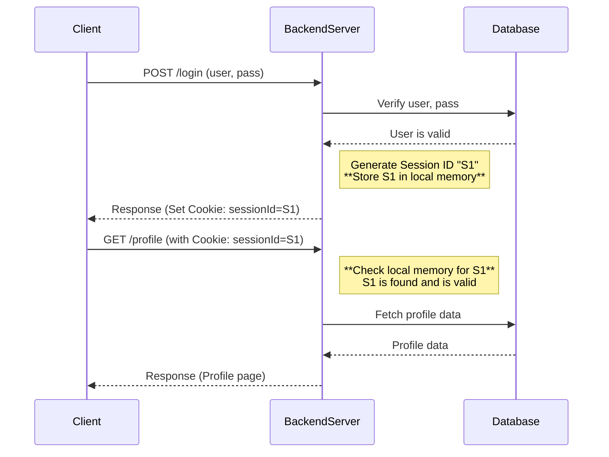
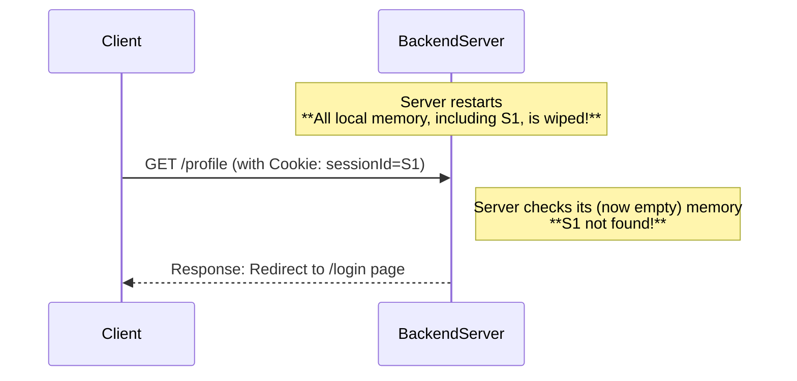
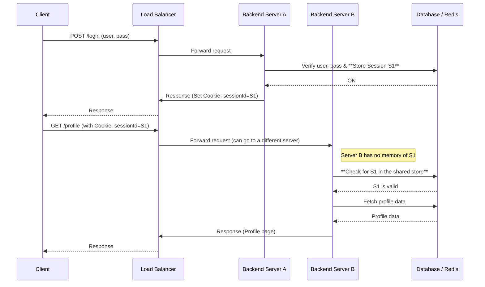

# Stateless vs Stateful Backend Design

A core architectural decision in backend engineering revolves around state management: **Does the server need to remember what happened in past interactions with a client?**

## Overview

- **Stateful**: **YES**. The server stores client-specific information (state) in its own memory and relies on this information for subsequent requests to function correctly.
- **Stateless**: **NO**. The server stores no client session state. Each request from a client must contain all the information necessary for the server to process it independently.

> **Key Insight**: This choice fundamentally affects your system's scalability, reliability, and complexity.

## Stateful Backends: The Server Remembers Everything

### Analogy

Imagine visiting a small, local coffee shop. The barista (server) remembers you, your name, and your usual order (the state). You can simply say, "the usual," and they know exactly what to do.

### Definition

A backend is considered **stateful** when it stores client session data directly within the memory of its running process. It depends on that state to handle future requests.

### Example: A Stateful Login System

This is a common example where the server stores the user's session ID in its local memory after they log in.

#### Stateful Workflow Diagram



#### In-depth Explanation

- When the user logs in, the server generates a Session ID, `S1`.
- **Key Point**: The server stores `S1` in its own memory (e.g., a global variable or dictionary). This is very fast because it avoids a database call.
- When the client requests their profile, the server validates them simply by checking for `S1` in its memory.

#### Code Example (Node.js)

```javascript
// Stateful server - storing sessions in memory
const sessions = {}; // In-memory session store

app.post('/login', (req, res) => {
  const { username, password } = req.body;
  
  // Verify credentials (simplified)
  if (verifyUser(username, password)) {
    const sessionId = generateUniqueId();
    
    // Store session in server memory
    sessions[sessionId] = {
      username,
      loginTime: new Date(),
      isAuthenticated: true
    };
    
    res.cookie('sessionId', sessionId);
    res.json({ success: true });
  } else {
    res.status(401).json({ error: 'Invalid credentials' });
  }
});

app.get('/profile', (req, res) => {
  const sessionId = req.cookies.sessionId;
  
  // Check if session exists in memory
  if (sessions[sessionId] && sessions[sessionId].isAuthenticated) {
    res.json({ 
      username: sessions[sessionId].username,
      message: 'Welcome to your profile!'
    });
  } else {
    res.status(401).json({ error: 'Please log in' });
  }
});
```

#### The Problem with Stateful: What Happens on Failure?

What if the server restarts, or if you have multiple servers behind a load balancer?

#### Server Restart Scenario



#### Consequences

- **Poor User Experience**: The user is suddenly logged out and forced to log in again for no apparent reason.
- **Difficult to Scale**: If you run multiple server instances, you must ensure that all requests from a single user are routed to the *exact same server* that holds their session. This requires **sticky sessions**, which complicates your load balancer setup and reduces flexibility.
- **Single Point of Failure**: If the server holding user sessions crashes, all those users lose their sessions.
- **Memory Consumption**: Each active session consumes server memory, limiting the number of concurrent users.

#### Real-World Stateful Examples

1. **WebSocket Connections**: Real-time chat applications maintain connection state
2. **Game Servers**: Online multiplayer games track player positions and game state
3. **Video Streaming**: Live streaming services maintain viewer connection state
4. **Legacy Applications**: Older enterprise applications often use session-based authentication

## Stateless Backends: The Server Remembers Nothing

### Stateless Analogy

Now, imagine going to a large, busy post office. The clerk (server) doesn't remember you from five minutes ago. Each time you step up to the counter, you have to present all of your forms and ID (the state) again. The state is carried with your request.

### Stateless Definition

The server does not maintain any client session state between requests. Each request is a self-contained unit that has all the data needed for it to be processed.

### The Litmus Test

> **Question**: "Can you restart the backend at any time, and have client workflows continue uninterrupted?"
>
> If the answer is **YES**, your backend is stateless.

### Example: A Stateless Login System

Here's how to fix the stateful login problem.

#### Workflow Diagram



#### In-depth Explanation

- **Key Point**: Instead of storing the session in local memory, the server stores it in a shared state store (like a Redis cache or a database) that is accessible to all server instances.
- **Benefit**: Any server instance (A, B, or C) can now handle the user's request because they can all look up the session in the shared store. You can restart Server A without affecting user sessions being handled by Server B.
- **Important Distinction**: The backend application is now stateless, but the overall system is still stateful because it relies on the database. If the database goes down, the system fails.

#### Code Example (Node.js with Redis)

```javascript
const redis = require('redis');
const client = redis.createClient();

// Stateless server - storing sessions in external store
app.post('/login', async (req, res) => {
  const { username, password } = req.body;
  
  if (verifyUser(username, password)) {
    const sessionId = generateUniqueId();
    
    // Store session in Redis (external store)
    await client.setex(sessionId, 3600, JSON.stringify({
      username,
      loginTime: new Date().toISOString(),
      isAuthenticated: true
    }));
    
    res.cookie('sessionId', sessionId);
    res.json({ success: true });
  } else {
    res.status(401).json({ error: 'Invalid credentials' });
  }
});

app.get('/profile', async (req, res) => {
  const sessionId = req.cookies.sessionId;
  
  // Check session in Redis (any server can handle this)
  const sessionData = await client.get(sessionId);
  
  if (sessionData) {
    const session = JSON.parse(sessionData);
    res.json({ 
      username: session.username,
      message: 'Welcome to your profile!'
    });
  } else {
    res.status(401).json({ error: 'Please log in' });
  }
});
```

#### Benefits of Stateless Architecture

1. **Horizontal Scalability**: Add or remove servers without affecting user sessions
2. **Fault Tolerance**: Server failures don't impact user experience
3. **Load Distribution**: Any server can handle any request
4. **Easier Deployment**: Rolling updates without session loss
5. **Cloud-Friendly**: Perfect for auto-scaling and container orchestration

#### Token-Based Authentication (JWT)

A popular stateless approach uses JSON Web Tokens (JWT):

```javascript
const jwt = require('jsonwebtoken');

app.post('/login', (req, res) => {
  const { username, password } = req.body;
  
  if (verifyUser(username, password)) {
    // Create a self-contained token
    const token = jwt.sign(
      { 
        username, 
        loginTime: new Date().toISOString() 
      },
      process.env.JWT_SECRET,
      { expiresIn: '1h' }
    );
    
    res.json({ token, success: true });
  } else {
    res.status(401).json({ error: 'Invalid credentials' });
  }
});

app.get('/profile', (req, res) => {
  const token = req.headers.authorization?.split(' ')[1];
  
  try {
    // Verify token without external storage
    const decoded = jwt.verify(token, process.env.JWT_SECRET);
    res.json({ 
      username: decoded.username,
      message: 'Welcome to your profile!'
    });
  } catch (error) {
    res.status(401).json({ error: 'Invalid token' });
  }
});
```

## Expanding the Concept: Stateful vs. Stateless Protocols

This concept also applies to network protocols themselves:

### Protocol Examples

#### Stateful Protocols

- **TCP (Transmission Control Protocol)**: It must remember the connection state, including sequence numbers, window sizes, and flags. If this state is lost, the connection breaks.
- **QUIC**: Creates a stateful connection concept but runs on top of stateless UDP. It must include a Connection ID in every UDP packet to allow the server to identify the correct stateful connection.
- **FTP (File Transfer Protocol)**: Maintains session state for file transfers and directory navigation.

#### Stateless Protocols

- **UDP (User Datagram Protocol)**: It's a "fire-and-forget" protocol. Each packet (datagram) is independent and has no memory of the packets that came before it.
- **HTTP**: Though it runs on top of stateful TCP, HTTP itself is designed to be stateless. We use mechanisms like cookies to carry state with each request.
- **DNS (Domain Name System)**: Each query is independent and self-contained.

### Real-World Protocol Comparison

| Protocol | Type | State Management | Use Cases |
|----------|------|------------------|-----------|
| TCP | Stateful | Connection tracking, ordering | Web browsing, file transfer |
| UDP | Stateless | No connection state | Gaming, video streaming, DNS |
| HTTP/1.1 | Stateless | Cookies for session | Web applications |
| WebSocket | Stateful | Persistent connection | Real-time chat, live updates |
| MQTT | Stateful | Client sessions | IoT devices, messaging |
| REST API | Stateless | Token-based auth | Microservices, web APIs |

## Key Keywords to Remember

- **Stateful**: The server stores client-specific state in its local memory.
- **Stateless**: The server stores no session state; each request is independent.
- **Session ID**: A unique identifier for a user's session.
- **Local Memory**: The memory of the specific server process.
- **Shared State Store**: A centralized database or cache (e.g., Redis) for storing state.
- **Sticky Session**: A load balancer configuration that directs all requests from a user to the same backend server.
- **JWT (JSON Web Token)**: A self-contained token that carries user information without requiring server-side storage.
- **Horizontal Scaling**: Adding more servers to handle increased load.

## Trade-offs Comparison

| Aspect | Stateful | Stateless |
|--------|----------|-----------|
| **Performance** | ⚡ Faster (no external calls) | ⚠️ Slower (external state store calls) |
| **Scalability** | ❌ Difficult (sticky sessions) | ✅ Easy (any server handles any request) |
| **Fault Tolerance** | ❌ Poor (state lost on crash) | ✅ Excellent (no state to lose) |
| **Memory Usage** | ❌ High (per-user state) | ✅ Low (no local state) |
| **Complexity** | ✅ Simple (local state) | ⚠️ Medium (external dependencies) |
| **Load Balancing** | ❌ Complex (sticky sessions) | ✅ Simple (round-robin) |
| **Deployment** | ❌ Difficult (graceful shutdowns) | ✅ Easy (instant restarts) |

## When to Use Each Approach

### Use Stateful When

- **Real-time applications** (gaming, live streaming)
- **WebSocket connections** (chat applications)
- **High-performance requirements** (financial trading systems)
- **Legacy system constraints**

### Use Stateless When

- **Microservices architecture**
- **Cloud-native applications**
- **RESTful APIs**
- **Auto-scaling requirements**
- **Container orchestration** (Kubernetes)

## Conclusion

There is no single "best" choice; it's a matter of trade-offs:

- **Stateful architecture** can sometimes offer higher performance for specific tasks (by avoiding external calls to a state store) but is harder to scale and less resilient.
- **Stateless architecture** is the dominant paradigm in modern web development, especially for microservices, because it provides superior scalability, fault tolerance, and deployment simplicity.

### Modern Recommendation

For most new applications, start with a **stateless design** using:

- JWT tokens for authentication
- External stores (Redis/Database) for session data when needed
- Microservices with clear API boundaries
- Container-friendly deployment patterns

This approach provides the flexibility to scale and evolve your system as requirements change.
