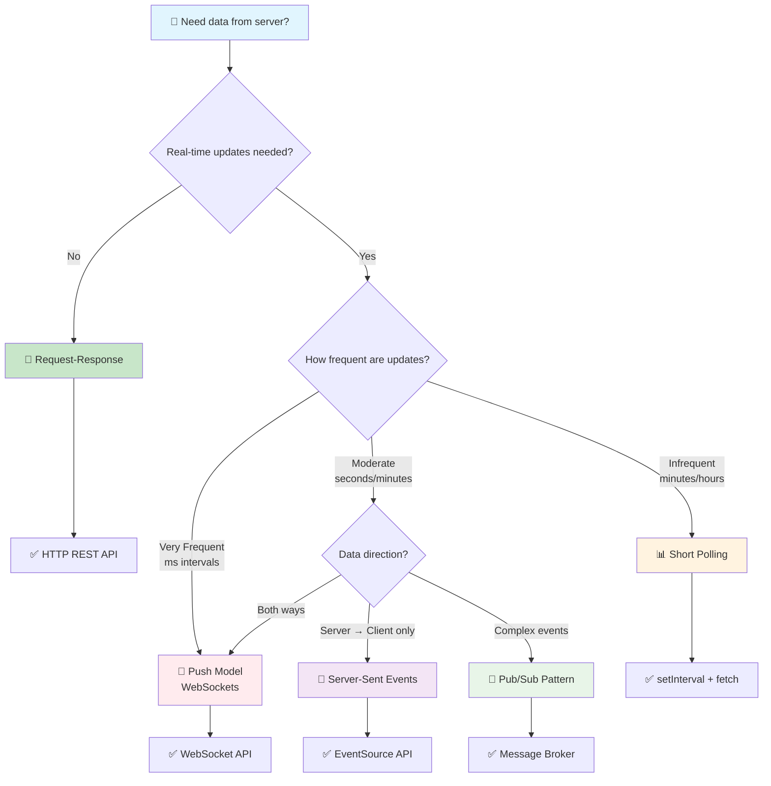
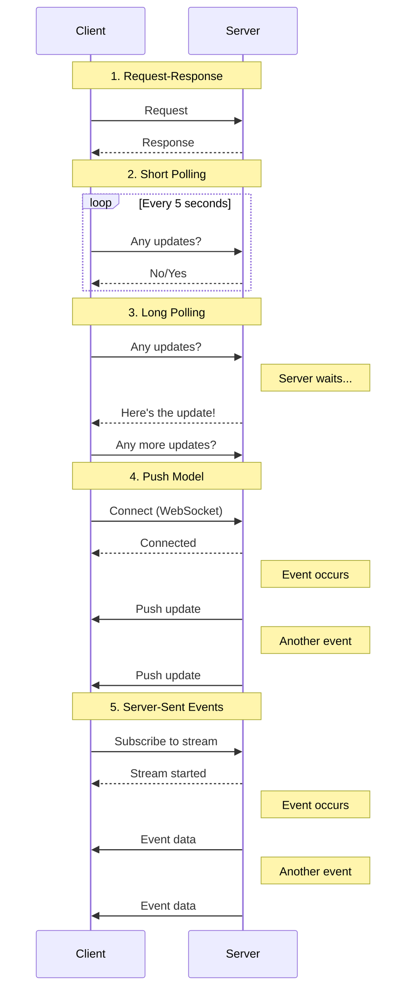
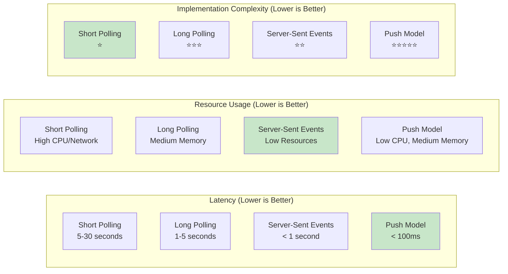
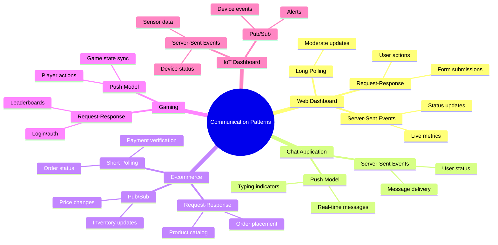
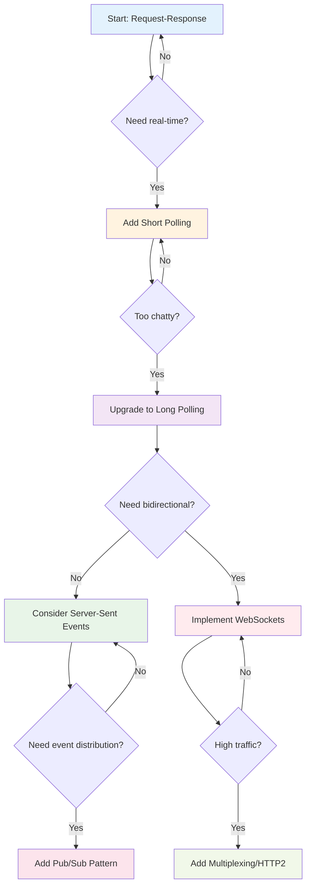

# Backend Communication Design Patterns - Summary

> **Cheat Sheet cho Frontend Developer học Backend** 📚

## Quick Reference Table

| Pattern | Core Concept | Analogy | Best For | Avoid When |
|---------|-------------|---------|----------|------------|
| **Request-Response** | "Ask → Get Answer" | Người phục vụ nhà hàng | Web APIs, REST | Real-time updates |
| **Sync vs Async** | "Wait vs Don't Wait" | Gọi điện vs Nhắn tin | I/O operations | Simple calculations |
| **Stateless vs Stateful** | "Remember vs Forget" | Máy ATM vs Tư vấn viên | Scalability | User sessions |
| **Short Polling** | "Are we there yet?" | Hỏi lại mãi | Simple status checks | Real-time apps |
| **Long Polling** | "Tell me when ready" | Chờ điện thoại reo | Near real-time | High-frequency updates |
| **Push Model** | "I'll send it to you" | Báo thức | Chat, Gaming | Simple updates |
| **Server-Sent Events** | "One-way live stream" | Radio broadcast | Live feeds | Two-way chat |
| **Pub/Sub** | "Broadcasting news" | Đài phát thanh | Event-driven systems | Direct communication |
| **Multiplexing** | "Multiple lanes" | Cao tốc nhiều làn | High traffic | Simple connections |

---

## 🏗️ **Foundation Patterns (Học trước tiên)**

### 1. Request-Response

**🎯 Core**: Client hỏi → Server trả lời  
**🔑 Keywords**: HTTP, REST API, Synchronous Communication  
**💡 Analogy**: Như order đồ ăn - bạn gọi món, phục vụ mang ra  
**✅ Use**: Web APIs, CRUD operations, simple data fetching  
**❌ Avoid**: Real-time updates, live notifications

```javascript
// Frontend gọi API
const response = await fetch('/api/users');
const users = await response.json();
```

### 2. Synchronous vs Asynchronous

**🎯 Core**: Wait vs Don't Wait  
**🔑 Keywords**: Blocking, Non-blocking, Async/Await, Promises  
**💡 Analogy**:

- **Sync**: Gọi điện (chờ người ta nhấc máy)
- **Async**: Nhắn tin (gửi xong làm việc khác)

**✅ Sync Use**: Simple operations, when order matters  
**✅ Async Use**: File I/O, API calls, database queries

```javascript
// Sync (blocking)
const data = fs.readFileSync('file.txt');

// Async (non-blocking) 
const data = await fs.readFile('file.txt');
```

### 3. Stateless vs Stateful

**🎯 Core**: Remember vs Forget between requests  
**🔑 Keywords**: JWT, Session, Cookies, Scalability  
**💡 Analogy**:

- **Stateless**: Máy ATM (cần thẻ mỗi lần)
- **Stateful**: Tư vấn viên ngân hàng (nhớ bạn)

**✅ Stateless**: REST APIs, microservices  
**✅ Stateful**: User sessions, game states  

---

## 📡 **Real-Time Communication Patterns**

### 4. Short Polling

**🎯 Core**: "Are we there yet?" - Hỏi lại hoài  
**🔑 Keywords**: Polling Interval, Job ID, Chattiness  
**💡 Analogy**: Trẻ con hỏi "đến chưa?" mỗi 5 giây  
**✅ Use**: Job status, infrequent updates  
**❌ Avoid**: Real-time chat, high-frequency data

```javascript
// Client keeps asking
setInterval(async () => {
  const status = await fetch(`/job/${jobId}/status`);
}, 5000);
```

### 5. Long Polling

**🎯 Core**: "Tell me when it's ready" - Server giữ request  
**🔑 Keywords**: Hold-and-Wait, Timeout, Reduced Chattiness  
**💡 Analogy**: "Gọi tôi khi có tin" rồi chờ điện thoại reo  
**✅ Use**: Chat systems, notifications, Kafka consumers  
**❌ Avoid**: Very high-frequency updates

```javascript
// Server holds request until data available
async function longPoll() {
  const response = await fetch('/events'); // Waits until new event
  const data = await response.json();
  longPoll(); // Immediately poll again
}
```

### 6. Push Model (WebSockets)

**🎯 Core**: "I'll send it to you" - Server chủ động gửi  
**🔑 Keywords**: Bidirectional, Persistent Connection, Real-time  
**💡 Analogy**: Báo thức - tự động reo khi đến giờ  
**✅ Use**: Live chat, gaming, collaboration tools  
**❌ Avoid**: Simple status updates, infrequent data

```javascript
const socket = new WebSocket('ws://localhost:8080');
socket.onmessage = (event) => {
  console.log('Server pushed:', event.data);
};
```

### 7. Server-Sent Events (SSE)

**🎯 Core**: "One-way live stream" - Server → Client only  
**🔑 Keywords**: EventSource, text/event-stream, Unidirectional  
**💡 Analogy**: Nghe radio - chỉ nhận, không gửi lại  
**✅ Use**: Live feeds, notifications, dashboards  
**❌ Avoid**: Two-way communication

```javascript
const eventSource = new EventSource('/live-feed');
eventSource.onmessage = (event) => {
  console.log('Live update:', event.data);
};
```

---

## 🏭 **System Architecture Patterns**

### 8. Publish-Subscribe (Pub/Sub)

**🎯 Core**: "Broadcasting system" - 1 gửi, nhiều người nhận  
**🔑 Keywords**: Publisher, Subscriber, Message Broker, Decoupling  
**💡 Analogy**: Đài phát thanh - 1 MC, nhiều người nghe  
**✅ Use**: Event-driven architecture, microservices  
**❌ Avoid**: Direct point-to-point communication

```javascript
// Publisher
pubsub.publish('user-registered', { userId: 123 });

// Subscriber
pubsub.subscribe('user-registered', (data) => {
  sendWelcomeEmail(data.userId);
});
```

### 9. Multiplexing/Demultiplexing

**🎯 Core**: "Multiple streams on one connection"  
**🔑 Keywords**: HTTP/2, Connection Pooling, Resource Sharing  
**💡 Analogy**: Cao tốc nhiều làn xe chạy cùng lúc  
**✅ Use**: High-traffic applications, HTTP/2  
**❌ Avoid**: Simple, low-traffic scenarios

---

## 📊 **Detailed Pattern Comparison Matrix**

### Real-Time Communication Patterns

| Aspect | Short Polling | Long Polling | Push Model (WS) | Server-Sent Events |
|--------|---------------|--------------|-----------------|-------------------|
| **Latency** | High (poll interval) | Low (hold-wait) | Immediate | Immediate |
| **Server Load** | High (frequent requests) | Medium (held connections) | Low (efficient push) | Low (single connection) |
| **Client Complexity** | Low | Medium | High | Low |
| **Connection Type** | Request-Response | Request-Response | Persistent Bidirectional | Persistent Unidirectional |
| **Bandwidth Usage** | High (many requests) | Low (few requests) | Very Low (data only) | Low (event stream) |
| **Disconnection Handling** | Excellent | Good | Poor (manual retry) | Good (auto-reconnect) |
| **Browser Support** | 100% | 100% | 95% | 95% |
| **Scaling Difficulty** | High (request volume) | Medium (connection state) | High (connection state) | Low (HTTP-based) |
| **Battery Impact** | High (mobile) | Medium | Medium | Low |
| **Implementation Time** | 30 mins | 2 hours | 1 day | 1 hour |

### Architecture Patterns

| Aspect | Request-Response | Pub/Sub | Multiplexing |
|--------|------------------|---------|--------------|
| **Coupling** | Direct (tight) | Loose (decoupled) | Direct (optimized) |
| **Scalability** | Limited | Excellent | Good |
| **Complexity** | Low | Medium | High |
| **Use Case** | CRUD operations | Event systems | High traffic |
| **Error Handling** | Simple | Complex | Medium |

### State Management

| Aspect | Stateless | Stateful |
|--------|-----------|----------|
| **Scalability** | Excellent (horizontal) | Limited (vertical) |
| **Memory Usage** | Low | High |
| **User Experience** | Good (with tokens) | Excellent |
| **Development Complexity** | Medium | Low |
| **Session Recovery** | Excellent | Poor |

---

## 📈 **Visual Flow Diagrams**

### Pattern Selection Decision Tree



### Communication Flow Comparison



### Real-Time Performance Comparison



---

## 🎯 **Pattern Selection Guide by Use Case**

### By Application Type



### By Technical Requirements

| Requirement | Recommended Pattern | Alternative | Avoid |
|-------------|-------------------|-------------|--------|
| **Ultra-low latency** (< 100ms) | Push Model (WebSockets) | - | Short Polling |
| **Simple implementation** | Request-Response | Short Polling | Push Model |
| **High scalability** | Server-Sent Events | Pub/Sub | Stateful patterns |
| **Bidirectional communication** | Push Model (WebSockets) | - | Server-Sent Events |
| **Battery-friendly mobile** | Server-Sent Events | Long Polling | Short Polling |
| **Legacy browser support** | Short Polling | Long Polling | Push Model |
| **Offline resilience** | Request-Response | Short Polling | Push Model |
| **Event-driven architecture** | Pub/Sub | Push Model | Request-Response |

---

## 🚀 **Evolution Path Visualization**

### Progressive Enhancement Strategy



---

## 📋 **Quick Pattern Cheat Sheet**

### Frontend Developer's Quick Decisions

| Scenario | Pattern | Code Snippet | Why? |
|----------|---------|--------------|------|
| **Form submission** | Request-Response | `await fetch('/api/users', {method: 'POST'})` | Simple, reliable |
| **Job progress tracking** | Short Polling | `setInterval(() => checkStatus(), 5000)` | Infrequent updates |
| **Live notifications** | Server-Sent Events | `new EventSource('/notifications')` | One-way, efficient |
| **Chat messages** | WebSockets | `new WebSocket('ws://chat')` | Bidirectional, real-time |
| **Live dashboard** | Server-Sent Events | `eventSource.onmessage = updateUI` | Continuous updates |
| **File upload status** | Long Polling | `await fetch('/upload-status')` | Wait for completion |
| **Multi-user collaboration** | WebSockets + Pub/Sub | `socket.broadcast.emit('update')` | Event distribution |

### Performance Impact Summary

| Pattern | Bandwidth | Server CPU | Server Memory | Client Battery |
|---------|-----------|------------|---------------|----------------|
| Request-Response | 🟢 Low | 🟢 Low | 🟢 Low | 🟢 Excellent |
| Short Polling | 🔴 High | 🔴 High | 🟡 Medium | 🔴 Poor |
| Long Polling | 🟡 Medium | 🟡 Medium | 🔴 High | 🟡 Good |
| Server-Sent Events | 🟢 Low | 🟢 Low | 🟡 Medium | 🟢 Excellent |
| Push Model (WebSockets) | 🟢 Very Low | 🟡 Medium | 🔴 High | 🟡 Good |
| Pub/Sub | 🟢 Low | 🟡 Medium | 🟡 Medium | 🟢 Good |

---

## 🎯 **Decision Framework for Frontend Developers**

### When Building Frontend Features

**🔄 Need updates from server?**

- **No**: Request-Response ✅
- **Yes**: Continue...

**⚡ How fast do you need updates?**

- **Immediate**: Push Model (WebSockets) or SSE ✅
- **Near real-time**: Long Polling ✅  
- **Can wait**: Short Polling ✅

**📡 What direction is data flowing?**

- **Both ways**: Push Model (WebSockets) ✅
- **Server → Client only**: Server-Sent Events ✅
- **Client → Server**: Request-Response ✅

**📊 How often do updates happen?**

- **Very frequent**: Push Model ✅
- **Moderate**: Long Polling or SSE ✅
- **Infrequent**: Short Polling ✅

---

## 🚀 **Pro Tips for Frontend Developers**

### 1. Start Simple, Scale Up

```text
Request-Response → Short Polling → Long Polling → SSE/WebSockets
```

### 2. Common Frontend Patterns

- **Form submission**: Request-Response
- **Live notifications**: SSE or Long Polling  
- **Chat**: WebSockets (Push Model)
- **Status monitoring**: Short/Long Polling
- **Live feeds**: SSE

### 3. Error Handling Hierarchy

1. **Request-Response**: Standard HTTP error codes
2. **Polling**: Retry logic + exponential backoff
3. **WebSockets**: Connection retry + heartbeat
4. **SSE**: Auto-reconnection built-in

### 4. Performance Considerations

- **Short Polling**: High bandwidth usage ⚠️
- **Long Polling**: Server memory usage ⚠️  
- **WebSockets**: Connection state management ⚠️
- **SSE**: HTTP/1.1 connection limits ⚠️

---

## 📝 **Quick Debugging Checklist**

### Real-time not working?

1. ✅ Check WebSocket connection status
2. ✅ Verify event listeners are attached  
3. ✅ Check for connection timeouts
4. ✅ Monitor network tab for failed requests

### Polling too slow?

1. ✅ Reduce polling interval (but watch server load)
2. ✅ Switch to Long Polling
3. ✅ Consider SSE for one-way updates

### High server load?

1. ✅ Too many polling requests? → Long Polling
2. ✅ Too many WebSocket connections? → Consider SSE
3. ✅ Optimize connection pooling

---

## 🎓 **Learning Path cho Frontend Developer**

### Week 1-2: Foundation

- ✅ Request-Response (REST APIs)  
- ✅ Sync vs Async (Promises, async/await)
- ✅ Stateless vs Stateful (JWT vs Sessions)

### Week 3-4: Real-time Basics

- ✅ Short Polling (Job status)
- ✅ Long Polling (Chat systems)
- ✅ Server-Sent Events (Live feeds)

### Week 5-6: Advanced Patterns

- ✅ WebSockets (Push Model)
- ✅ Pub/Sub (Event systems)  
- ✅ Multiplexing (HTTP/2)

### Week 7+: Practice Projects

- 🚀 Build a chat app (WebSockets)
- 🚀 Create live dashboard (SSE)
- 🚀 Job processing UI (Polling)

---

## 🔗 **Related Frontend Technologies**

| Backend Pattern | Frontend Implementation |
|----------------|------------------------|
| Request-Response | `fetch()`, `axios`, `XMLHttpRequest` |
| Server-Sent Events | `EventSource` API |
| WebSockets | `WebSocket` API, Socket.io |
| Long Polling | `fetch()` with loops |
| Short Polling | `setInterval()` + `fetch()` |

---

**💡 Remember**: Backend communication patterns solve the fundamental question: **"How does data flow between client and server?"**

Hiểu rõ từng pattern giúp bạn chọn đúng công cụ cho đúng việc! 🎯
