# Synchronous vs Asynchronous Communication

**Core Question**: Can I do work while waiting?

## Overview

Understanding synchronous vs asynchronous execution is fundamental to building efficient backend systems. This concept determines how your application handles I/O operations, user requests, and system resources.

## Synchronous Communication  

> "Wait Until I'm Done!"

This is the traditional, straightforward way of execution. When you execute a synchronous task, your program **stops and waits** for that task to complete before moving on to the next line of code.

### Definition

The caller sends a request and **blocks**, unable to execute any further code until a response is received. The caller and receiver are "in sync".

### Real-World Analogy

You're in a meeting and ask a colleague a question. It would be awkward to ignore them and start another task; you wait for their answer. That's synchronous communication.

### Code Example (File I/O)

```javascript
// --- Synchronous Code ---
console.log('1. Starting file read...');

// This operation BLOCKS the entire program. Nothing else can run.
const data = fs.readFileSync('largefile.txt');

console.log('2. File read complete!'); // Only runs AFTER file is fully read
console.log('3. Starting next task...');
```

**Output order**: `1` → `2` → `3` (predictable sequence)

## Asynchronous Communication

>"You Go Ahead, I'll Let You Know!"

This is a more modern and efficient approach for many backend tasks. When you execute an asynchronous task, your program **does not wait**. It kicks off the operation and immediately moves on to the next task.

### Async Definition

The caller sends a request but is **not blocked**; it can continue to execute other code while waiting for a response. When the task is done, it notifies the main program via a callback, promise, or another mechanism.

### Async Analogy

You send an email. You don't stare at your screen waiting for a reply. You move on to other work, and you'll be notified when the reply arrives. That's asynchronous communication.

### Async Code Example

```javascript
// --- Asynchronous Code ---
console.log('1. Starting file read...');

// Kicks off the file read and provides a callback function
fs.readFile('largefile.txt', (err, data) => {
  // This function is called LATER when file read completes
  console.log('3. File read complete!');
});

console.log('2. Starting next task...'); // This runs IMMEDIATELY
```

**Output order**: `1` → `2` → `3` (continues while file reads in background)

## Comparison at a Glance

| Aspect | Synchronous | Asynchronous |
|--------|-------------|--------------|
| **Execution** | Blocks and waits | Continues immediately |
| **Performance** | Lower throughput | Higher throughput |
| **Complexity** | Simple to understand | More complex |
| **Use Cases** | Simple operations | I/O operations, APIs |
| **Error Handling** | Direct try/catch | Callbacks/Promises |

## Visualizing the Difference

This simple Gantt chart illustrates the difference in the execution timeline.

```mermaid
gantt
    title Execution Flow Comparison
    dateFormat  X
    axisFormat %Ssec
    section Synchronous
    File Read (Blocking)  :done, 0, 5
    Other Work            :5, 4
    section Asynchronous
    File Read (Non-Blocking) :crit, 0, 5
    Other Work               :0, 4
```



## Keywords to Remember

- **Synchronous (Sync)**: Sequential, blocking, one-at-a-time execution
- **Asynchronous (Async)**: Concurrent, non-blocking execution
- **Blocking vs Non-Blocking**: Core technical difference in execution behavior
- **I/O Operations**: File access, network requests, database calls - ideal for async
- **Event Loop**: Mechanism enabling async behavior (e.g., Node.js)
- **Callback/Promise/Async-Await**: Programming constructs for handling async results

## Common Use Cases

### When to Use Synchronous

- **Simple operations** that complete quickly
- **Sequential logic** where order matters
- **CPU-intensive tasks** without I/O waiting
- **Configuration loading** at application startup

### When to Use Asynchronous

- **File operations** (reading/writing files)
- **Network requests** (APIs, databases)
- **User interfaces** (prevent UI freezing)
- **Concurrent processing** (handling multiple requests)

## Backend Engineering Examples

This concept is everywhere in backend systems:

### 1. Web Server Architecture

- **Synchronous**: Traditional servers handle one request at a time
- **Asynchronous**: Modern servers (Node.js, Nginx) handle thousands of concurrent connections

### 2. Database Operations

- **Sync Commits**: Wait for data to be written to disk before responding
- **Async Commits**: Return "success" immediately, write to disk in background
- **Async Replication**: Primary database doesn't wait for secondary confirmations

### 3. Job Processing

- **Synchronous**: Client waits for long-running job to complete
- **Asynchronous**: Return job ID immediately, process in background queue

### Example: Video Processing API

```javascript
// Synchronous approach (poor UX)
app.post('/process-video', async (req, res) => {
  const result = await processVideo(req.file); // Takes 5-10 minutes!
  res.json(result); // Client waits the entire time
});

// Asynchronous approach (better UX)
app.post('/process-video', async (req, res) => {
  const jobId = await queueVideoProcessing(req.file);
  res.json({ jobId, status: 'processing' }); // Immediate response
});

app.get('/job/:id', async (req, res) => {
  const status = await getJobStatus(req.params.id);
  res.json(status); // Client can check progress
});
```

## Conclusion

Understanding sync vs async is crucial for building efficient backend systems:

- **Use synchronous** for simple, fast operations
- **Use asynchronous** for I/O operations and better user experience
- **Modern systems favor async** for scalability and responsiveness
- **Choose based on your specific requirements** and user experience goals
