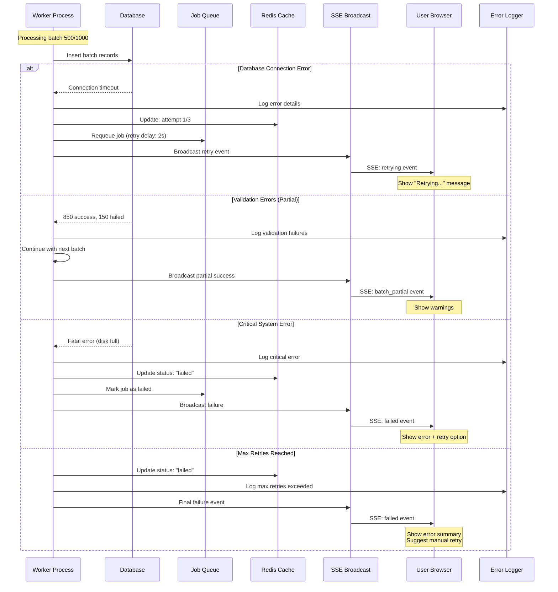

# Upload Large File Excel - Best Practices & Implementation Strategies

> **Xử lý upload file Excel 1 triệu records với các pattern backend phù hợp** 📊

## 🎯 **Bài toán thực tế**

**Scenario**: User upload file Excel 1 triệu records → Insert vào database → Cung cấp real-time progress cho user

**Challenges**:
- File size lớn (có thể 50-100MB+)
- Processing time lâu (5-30 phút)
- Memory consumption cao
- User experience (không biết đang ở đâu)
- Error handling (nếu fail ở record 500k thì sao?)

---

## 🏗️ **System Design Diagrams**

### **Overall System Architecture**


### **Component Responsibilities**

| Component | Responsibility | Technology |
|-----------|---------------|------------|
| **Load Balancer** | Route requests, health checks | Nginx/HAProxy |
| **API Servers** | Handle HTTP requests, validate files | Express.js/Node.js |
| **Job Queue** | Store and distribute tasks | Bull.js + Redis |
| **Workers** | Process Excel files, batch insert | Node.js processes |
| **File Storage** | Temporary file storage | Local disk/AWS S3 |
| **Database** | Store final records | MongoDB/PostgreSQL |
| **Cache** | Job status, progress tracking | Redis |
| **SSE Layer** | Real-time progress updates | Server-Sent Events |

---

## 📊 **Detailed Sequence Flows**

### **Flow 1: File Upload & Job Creation**


### **Flow 2: Background Processing with Progress Updates**


### **Flow 3: Real-time Progress Tracking (SSE)**


### **Flow 4: Error Handling & Recovery**



### **Flow 5: Frontend State Management**


---

## ⚙️ **Data Flow Architecture**

### **Data Processing Pipeline**


### **Memory & Performance Optimization**


---

## 📋 **Recommended Solution: Hybrid Pattern**

### **Step 1: File Upload (Request-Response)**
```typescript
// POST /api/upload/excel
interface UploadResponse {
    success: boolean;
    jobId: string;
    fileName: string;
    totalRows: number; // Estimated from file
    message: string;
}
```

### **Step 2: Background Processing (Job Queue)**
```typescript
interface ProcessingJob {
    jobId: string;
    filePath: string;
    userId: string;
    totalRows: number;
    status: 'pending' | 'processing' | 'completed' | 'failed';
    processedRows: number;
    successRows: number;
    failedRows: number;
    errors: string[];
}
```

### **Step 3: Progress Tracking (Server-Sent Events)**
```typescript
// GET /api/progress/{jobId}/stream
interface ProgressEvent {
    jobId: string;
    type: 'progress' | 'batch_complete' | 'error' | 'completed';
    data: {
        totalRows: number;
        processedRows: number;
        successRows: number;
        failedRows: number;
        percentage: number;
        currentBatch: number;
        estimatedTimeRemaining?: string;
        errors?: string[];
        insertedIds?: string[]; // IDs of last 1000 inserted records
    };
}
```

---

## 🤔 **Tại sao SSE không phù hợp cho File Upload?**

### **Hiểu lầm thường gặp:**
> "SSE không phù hợp cho file uploads" **KHÔNG có nghĩa** là không dùng SSE trong luồng upload

### **Ý nghĩa thực tế:**

1. **❌ SSE không thể upload file:**
   ```javascript
   // WRONG - Không thể làm như này
   eventSource.send(fileData); // SSE chỉ receive, không send
   ```

2. **✅ SSE dùng cho progress tracking:**
   ```javascript
   // CORRECT - Dùng SSE để track progress
   // Upload qua HTTP POST → Track progress qua SSE
   ```

### **Lý do kỹ thuật:**

| Aspect | HTTP Upload | SSE |
|--------|------------|-----|
| **Direction** | Client → Server | Server → Client |
| **Data Size** | Large files (GB) | Small messages (KB) |
| **Purpose** | Transfer data | Stream updates |
| **Protocol** | POST multipart | GET text/event-stream |
| **Buffering** | Chunked upload | Text messages |

---

## 🔐 **User Authentication & Targeting trong SSE**

### **Challenge: Làm sao biết event gửi cho user nào?**

### **Solution 1: Query Parameter Authentication**
```typescript
// Client kết nối với token
const eventSource = new EventSource(`/api/progress/${jobId}/stream?token=${userToken}`);

// Server verify
app.get('/api/progress/:jobId/stream', (req, res) => {
    const token = req.query.token;
    const user = verifyToken(token);
    
    if (!user) {
        return res.status(401).json({ error: 'Unauthorized' });
    }
    
    // Store connection với userId
    connections.set(user.id, res);
});
```

### **Solution 2: Cookie-based Authentication**
```typescript
// Client tự động gửi cookie
const eventSource = new EventSource('/api/progress/stream');

// Server đọc cookie
app.get('/api/progress/stream', authenticateUser, (req, res) => {
    const userId = req.user.id; // From cookie middleware
    
    // Store connection
    userConnections.set(userId, res);
});
```

### **Solution 3: Connection Mapping Strategy**
```typescript
// Advanced: Map connections theo multiple criteria
const connectionMap = new Map<string, {
    userId: string;
    jobId: string;
    response: express.Response;
    connectedAt: Date;
}>();

function broadcastToUser(userId: string, data: any) {
    connectionMap.forEach((conn, connId) => {
        if (conn.userId === userId) {
            conn.response.write(`data: ${JSON.stringify(data)}\n\n`);
        }
    });
}

function broadcastToJob(jobId: string, data: any) {
    connectionMap.forEach((conn, connId) => {
        if (conn.jobId === jobId) {
            conn.response.write(`data: ${JSON.stringify(data)}\n\n`);
        }
    });
}
```

---

## 🤔 **Deep Dive: Advanced Questions & Answers**

### **Q1: Job Queue là gì và tại sao cần nó?**

#### **Job Queue Overview:**
Job Queue là một **message broker pattern** để xử lý tasks nặng trong background.


#### **Tại sao cần Job Queue:**

| **Without Job Queue** | **With Job Queue** |
|----------------------|-------------------|
| 🐌 Client wait 30 phút | ⚡ Client get response ngay lập tức |
| 💥 Server timeout | ✅ Background processing |
| 🔄 Single-threaded | 🚀 Multi-worker scalable |
| ❌ No retry on failure | 🔄 Auto retry với backoff |
| 📊 No progress tracking | 📈 Real-time progress |

#### **Implementation với Bull Queue:**

```typescript
// 1. Setup Job Queue
import Bull from 'bull';
import Redis from 'ioredis';

const redis = new Redis({
    host: 'localhost',
    port: 6379,
    retryDelayOnFailover: 100
});

const excelQueue = new Bull('excel processing', {
    redis: {
        port: 6379,
        host: 'localhost'
    },
    defaultJobOptions: {
        removeOnComplete: 10,    // Keep last 10 completed jobs
        removeOnFail: 50,        // Keep last 50 failed jobs
        attempts: 3,             // Retry 3 times
        backoff: {
            type: 'exponential',
            delay: 2000,         // Start with 2s delay
        }
    }
});

// 2. Add Job to Queue
async function createExcelProcessingJob(jobData: ProcessingJob) {
    const job = await excelQueue.add('process-excel', jobData, {
        priority: jobData.totalRows > 100000 ? 1 : 10, // High priority for large files
        delay: 0,                                       // Process immediately
        jobId: jobData.jobId                           // Custom job ID
    });
    
    console.log(`Job ${job.id} added to queue`);
    return job;
}

// 3. Process Jobs
excelQueue.process('process-excel', 5, async (job) => {
    // 5 = concurrent workers
    const jobData: ProcessingJob = job.data;
    
    try {
        // Update status to processing
        await updateJobStatus(jobData.jobId, 'processing');
        
        // Your processing logic here
        await processExcelFile(jobData);
        
        // Mark as completed
        await updateJobStatus(jobData.jobId, 'completed');
        
    } catch (error) {
        await updateJobStatus(jobData.jobId, 'failed');
        throw error; // Let Bull handle retry
    }
});

// 4. Job Status Tracking
interface JobStatus {
    jobId: string;
    status: 'pending' | 'processing' | 'completed' | 'failed' | 'retrying';
    progress: number;
    attempts: number;
    error?: string;
    createdAt: Date;
    updatedAt: Date;
}
```

#### **Job Status Lifecycle:**


**Status Meanings:**
- **`pending`**: Job đã tạo, đang chờ worker xử lý
- **`processing`**: Worker đã pick up job và đang xử lý
- **`retrying`**: Job failed nhưng sẽ retry lại
- **`completed`**: Xử lý thành công hoàn toàn
- **`failed`**: Fail và không retry nữa

---

### **Q2: Tại sao có failedRows trong ProgressEvent?**

#### **Partial Failure Strategy - Best Practice:**

Thực tế trong production, **không nên fail toàn bộ job** chỉ vì 1 vài records lỗi.

```typescript
// ❌ BAD: All-or-nothing approach
async function processBatch(records: any[]) {
    try {
        await db.insertMany(records); // If 1 record fails → all 1000 fail
        return { success: 1000, failed: 0 };
    } catch (error) {
        return { success: 0, failed: 1000 }; // Lose all data!
    }
}

// ✅ GOOD: Partial failure handling
async function processBatchWithPartialFailure(records: any[]) {
    const results = {
        successCount: 0,
        failedCount: 0,
        successIds: [] as string[],
        failedRecords: [] as { record: any, error: string }[]
    };
    
    // Strategy 1: Individual inserts with transaction
    const session = await db.startSession();
    session.startTransaction();
    
    try {
        for (const record of records) {
            try {
                // Validate record first
                const validatedRecord = await validateRecord(record);
                
                // Insert individual record
                const result = await db.collection('records').insertOne(validatedRecord, { session });
                
                results.successCount++;
                results.successIds.push(result.insertedId.toString());
                
            } catch (recordError) {
                results.failedCount++;
                results.failedRecords.push({
                    record,
                    error: recordError.message
                });
                
                // Log but continue processing
                console.warn(`Record failed:`, recordError.message);
            }
        }
        
        await session.commitTransaction();
        
    } finally {
        await session.endSession();
    }
    
    return results;
}

// Strategy 2: Batch insert with error collection
async function processBatchSmartly(records: any[]) {
    const validRecords = [];
    const invalidRecords = [];
    
    // Pre-validate all records
    for (const record of records) {
        try {
            const validated = await validateRecord(record);
            validRecords.push(validated);
        } catch (error) {
            invalidRecords.push({ record, error: error.message });
        }
    }
    
    // Insert valid records in batch
    let insertResult = null;
    if (validRecords.length > 0) {
        try {
            insertResult = await db.collection('records').insertMany(validRecords, {
                ordered: false // Continue on error
            });
        } catch (bulkError) {
            // Handle partial bulk insert failures
            console.error('Bulk insert error:', bulkError);
        }
    }
    
    return {
        successCount: insertResult?.insertedCount || 0,
        failedCount: invalidRecords.length,
        successIds: insertResult ? Object.values(insertResult.insertedIds) : [],
        failedRecords: invalidRecords
    };
}
```

#### **Real-world Example:**

```typescript
// Excel processing with partial failures
async function processExcelWithErrorHandling(jobData: ProcessingJob) {
    const BATCH_SIZE = 1000;
    let totalSuccess = 0;
    let totalFailed = 0;
    const allErrors: string[] = [];
    
    for (let i = 0; i < jobData.totalRows; i += BATCH_SIZE) {
        const batch = excelData.slice(i, i + BATCH_SIZE);
        
        const batchResult = await processBatchWithPartialFailure(batch);
        
        totalSuccess += batchResult.successCount;
        totalFailed += batchResult.failedCount;
        
        // Collect error details
        batchResult.failedRecords.forEach(failed => {
            allErrors.push(`Row ${i + records.indexOf(failed.record)}: ${failed.error}`);
        });
        
        // Broadcast progress (including failures)
        broadcastProgress(jobData.jobId, {
            type: 'batch_complete',
            data: {
                totalRows: jobData.totalRows,
                processedRows: i + batch.length,
                successRows: totalSuccess,
                failedRows: totalFailed,
                percentage: Math.round(((i + batch.length) / jobData.totalRows) * 100),
                currentBatch: Math.floor(i / BATCH_SIZE) + 1,
                insertedIds: batchResult.successIds,
                errors: batchResult.failedRecords.map(f => f.error).slice(0, 5) // Show recent errors
            }
        });
        
        // Continue processing even if some records failed
    }
    
    // Final summary
    const finalStatus = totalFailed > 0 ? 'completed_with_errors' : 'completed';
    
    broadcastProgress(jobData.jobId, {
        type: 'completed',
        data: {
            totalRows: jobData.totalRows,
            processedRows: jobData.totalRows,
            successRows: totalSuccess,
            failedRows: totalFailed,
            percentage: 100,
            errors: allErrors.slice(0, 10), // Show first 10 errors
            summary: `Processing completed: ${totalSuccess} success, ${totalFailed} failed`
        }
    });
}
```

#### **Benefits của Partial Failure:**
- ✅ **Data Recovery**: Không mất hết data vì 1 vài records lỗi
- ✅ **User Experience**: User biết được exact số lượng success/failed
- ✅ **Debugging**: Có thể fix lỗi và re-upload chỉ failed records
- ✅ **Business Value**: Partial data vẫn có giá trị sử dụng

---

### **Q3: Protect JobId Security cho User**

#### **Security Concerns:**
```typescript
// ❌ VULNERABLE: Anyone can access any job
GET /api/progress/job_123456/stream  // No validation

// ✅ SECURE: Only job owner can access
GET /api/progress/job_123456/stream  // With user validation
```

#### **Implementation: Multi-layer Security**

```typescript
// 1. Job Ownership Database Schema
interface JobRecord {
    jobId: string;
    userId: string;           // Owner of the job
    fileName: string;
    status: JobStatus;
    createdAt: Date;
    permissions: {
        canView: string[];    // UserIDs who can view
        canControl: string[]; // UserIDs who can pause/cancel
    };
    isPublic: boolean;        // For shared jobs
}

// 2. Authentication Middleware
async function authenticateUser(req: Request, res: Response, next: NextFunction) {
    try {
        const token = req.headers.authorization?.replace('Bearer ', '') || 
                     req.query.token || 
                     req.cookies.authToken;
        
        if (!token) {
            return res.status(401).json({ error: 'No authentication token provided' });
        }
        
        const decoded = jwt.verify(token, process.env.JWT_SECRET!);
        const user = await User.findById(decoded.userId);
        
        if (!user) {
            return res.status(401).json({ error: 'Invalid token' });
        }
        
        req.user = user;
        next();
    } catch (error) {
        return res.status(401).json({ error: 'Authentication failed' });
    }
}

// 3. Job Authorization Middleware
async function authorizeJobAccess(req: Request, res: Response, next: NextFunction) {
    try {
        const { jobId } = req.params;
        const userId = req.user.id;
        
        // Get job from database
        const job = await JobRecord.findOne({ jobId });
        
        if (!job) {
            return res.status(404).json({ error: 'Job not found' });
        }
        
        // Check ownership
        if (job.userId !== userId) {
            // Check if user has permission
            if (!job.permissions.canView.includes(userId) && !job.isPublic) {
                return res.status(403).json({ 
                    error: 'Access denied. You do not own this job.' 
                });
            }
        }
        
        // Add job to request for use in handler
        req.job = job;
        next();
        
    } catch (error) {
        return res.status(500).json({ error: 'Authorization check failed' });
    }
}

// 4. Secure SSE Endpoint
app.get('/api/progress/:jobId/stream', 
    authenticateUser,           // Step 1: Verify user identity
    authorizeJobAccess,         // Step 2: Check job access rights
    async (req, res) => {
        const { jobId } = req.params;
        const userId = req.user.id;
        const job = req.job;
        
        // Setup SSE
        res.writeHead(200, {
            'Content-Type': 'text/event-stream',
            'Cache-Control': 'no-cache',
            'Connection': 'keep-alive',
            'Access-Control-Allow-Origin': '*'
        });
        
        // Store connection with user context
        const connectionId = `${userId}_${jobId}_${Date.now()}`;
        progressConnections.set(connectionId, {
            response: res,
            userId,
            jobId,
            connectedAt: new Date(),
            permissions: job.permissions
        });
        
        // Send current status
        const currentProgress = await getJobProgress(jobId);
        if (currentProgress) {
            res.write(`data: ${JSON.stringify({
                type: 'progress',
                data: currentProgress
            })}\n\n`);
        }
        
        // Log access (for security auditing)
        console.log(`User ${userId} connected to job ${jobId} progress stream`);
        
        // Cleanup on disconnect
        req.on('close', () => {
            progressConnections.delete(connectionId);
            console.log(`User ${userId} disconnected from job ${jobId}`);
        });
    }
);

// 5. Secure Broadcast Function
function broadcastProgress(jobId: string, progressData: ProgressEvent) {
    progressConnections.forEach((connection, connectionId) => {
        if (connection.jobId === jobId) {
            try {
                if (!connection.response.writableEnded) {
                    // Additional data filtering based on permissions
                    const filteredData = filterDataByPermissions(progressData, connection.permissions);
                    
                    connection.response.write(`data: ${JSON.stringify(filteredData)}\n\n`);
                }
            } catch (error) {
                progressConnections.delete(connectionId);
            }
        }
    });
}

// 6. Permission-based Data Filtering
function filterDataByPermissions(data: ProgressEvent, permissions: any): ProgressEvent {
    // Example: Hide detailed error messages from view-only users
    if (!permissions.canControl.includes(data.userId)) {
        if (data.data.errors) {
            data.data.errors = data.data.errors.map(() => 'Error occurred (details hidden)');
        }
    }
    
    return data;
}

// 7. Additional Security: Rate Limiting
import rateLimit from 'express-rate-limit';

const progressStreamLimit = rateLimit({
    windowMs: 15 * 60 * 1000, // 15 minutes
    max: 10, // Max 10 SSE connections per user per 15 minutes
    keyGenerator: (req) => req.user.id,
    message: 'Too many progress stream connections. Please try again later.'
});

app.get('/api/progress/:jobId/stream', 
    progressStreamLimit,        // Rate limiting
    authenticateUser,
    authorizeJobAccess,
    // ... SSE handler
);

// 8. Job Sharing Feature (Optional)
interface ShareJobRequest {
    jobId: string;
    shareWithUsers: string[];   // UserIDs
    permissions: 'view' | 'control';
    expiresAt?: Date;
}

app.post('/api/jobs/:jobId/share', 
    authenticateUser,
    authorizeJobAccess,
    async (req, res) => {
        const { jobId } = req.params;
        const { shareWithUsers, permissions, expiresAt }: ShareJobRequest = req.body;
        
        // Update job permissions
        await JobRecord.updateOne(
            { jobId, userId: req.user.id }, // Only owner can share
            {
                $addToSet: {
                    [`permissions.${permissions === 'control' ? 'canControl' : 'canView'}`]: {
                        $each: shareWithUsers
                    }
                },
                sharedAt: new Date(),
                sharedBy: req.user.id,
                expiresAt
            }
        );
        
        res.json({ success: true, message: 'Job shared successfully' });
    }
);
```

#### **Security Best Practices:**

```typescript
// 1. Environment-based Security
const SECURITY_CONFIG = {
    JWT_SECRET: process.env.JWT_SECRET,
    JWT_EXPIRES_IN: '24h',
    MAX_CONCURRENT_JOBS_PER_USER: 5,
    MAX_SSE_CONNECTIONS_PER_USER: 3,
    JOB_RETENTION_DAYS: 30
};

// 2. Audit Logging
interface SecurityAuditLog {
    userId: string;
    action: 'job_created' | 'job_accessed' | 'job_shared' | 'unauthorized_access';
    jobId: string;
    ip: string;
    userAgent: string;
    timestamp: Date;
    details?: any;
}

function logSecurityEvent(event: SecurityAuditLog) {
    // Log to security monitoring system
    console.log('SECURITY_AUDIT:', JSON.stringify(event));
    
    // Store in database for analysis
    SecurityLog.create(event);
}

// 3. Input Validation
import Joi from 'joi';

const jobIdSchema = Joi.string().uuid().required();

function validateJobId(req: Request, res: Response, next: NextFunction) {
    const { error } = jobIdSchema.validate(req.params.jobId);
    if (error) {
        return res.status(400).json({ error: 'Invalid job ID format' });
    }
    next();
}
```

**Security Layers Summary:**
1. **Authentication**: JWT tokens verify user identity
2. **Authorization**: Database checks job ownership
3. **Rate Limiting**: Prevent abuse of SSE connections
4. **Input Validation**: Validate jobId format
5. **Audit Logging**: Track all access attempts
6. **Permission System**: Fine-grained access control
7. **Data Filtering**: Hide sensitive info based on permissions

---

## 🎯 **Conclusion**

**Recommended Architecture cho Excel Upload 1M records:**

1. **HTTP POST** cho file upload (fast, reliable)
2. **Job Queue** cho background processing (scalable, fault-tolerant)
3. **SSE** cho real-time progress updates (user-friendly)
4. **Database batching** cho performance (efficient)

**Key Points:**
- SSE hoàn toàn phù hợp cho **progress tracking**, không phù hợp cho **file transfer**
- Authentication trong SSE thông qua query params hoặc cookies
- Job-based processing cho reliability và scalability
- Batch processing cho database performance

Cách tiếp cận này balance giữa performance, user experience, và system reliability! 🎯
