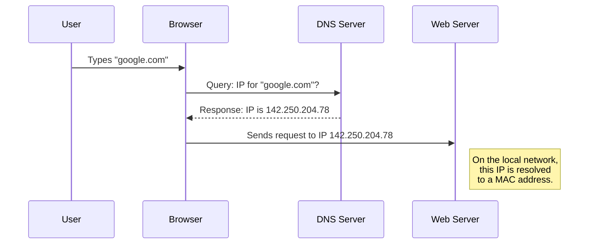

# Protocol Properties

## Overview

Hãy tưởng tượng các thuộc tính của giao thức giống như "**luật chơi**" hay "**ngữ pháp**" của một cuộc hội thoại. Để hai người (hoặc hai máy tính) có thể nói chuyện và hiểu nhau, họ cần phải thống nhất về:

- **Ngôn ngữ**: Hai bên sẽ dùng ngôn ngữ nào? (Văn bản con người đọc được hay mã nhị phân cho máy?) – **Data Format**.
- **Cách thức nói chuyện**: Sẽ nói từng câu ngắn gọn, dứt khoát hay nói một tràng dài liên tục? – **Transfer Mode**.
- **Địa chỉ người nhận**: Bức thư này sẽ gửi cho ai, ở đâu? – **Addressing System**.
- **Đường đi đến đích**: Liệu có cần đi qua các "trạm trung chuyển" như proxy hay không? – **Routing**.
- **Kiểu hội thoại**: Đây là cuộc đối thoại hai chiều hay chỉ là một bài phát thanh một chiều? – **Directionality**.
- **Trí nhớ**: Người nghe có cần nhớ những gì đã nói trước đó không? – **State**.
- **Ứng xử khi gặp sự cố**: Nếu một bên nói quá nhanh thì sao? Nếu không nghe rõ thì phải làm gì? – **Flow & Congestion Control** và **Error Management**.

Mỗi "luật chơi" này tương ứng với một thuộc tính của giao thức. Việc lựa chọn giao thức nào để sử dụng phụ thuộc hoàn toàn vào mục đích của ứng dụng, giống như bạn chọn cách giao tiếp khác nhau trong một cuộc họp trang trọng so với khi trò chuyện với bạn bè.

## 1. Data Format (Định dạng dữ liệu)

- **Giải thích đơn giản**: Đây là "ngôn ngữ" mà hai bên thống nhất sử dụng. Nó có thể là ngôn ngữ con người đọc được hoặc ngôn ngữ chỉ máy tính mới hiểu.
- **Chi tiết kỹ thuật**:
  - **Text-based (Dạng văn bản)**: Dữ liệu được truyền đi dưới dạng ký tự mà con người có thể đọc được như JSON, XML, hay văn bản thuần túy. Ưu điểm là dễ gỡ lỗi (debug) nhưng nhược điểm là kích thước lớn hơn.
  - **Binary (Dạng nhị phân)**: Dữ liệu được truyền dưới dạng các bit 0 và 1, không được thiết kế cho con người đọc. Ưu điểm là rất hiệu quả, nhỏ gọn, và xử lý nhanh. Nhược điểm là khó debug nếu không có công cụ chuyên dụng.
- **Ví dụ**:
  - **Dễ hiểu**: Khi bạn viết email, bạn đang dùng định dạng **text-based**. Khi bạn gửi một file ảnh .jpg, bạn đang dùng định dạng **binary**.
  - **Thực tế**: Một **REST API** cho ứng dụng web thường trả về dữ liệu người dùng dưới dạng **JSON** (text-based). Trong khi đó, giao tiếp giữa các microservices hiệu năng cao trong nội bộ Google thường dùng gRPC với **Protocol Buffers** (binary) để tiết kiệm băng thông và giảm độ trễ.

## 2. Transfer Mode (Chế độ truyền tải)

- **Giải thích đơn giản**: Đây là cách dữ liệu được "đóng gói" và gửi đi. Giống như bạn gửi một loạt bưu thiếp riêng lẻ (mỗi cái là một thông điệp hoàn chỉnh) hay bạn gọi một cuộc điện thoại (một dòng chảy thông tin liên tục).
- **Chi tiết kỹ thuật**:
  - **Message-based (Dựa trên thông điệp)**: Dữ liệu được chia thành các gói tin (message) riêng biệt, mỗi gói có điểm bắt đầu và kết thúc rõ ràng. Giao thức **UDP** và **HTTP** là ví dụ điển hình.
  - **Stream-based (Dựa trên luồng)**: Dữ liệu là một dòng chảy liên tục của các byte không có ranh giới rõ ràng. Bên nhận phải tự phân tích dòng chảy này để xác định các thông điệp. **TCP** là giao thức stream kinh điển.
- **Ví dụ**:
  - **Dễ hiểu**: Gửi tin nhắn SMS là **message-based**. Xem video trực tiếp trên YouTube là **stream-based**.
  - **Thực tế**: Một ứng dụng game online có thể dùng **UDP (message-based)** để gửi tọa độ của người chơi. Mỗi gói tin là một bản cập nhật hoàn chỉnh và độc lập. Ngược lại, khi bạn tải một file lớn từ một trang web, trình duyệt sẽ dùng **TCP (stream-based)** để nhận một dòng dữ liệu liên tục cho đến khi file được tải xong.

## 3. Addressing System (Hệ thống địa chỉ)

- **Giải thích đơn giản**: Làm thế nào để biết "gửi cho ai" và "gửi từ đâu". Giống như địa chỉ nhà của bạn có số nhà, tên đường, quận, thành phố.
- **Chi tiết kỹ thuật**: Giao tiếp mạng có nhiều lớp địa chỉ:
  - **DNS name** (ví dụ: `google.com`): Tên miền mà con người dễ nhớ (Lớp 7).
  - **IP address** (ví dụ: `142.250.204.78`): Địa chỉ logic của máy chủ trên mạng Internet (Lớp 3).
  - **MAC address**: Địa chỉ vật lý của card mạng, dùng trong mạng nội bộ (Lớp 2).
- **Ví dụ**:
  - **Dễ hiểu**: Bạn muốn gọi cho "Ba", bạn tìm trong danh bạ để lấy số điện thoại của "Ba" rồi mới bấm số gọi.
  - **Thực tế**: Khi bạn gõ google.com (DNS) vào trình duyệt, máy tính của bạn sẽ hỏi máy chủ DNS để tìm ra địa chỉ **IP** tương ứng. Sau đó, nó tạo một yêu cầu đến địa chỉ IP đó. Khi gói tin đi qua mạng LAN nhà bạn, router sẽ dùng địa chỉ **MAC** để đảm bảo gói tin đến đúng laptop của bạn chứ không phải điện thoại của người khác.

## 4. Directionality (Tính định hướng)

- **Giải thích đơn giản**: Thuộc tính này xác định luồng di chuyển của dữ liệu. Giống như một con đường có thể là **đường một chiều**, **đường hai chiều**, hoặc **đường hai chiều nhưng hẹp** (chỉ cho phép một xe đi tại một thời điểm).
- **Chi tiết kỹ thuật**:
  - **Unidirectional**: Dữ liệu chỉ chảy theo một hướng. Mặc dù **HTTP** được xây dựng trên **TCP** (vốn là hai chiều), ở tầng ứng dụng, luồng đi của nó mang tính một chiều: client gửi một yêu cầu hoàn chỉnh, sau đó server gửi lại một phản hồi hoàn chỉnh.
  - **Bidirectional**: Dữ liệu có thể chảy theo cả hai hướng. Giao thức **TCP** là một ví dụ điển hình. Trong hai chiều, ta còn phân biệt:
    - **Full-duplex**: Hai bên có thể gửi và nhận dữ liệu **cùng một lúc**.
    - **Half-duplex**: Hai bên đều có thể gửi và nhận, nhưng **không phải cùng một lúc**. Chỉ một bên được truyền tại một thời điểm.
- **Ví dụ**:
  - **Dễ hiểu**: Một chương trình phát thanh trên đài AM/FM là **unidirectional**. Một cuộc gọi điện thoại là **bidirectional full-duplex**. Một cuộc nói chuyện qua bộ đàm là **bidirectional half-duplex** (bạn phải nhấn nút để nói và thả ra để nghe).
  - **Thực tế**: Một kết nối **WebSocket** dùng cho ứng dụng chat là ví dụ kinh điển của **bidirectional full-duplex**. Server có thể đẩy tin nhắn mới xuống cho bạn cùng lúc bạn đang gõ và gửi một tin nhắn khác đi. Trong khi đó, một yêu cầu `GET` HTTP thông thường có logic **unidirectional**: client gửi yêu cầu, rồi chờ server trả lời, không có chuyện server "chen ngang" để gửi một dữ liệu khác khi client chưa nhận xong phản hồi.

## 5. State (Trạng thái)

- **Giải thích đơn giản**: Liệu máy chủ có cần "nhớ" những gì đã xảy ra trong các lần giao tiếp trước đó với bạn hay không.
- **Chi tiết kỹ thuật**:
  - **Stateful (Có trạng thái)**: Máy chủ duy trì thông tin về phiên làm việc của client. Mỗi yêu cầu sau đó được xử lý trong bối cảnh của các yêu cầu trước.
    **TCP** là stateful vì nó phải nhớ trạng thái của kết nối (đang mở, đang đóng, đã gửi bao nhiêu byte...).
  - **Stateless (Không trạng thái)**: Mỗi yêu cầu từ client là hoàn toàn độc lập. Máy chủ không lưu lại bất kỳ thông tin nào về các yêu cầu trước đó. Mỗi yêu cầu phải chứa tất cả thông tin cần thiết để được xử lý.
    **HTTP** và **UDP** là stateless.
- **Ví dụ**:
  - **Dễ hiểu**: Một cuộc trò chuyện là **stateful** (bạn nhớ những gì người kia vừa nói). Việc hỏi giờ một người lạ trên đường là **stateless** (mỗi lần hỏi là một sự kiện mới, không liên quan đến lần hỏi trước).
  - **Thực tế**: Một kết nối đến cơ sở dữ liệu là **stateful**. Sau khi đăng nhập, máy chủ biết bạn là ai và có quyền gì cho các truy vấn tiếp theo. Ngược lại, một **REST API** là **stateless**. Yêu cầu `GET /api/products/123` luôn trả về thông tin sản phẩm 123, bất kể bạn là ai hay đã làm gì trước đó.

## 6. Routing (Định tuyến)

- **Giải thích đơn giản**: Đây là cách mà giao thức xử lý việc đi qua các "trạm trung chuyển" (như proxy, gateway) trên đường đến đích cuối cùng. Giống như bạn gửi một bưu kiện quốc tế, nó không đi thẳng từ nhà bạn đến nhà người nhận mà phải qua bưu cục địa phương, trung tâm khai thác, hải quan...
- **Chi tiết kỹ thuật**: Thuộc tính này mô tả cách giao thức của bạn tương tác với các proxy và gateway. Đích đến cuối cùng của bạn có thể là `google.com`, nhưng kết nối **TCP** ngay trước mắt của bạn lại là đến một máy chủ proxy trong mạng công ty. Máy chủ proxy đó sau đó sẽ thay mặt bạn tạo một kết nối khác đến `google.com`. Giao thức phải có các quy tắc để xử lý việc này, ví dụ như làm sao để proxy biết được đích đến cuối cùng mà bạn muốn là gì (ví dụ: thông qua header `Host` trong **HTTP**).
- **Ví dụ**:
  - **Dễ hiểu**: Kế hoạch đi từ Hà Nội vào TP.HCM. Đích cuối cùng là TP.HCM, nhưng chặng đường trước mắt của bạn có thể là đi tới Ninh Bình, rồi tới Vinh... Mỗi "trạm" này là một bước định tuyến.
  - **Thực tế**: Trong một mạng doanh nghiệp, khi bạn truy cập web, yêu cầu của bạn thường đi qua một **Forward Proxy**. Trình duyệt của bạn kết nối tới proxy, và proxy này sẽ chuyển tiếp yêu cầu của bạn tới Internet. Một ví dụ khác là **Reverse Proxy** (như NGINX) hoặc **API Gateway**. Client chỉ kết nối tới một địa chỉ duy nhất của Reverse Proxy, sau đó Reverse Proxy sẽ dựa vào đường dẫn (ví dụ `/api/users` hay `/api/products`) để định tuyến yêu cầu đến đúng microservice backend tương ứng.

## 7. Flow & Congestion Control (Kiểm soát luồng & tắc nghẽn)

- **Giải thích đơn giản**: Cơ chế để tránh việc bên gửi "nói" quá nhanh khiến bên nhận không "nghe" kịp (Flow Control), hoặc tránh việc quá nhiều người cùng "nói" làm "tắc" đường truyền (Congestion Control).
- **Chi tiết kỹ thuật**:
  - **TCP** có cả hai cơ chế này. Nó điều chỉnh tốc độ gửi dữ liệu để phù hợp với khả năng nhận của máy chủ và tình trạng của mạng lưới, đảm bảo việc truyền tin cậy.
  - **UDP** không có cơ chế nào cả. Nó chỉ "bắn" dữ liệu đi và hy vọng nơi nhận sẽ xử lý được.
- **Ví dụ**:
  - **Dễ hiểu**: Giống như điều chỉnh tốc độ vòi nước để chậu không bị tràn (Flow Control) và cảnh sát giao thông điều tiết xe cộ ở ngã tư (Congestion Control).
  - **Thực tế**: Khi bạn **download file bằng TCP**, tốc độ download sẽ tự động chậm lại nếu mạng bị nghẽn. Khi bạn xem **livestream game (thường dùng UDP)**, nếu mạng nghẽn, bạn có thể thấy hình ảnh bị vỡ hoặc giật lag, vì các gói tin bị mất không được gửi lại.

## 8. Error Management (Quản lý lỗi)

- **Giải thích đơn giản**: Quy tắc xử lý khi có sự cố xảy ra, ví dụ như "không tìm thấy người nhận" hay "thông điệp bị hỏng".
- **Chi tiết kỹ thuật**: Bao gồm các cơ chế như:
  - **Error codes (Mã lỗi)**: Các mã được định nghĩa sẵn để thông báo về loại lỗi (ví dụ: HTTP 404 Not Found). - - **Retries (Thử lại)**: Chính sách thử gửi lại yêu cầu nếu thất bại.
  - **Timeouts (Hết thời gian chờ)**: Quy định thời gian tối đa để chờ phản hồi trước khi coi là thất bại.
- **Ví dụ**:
  - **Dễ hiểu**: Khi bạn gọi điện thoại mà không ai bắt máy sau một hồi chuông, bạn cúp máy và có thể gọi lại sau (Timeout và Retry).
  - **Thực tế**: Trình duyệt của bạn hiển thị trang "**404 Not Found**" khi bạn truy cập một đường link không tồn tại. Hoặc khi ứng dụng ngân hàng của bạn không thể thực hiện giao dịch, nó có thể hiển thị thông báo "Giao dịch thất bại, vui lòng thử lại" sau một khoảng thời gian chờ.
