# Modern Frontend Concepts & Patterns

> **Deep dive vào các khái niệm và pattern quan trọng của web frontend hiện đại** 🚀

## 🎯 **Overview: Frontend Evolution Timeline**

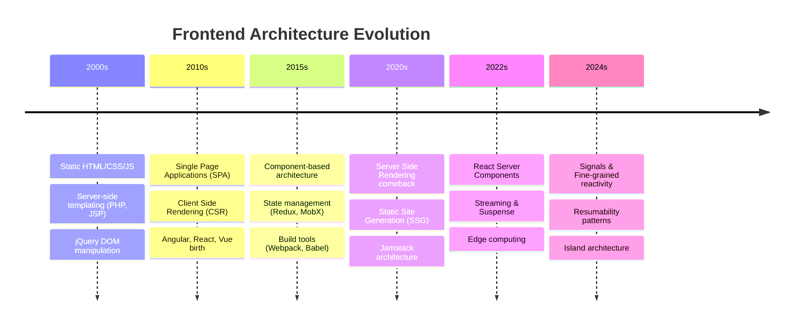

---

## 📚 **Core Concepts Deep Dive**

### **1. Client Side Rendering (CSR)**

#### **Definition:**
Browser tải về JavaScript bundle và render UI hoàn toàn trên client side.

#### **How it works:**
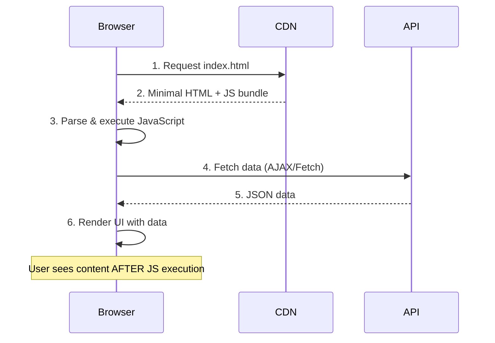

#### **Technical Implementation:**
```typescript
// Traditional CSR with React
import React, { useState, useEffect } from 'react';

function ProductList() {
    const [products, setProducts] = useState([]);
    const [loading, setLoading] = useState(true);
    
    useEffect(() => {
        // Client-side data fetching
        fetch('/api/products')
            .then(res => res.json())
            .then(data => {
                setProducts(data);
                setLoading(false);
            });
    }, []);
    
    if (loading) return <div>Loading...</div>;
    
    return (
        <div>
            {products.map(product => (
                <ProductCard key={product.id} product={product} />
            ))}
        </div>
    );
}

// Bundle size: ~200KB+ of JavaScript
// Time to content: 2-5 seconds (depends on JS size)
```

#### **Pros & Cons:**

| ✅ **Advantages** | ❌ **Disadvantages** |
|------------------|---------------------|
| Rich interactivity | Slow initial load |
| Smooth transitions | Poor SEO |
| Offline capability | Large bundle size |
| Reduced server load | Blank screen flash |

#### **Use Cases:**
- **Dashboards**: Admin panels, analytics
- **Apps**: Social media, productivity tools
- **Games**: Interactive web games
- **SPAs**: Complex single-page applications

---

### **2. Server Side Rendering (SSR)**

#### **Definition:**
Server render HTML với data và gửi fully-formed page về browser.

#### **Modern SSR Flow:**
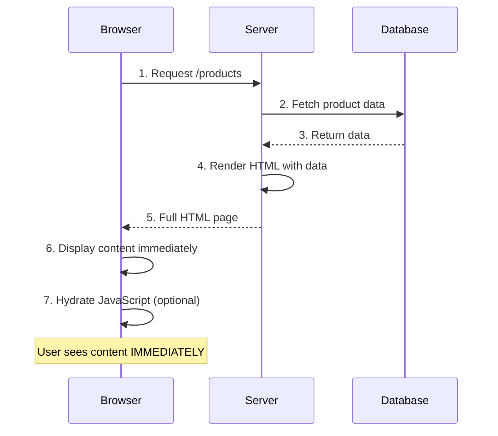

#### **Technical Implementation:**

```typescript
// Next.js SSR example
import { GetServerSideProps } from 'next';

interface ProductsPageProps {
    products: Product[];
    timestamp: string;
}

export default function ProductsPage({ products, timestamp }: ProductsPageProps) {
    return (
        <div>
            <h1>Products (Rendered at: {timestamp})</h1>
            {products.map(product => (
                <ProductCard key={product.id} product={product} />
            ))}
        </div>
    );
}

// This runs on every request (server-side)
export const getServerSideProps: GetServerSideProps = async (context) => {
    // Server-side data fetching
    const products = await fetch(`${process.env.API_URL}/products`).then(res => res.json());
    
    return {
        props: {
            products,
            timestamp: new Date().toISOString(),
        },
    };
};

// Server response: Complete HTML with data
// Time to content: 200-800ms
```

#### **SSR Variants:**

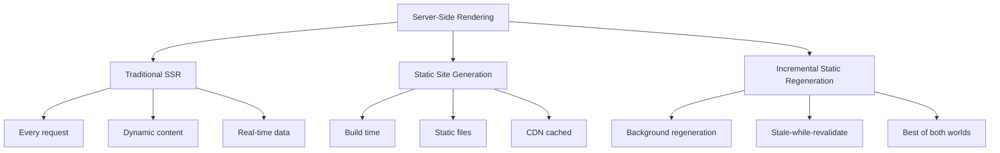

#### **Pros & Cons:**

| ✅ **Advantages** | ❌ **Disadvantages** |
|------------------|---------------------|
| Fast initial load | Server load |
| Excellent SEO | Less interactive |
| Social media sharing | Slower navigation |
| Accessibility | Complex caching |

---

### **3. Reactivity**

#### **Definition:**
Tự động update UI khi data thay đổi, không cần manual DOM manipulation.

#### **Reactivity Models:**

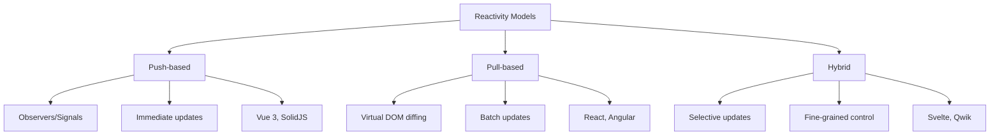

#### **Technical Comparison:**

```typescript
// 1. PUSH-BASED REACTIVITY (Vue 3 Composition API)
import { ref, computed, watchEffect } from 'vue';

const count = ref(0);
const doubleCount = computed(() => count.value * 2);

// Automatically re-runs when count changes
watchEffect(() => {
    console.log(`Count is: ${count.value}`);
});

count.value++; // Triggers immediate update

// 2. PULL-BASED REACTIVITY (React)
import { useState, useEffect, useMemo } from 'react';

function Counter() {
    const [count, setCount] = useState(0);
    const doubleCount = useMemo(() => count * 2, [count]);
    
    useEffect(() => {
        console.log(`Count is: ${count}`);
    }, [count]);
    
    return (
        <div>
            <p>Count: {count}</p>
            <p>Double: {doubleCount}</p>
            <button onClick={() => setCount(c => c + 1)}>
                Increment
            </button>
        </div>
    );
}

// 3. FINE-GRAINED REACTIVITY (SolidJS)
import { createSignal, createEffect } from 'solid-js';

function Counter() {
    const [count, setCount] = createSignal(0);
    const doubleCount = () => count() * 2;
    
    createEffect(() => {
        console.log(`Count is: ${count()}`);
    });
    
    return (
        <div>
            <p>Count: {count()}</p>
            <p>Double: {doubleCount()}</p>
            <button onClick={() => setCount(c => c + 1)}>
                Increment
            </button>
        </div>
    );
}
```

#### **Performance Comparison:**

| Framework | Update Strategy | Granularity | Performance |
|-----------|----------------|-------------|-------------|
| **React** | Virtual DOM diff | Component-level | Good |
| **Vue 3** | Proxy observers | Property-level | Better |
| **SolidJS** | Direct updates | Signal-level | Best |
| **Svelte** | Compile-time | Variable-level | Excellent |

---

### **4. Signals**

#### **Definition:**
Fine-grained reactive primitives cho efficient state management và UI updates.

#### **Signal Architecture:**
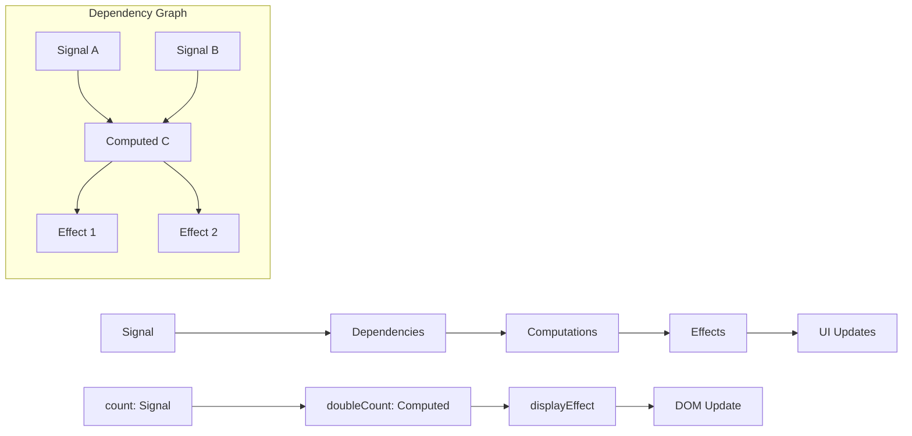

#### **Implementation Examples:**

```typescript
// SolidJS Signals
import { createSignal, createMemo, createEffect } from 'solid-js';

function UserProfile() {
    const [user, setUser] = createSignal({ name: 'John', age: 25 });
    const [theme, setTheme] = createSignal('light');
    
    // Computed signal - only updates when dependencies change
    const displayName = createMemo(() => {
        const userData = user();
        return `${userData.name} (${userData.age})`;
    });
    
    // Effect - runs when signals change
    createEffect(() => {
        console.log(`Theme changed to: ${theme()}`);
        document.body.className = theme();
    });
    
    return (
        <div class={theme()}>
            <h1>{displayName()}</h1>
            <button onClick={() => setUser(u => ({ ...u, age: u.age + 1 }))}>
                Age Up
            </button>
            <button onClick={() => setTheme(t => t === 'light' ? 'dark' : 'light')}>
                Toggle Theme
            </button>
        </div>
    );
}

// Preact Signals
import { signal, computed, effect } from '@preact/signals';

// Global signals
const count = signal(0);
const multiplier = signal(2);

// Computed signal
const result = computed(() => count.value * multiplier.value);

// Effect
effect(() => {
    console.log(`Result: ${result.value}`);
});

// React component using signals
function SignalCounter() {
    return (
        <div>
            <p>Count: {count}</p>
            <p>Result: {result}</p>
            <button onClick={() => count.value++}>
                Increment
            </button>
        </div>
    );
}
```

#### **Signal Benefits:**

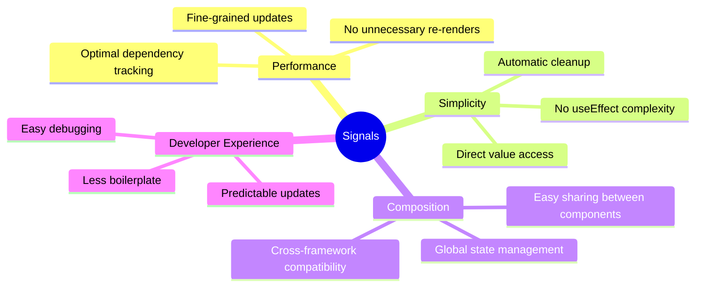

---

### **5. Hydration**

#### **Definition:**
Process "sống hóa" static HTML thành interactive web app bằng cách attach JavaScript event listeners.

#### **Hydration Process:**
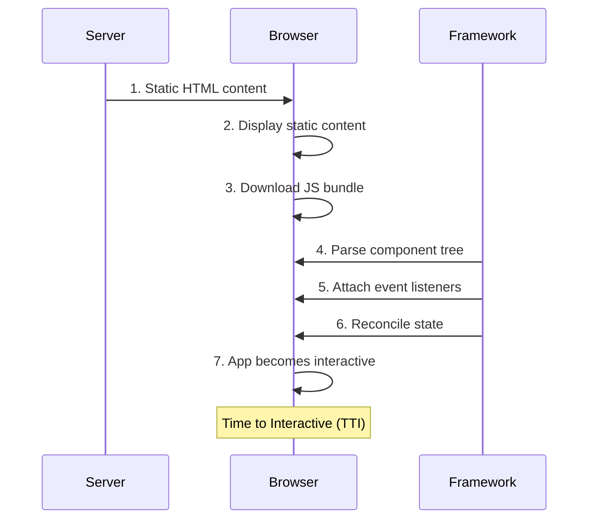

#### **Hydration Challenges:**

```typescript
// Server-rendered HTML
<div id="app">
  <button>Count: 0</button>
  <p>Server time: 2024-01-15 10:30:00</p>
</div>

// Client hydration
function Counter() {
    const [count, setCount] = useState(0);
    const [time] = useState(() => new Date().toISOString());
    
    return (
        <div>
            <button onClick={() => setCount(c => c + 1)}>
                Count: {count}
            </button>
            <p>Server time: {time}</p>
        </div>
    );
}

// ❌ HYDRATION MISMATCH!
// Server: "Server time: 2024-01-15 10:30:00"
// Client: "Server time: 2024-01-15 10:30:05"
```

#### **Hydration Strategies:**

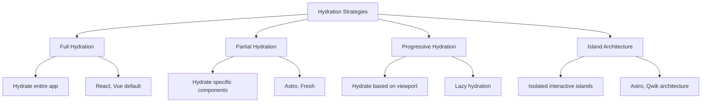

#### **Advanced Hydration:**

```typescript
// Progressive Hydration with Intersection Observer
import { lazy, Suspense } from 'react';
import { useInView } from 'react-intersection-observer';

const HeavyComponent = lazy(() => import('./HeavyComponent'));

function ProgressiveHydration() {
    const { ref, inView } = useInView({
        threshold: 0,
        triggerOnce: true,
    });
    
    return (
        <div ref={ref}>
            {inView ? (
                <Suspense fallback={<div>Loading...</div>}>
                    <HeavyComponent />
                </Suspense>
            ) : (
                <div>Placeholder content</div>
            )}
        </div>
    );
}

// Selective Hydration with data attributes
<div data-hydrate="true" data-component="Counter">
    <button>Count: 0</button>
</div>

// Client-side selective hydration
document.querySelectorAll('[data-hydrate="true"]').forEach(element => {
    const componentName = element.dataset.component;
    if (componentName) {
        hydrate(components[componentName], element);
    }
});
```

---

### **6. Resumability**

#### **Definition:**
Khả năng "tiếp tục" execution state từ server sang client mà không cần hydration.

#### **Resumability vs Hydration:**

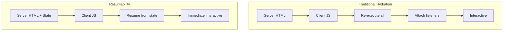

#### **Qwik Resumability Example:**

```typescript
// Qwik component with resumability
import { component$, useStore } from '@builder.io/qwik';

export const Counter = component$(() => {
    const state = useStore({ count: 0 });
    
    return (
        <div>
            <p>Count: {state.count}</p>
            <button 
                onClick$={() => state.count++}
                // This event listener is serialized with the HTML
            >
                Increment
            </button>
        </div>
    );
});

// Server-rendered HTML includes serialized state and listeners
<div q:container="...">
    <p>Count: 0</p>
    <button on:click="qrl_1" q:id="abc123">
        Increment
    </button>
    <script type="qwik/json">
        {
            "state": { "count": 0 },
            "listeners": { "qrl_1": "..." },
            "refs": { "abc123": "..." }
        }
    </script>
</div>
```

#### **Resumability Benefits:**

| Traditional Hydration | Resumability |
|-----------------------|--------------|
| Re-execute all components | Resume from serialized state |
| 200ms+ Time to Interactive | ~0ms Time to Interactive |
| Large JS bundle upfront | Lazy load on interaction |
| Waterfall loading | Parallel loading |

---

### **7. Suspense**

#### **Definition:**
Declarative cách handle loading states cho async operations.

#### **Suspense Architecture:**
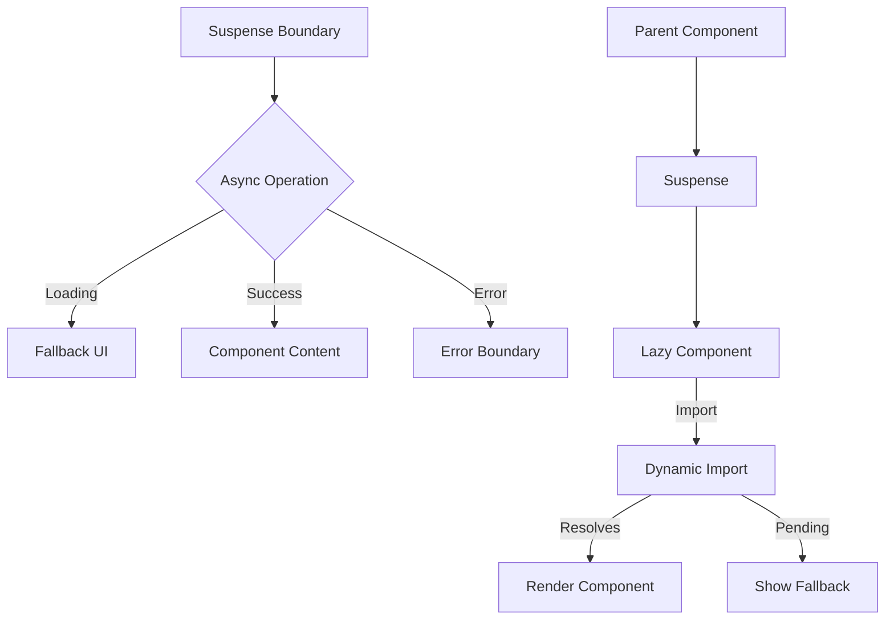

#### **React Suspense Implementation:**

```typescript
// Code splitting with Suspense
import { Suspense, lazy } from 'react';

const LazyChart = lazy(() => import('./Chart'));
const LazyTable = lazy(() => import('./Table'));

function Dashboard() {
    return (
        <div>
            <h1>Dashboard</h1>
            
            {/* Code splitting */}
            <Suspense fallback={<ChartSkeleton />}>
                <LazyChart />
            </Suspense>
            
            {/* Data fetching */}
            <Suspense fallback={<TableSkeleton />}>
                <DataTable />
            </Suspense>
        </div>
    );
}

// Data fetching with Suspense
function DataTable() {
    // This will suspend the component until data is loaded
    const data = useSuspenseQuery({
        queryKey: ['table-data'],
        queryFn: fetchTableData,
    });
    
    return (
        <table>
            {data.map(row => (
                <tr key={row.id}>
                    <td>{row.name}</td>
                </tr>
            ))}
        </table>
    );
}

// Nested Suspense boundaries
function App() {
    return (
        <ErrorBoundary>
            <Suspense fallback={<AppSkeleton />}>
                <Header />
                <Suspense fallback={<ContentSkeleton />}>
                    <MainContent />
                    <Suspense fallback={<SidebarSkeleton />}>
                        <Sidebar />
                    </Suspense>
                </Suspense>
            </Suspense>
        </ErrorBoundary>
    );
}
```

#### **Advanced Suspense Patterns:**

```typescript
// Concurrent rendering with Suspense
import { startTransition, useDeferredValue } from 'react';

function SearchResults({ query }) {
    const deferredQuery = useDeferredValue(query);
    
    return (
        <Suspense fallback={<SearchSkeleton />}>
            <Results query={deferredQuery} />
        </Suspense>
    );
}

function SearchApp() {
    const [query, setQuery] = useState('');
    
    const handleSearch = (newQuery) => {
        // Mark as non-urgent update
        startTransition(() => {
            setQuery(newQuery);
        });
    };
    
    return (
        <div>
            <input 
                onChange={(e) => handleSearch(e.target.value)}
                placeholder="Search..."
            />
            <SearchResults query={query} />
        </div>
    );
}
```

---

### **8. React Server Components (RSC)**

#### **Definition:**
Components chạy trên server, return serialized output, không bao giờ ship về client.

#### **RSC Architecture:**
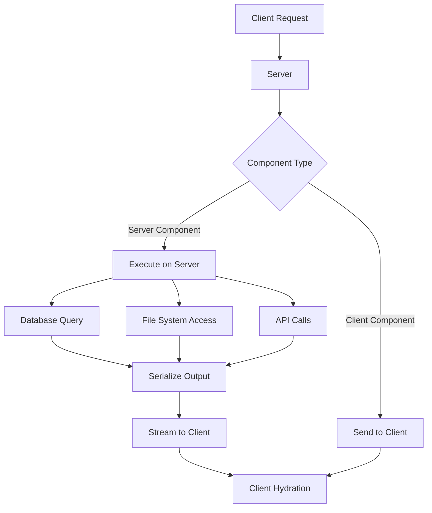

#### **RSC Implementation:**

```typescript
// Server Component (runs on server)
// app/products/page.tsx
import { ProductCard } from './ProductCard';

async function ProductsPage() {
    // This runs on the server
    const products = await fetch('http://localhost:3001/api/products')
        .then(res => res.json());
    
    return (
        <div>
            <h1>Products</h1>
            {products.map(product => (
                <ProductCard key={product.id} product={product} />
            ))}
        </div>
    );
}

export default ProductsPage;

// Client Component (ships to browser)
// components/ProductCard.tsx
'use client';

import { useState } from 'react';

interface Product {
    id: string;
    name: string;
    price: number;
}

export function ProductCard({ product }: { product: Product }) {
    const [liked, setLiked] = useState(false);
    
    return (
        <div className="product-card">
            <h3>{product.name}</h3>
            <p>${product.price}</p>
            <button 
                onClick={() => setLiked(!liked)}
                className={liked ? 'liked' : ''}
            >
                {liked ? '❤️' : '🤍'} Like
            </button>
        </div>
    );
}
```

#### **RSC Benefits & Trade-offs:**

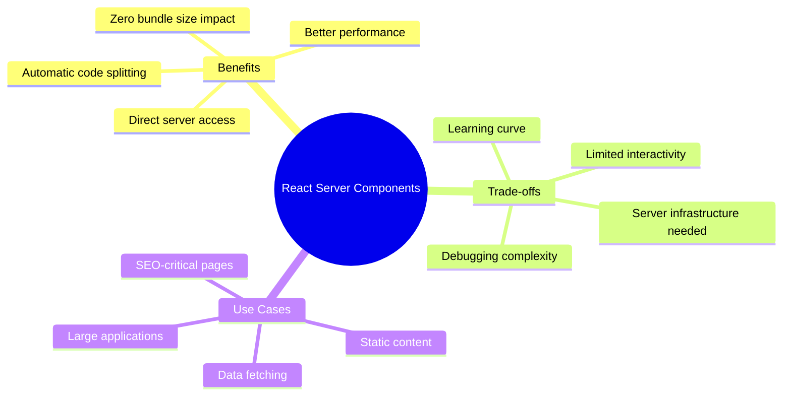

#### **RSC vs Traditional:**

| Aspect | Traditional React | React Server Components |
|--------|------------------|-------------------------|
| **Execution** | Client browser | Server environment |
| **Bundle Size** | Included in bundle | Zero bundle impact |
| **Data Fetching** | useEffect/SWR | Direct async/await |
| **Interactivity** | Full interactivity | Static (compose with Client Components) |
| **SEO** | Needs SSR | Built-in SEO |

---

## 🔗 **Interconnections & Relationships**

### **Pattern Combinations:**

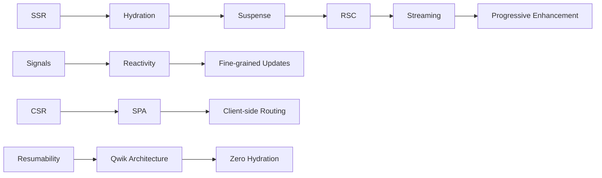

### **Framework Mapping:**

| Framework | Primary Patterns | Strengths |
|-----------|-----------------|-----------|
| **React** | CSR, SSR, Suspense, RSC | Ecosystem, Flexibility |
| **Next.js** | SSR, SSG, ISR, RSC | Full-stack, Performance |
| **Vue 3** | CSR, SSR, Reactivity | Developer Experience |
| **Nuxt** | SSR, SSG, Universal | Vue ecosystem |
| **SolidJS** | Signals, Fine-grained | Performance, Simplicity |
| **Qwik** | Resumability, SSR | Zero hydration |
| **Svelte** | Compile-time, CSR | Bundle size |
| **SvelteKit** | SSR, SSG, Hydration | Full-stack Svelte |

---

## 📖 **Additional Important Concepts**

### **9. Static Site Generation (SSG)**

#### **Definition:**
Pre-render pages at build time cho maximum performance và optimized delivery.

#### **How SSG Works:**

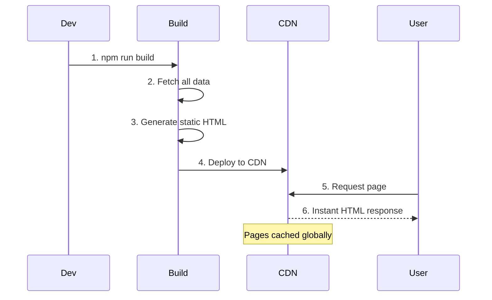

#### **Implementation Example:**

```typescript
// Next.js SSG with getStaticProps
export async function getStaticProps() {
    // This runs at BUILD TIME
    const posts = await fetchBlogPosts();
    
    return {
        props: {
            posts,
        },
        // Regenerate page every 24 hours
        revalidate: 86400,
    };
}

// Gatsby SSG with GraphQL
export const query = graphql`
    query {
        allMarkdownRemark {
            edges {
                node {
                    frontmatter {
                        title
                        date
                    }
                    html
                }
            }
        }
    }
`;

// Astro SSG (default behavior)
---
// This runs at BUILD TIME
const posts = await Astro.glob('./posts/*.md');
const sortedPosts = posts.sort((a, b) => 
    new Date(b.frontmatter.date) - new Date(a.frontmatter.date)
);
---

<Layout>
    {sortedPosts.map(post => (
        <PostCard post={post} />
    ))}
</Layout>
```

#### **SSG Benefits:**

| ✅ **Advantages** | ❌ **Limitations** |
|------------------|-------------------|
| Lightning fast load times | Build time increases |
| Excellent SEO | Stale content |
| CDN cacheable | Dynamic content challenges |
| High security | Large sites complexity |

---

### **10. Incremental Static Regeneration (ISR)**

#### **Definition:**
Update static pages sau khi deploy mà không rebuild toàn bộ site, combining SSG benefits với fresh content.

#### **ISR Flow:**

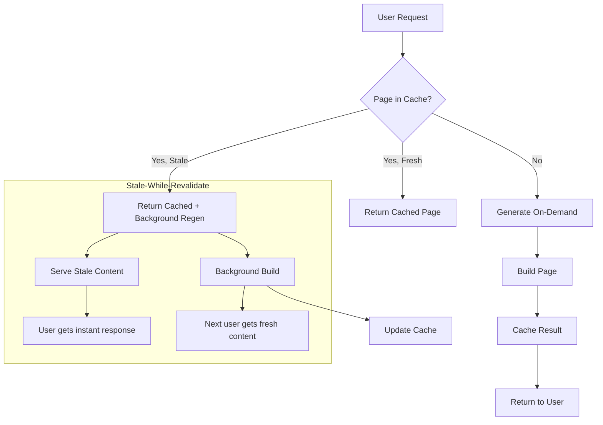

#### **Implementation:**

```typescript
// Next.js ISR
export async function getStaticProps() {
    const product = await fetchProduct(params.id);
    
    return {
        props: { product },
        // Revalidate every 60 seconds
        revalidate: 60,
    };
}

// Manual revalidation
export async function handler(req, res) {
    if (req.method === 'POST') {
        // Trigger revalidation for specific path
        await res.revalidate('/products/123');
        return res.json({ revalidated: true });
    }
}

// Nuxt 3 ISR
export default defineNuxtConfig({
    nitro: {
        storage: {
            'redis': {
                driver: 'redis',
                // ISR cache configuration
            }
        }
    },
    routeRules: {
        '/blog/**': { 
            isr: 60 // Revalidate every 60 seconds
        },
        '/products/**': { 
            isr: true // On-demand revalidation
        }
    }
});
```

---

### **11. Edge Computing**

#### **Definition:**
Run code gần user hơn để reduce latency bằng cách deploy lên global edge locations.

#### **Edge Computing Architecture:**

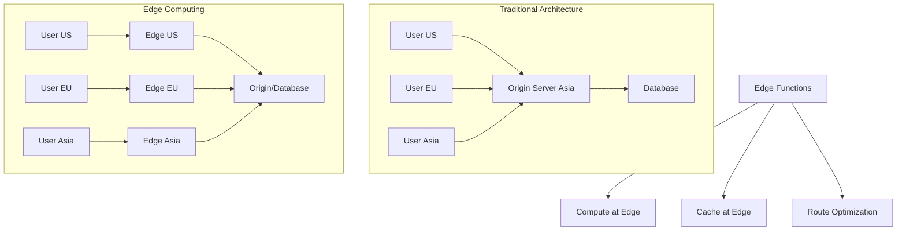

#### **Edge Implementation:**

```typescript
// Vercel Edge Functions
export const config = {
    runtime: 'edge',
};

export default async function handler(request: Request) {
    const url = new URL(request.url);
    const country = request.headers.get('x-vercel-ip-country');
    
    // Run at edge location near user
    const content = await fetch(`https://api.example.com/content/${country}`)
        .then(res => res.json());
    
    return new Response(JSON.stringify(content), {
        headers: {
            'content-type': 'application/json',
            'cache-control': 's-maxage=3600',
        },
    });
}

// Cloudflare Workers
export default {
    async fetch(request: Request): Promise<Response> {
        const country = request.cf?.country;
        const cacheKey = `content-${country}`;
        
        // Check edge cache first
        let content = await EDGE_CACHE.get(cacheKey);
        
        if (!content) {
            // Fetch from origin if not in cache
            content = await fetch('https://api.example.com/content')
                .then(res => res.text());
            
            // Cache at edge for 1 hour
            await EDGE_CACHE.put(cacheKey, content, { expirationTtl: 3600 });
        }
        
        return new Response(content);
    },
};

// Deno Deploy Edge
Deno.serve(async (request: Request) => {
    const userAgent = request.headers.get('user-agent');
    const isMobile = /Mobile|Android/i.test(userAgent);
    
    // Serve different content based on device
    const content = isMobile ? 
        await getMobileContent() : 
        await getDesktopContent();
    
    return new Response(content, {
        headers: {
            'content-type': 'text/html',
            'cache-control': 'public, s-maxage=300',
        },
    });
});
```

---

### **12. Island Architecture**

#### **Definition:**
Combine static HTML với interactive "islands" of functionality, optimizing performance bằng selective hydration.

#### **Island Architecture Concept:**

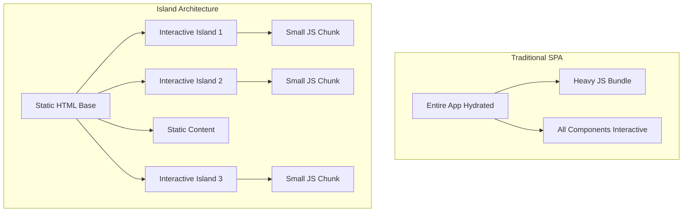

#### **Implementation Examples:**

```astro
---
// Astro - Islands by default
// This runs on the server
const posts = await fetch('/api/posts').then(r => r.json());
---

<Layout>
    <!-- Static HTML -->
    <header>
        <h1>My Blog</h1>
        <nav>
            <a href="/">Home</a>
            <a href="/about">About</a>
        </nav>
    </header>
    
    <!-- Interactive island -->
    <SearchBox client:load />
    
    <!-- Static content -->
    <main>
        {posts.map(post => (
            <article>
                <h2>{post.title}</h2>
                <p>{post.excerpt}</p>
                <!-- Interactive island for likes -->
                <LikeButton client:visible postId={post.id} />
            </article>
        ))}
    </main>
    
    <!-- Interactive island -->
    <Newsletter client:idle />
</Layout>
```

```typescript
// Fresh (Deno) Islands
// routes/index.tsx - Server component
export default function Home({ posts }: { posts: Post[] }) {
    return (
        <div>
            <h1>Blog Posts</h1>
            {posts.map(post => (
                <article key={post.id}>
                    <h2>{post.title}</h2>
                    <p>{post.content}</p>
                    {/* Interactive island */}
                    <Counter />
                </article>
            ))}
        </div>
    );
}

// islands/Counter.tsx - Client component
import { useState } from 'preact/hooks';

export default function Counter() {
    const [count, setCount] = useState(0);
    
    return (
        <div>
            <p>Count: {count}</p>
            <button onClick={() => setCount(c => c + 1)}>
                +
            </button>
        </div>
    );
}
```

#### **Island Loading Strategies:**

| Strategy | When to Load | Use Case |
|----------|--------------|----------|
| `client:load` | Immediately | Critical interactions |
| `client:idle` | When browser idle | Non-critical features |
| `client:visible` | When in viewport | Below-fold content |
| `client:media` | Based on media query | Responsive components |

---

### **13. Streaming**

#### **Definition:**
Send HTML chunks to browser as they're ready, improving perceived performance.

#### **Streaming Architecture:**

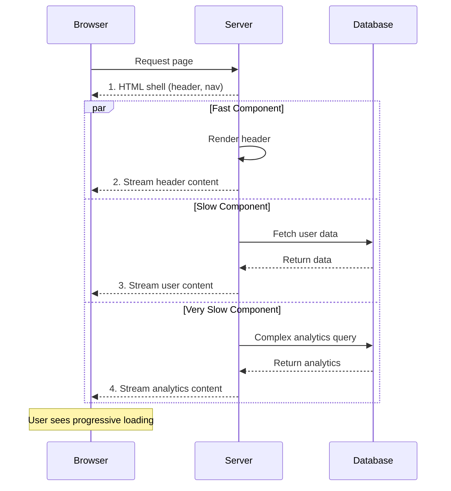

#### **Streaming Implementation:**

```typescript
// React 18 Streaming with Suspense
import { Suspense } from 'react';

function App() {
    return (
        <html>
            <body>
                {/* Immediate content */}
                <header>
                    <h1>My App</h1>
                    <nav>Navigation</nav>
                </header>
                
                {/* Streamed content */}
                <Suspense fallback={<UserSkeleton />}>
                    <UserProfile />
                </Suspense>
                
                <Suspense fallback={<PostsSkeleton />}>
                    <PostsList />
                </Suspense>
                
                <Suspense fallback={<AnalyticsSkeleton />}>
                    <AnalyticsDashboard />
                </Suspense>
            </body>
        </html>
    );
}

// Next.js App Router Streaming
export default function Page() {
    return (
        <div>
            <h1>Dashboard</h1>
            
            {/* This streams when ready */}
            <Suspense fallback={<p>Loading user...</p>}>
                <UserInfo />
            </Suspense>
            
            <Suspense fallback={<p>Loading posts...</p>}>
                <Posts />
            </Suspense>
        </div>
    );
}

// Manual streaming with ReadableStream
async function handler(request: Request) {
    const encoder = new TextEncoder();
    
    const stream = new ReadableStream({
        start(controller) {
            // Send initial HTML
            controller.enqueue(encoder.encode(`
                <!DOCTYPE html>
                <html>
                    <body>
                        <h1>Streaming Response</h1>
                        <div id="content">
            `));
            
            // Send content chunks
            setTimeout(() => {
                controller.enqueue(encoder.encode(`
                    <p>First chunk loaded!</p>
                `));
            }, 100);
            
            setTimeout(() => {
                controller.enqueue(encoder.encode(`
                    <p>Second chunk loaded!</p>
                        </div>
                    </body>
                </html>
                `));
                controller.close();
            }, 500);
        },
    });
    
    return new Response(stream, {
        headers: {
            'Content-Type': 'text/html; charset=utf-8',
            'Transfer-Encoding': 'chunked',
        },
    });
}
```

---

### **14. Partial Hydration**

#### **Definition:**
Chỉ hydrate những component cần thiết, reducing JavaScript bundle size và improving performance.

#### **Partial Hydration Strategies:**

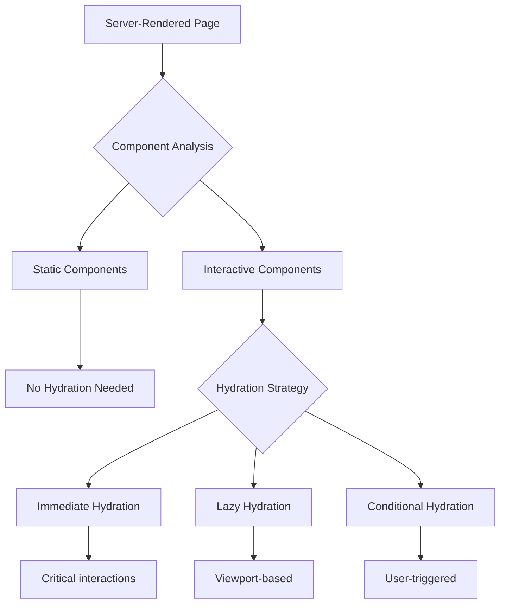

#### **Implementation:**

```typescript
// React with selective hydration
import { hydrateRoot } from 'react-dom/client';

// Only hydrate specific components
const interactiveElements = document.querySelectorAll('[data-hydrate]');

interactiveElements.forEach((element) => {
    const componentName = element.dataset.component;
    const Component = componentMap[componentName];
    
    if (Component) {
        hydrateRoot(element, <Component />);
    }
});

// Astro partial hydration directives
---
const posts = await fetchPosts();
---

<Layout>
    <!-- Static content - no hydration -->
    <article>
        <h1>Static Content</h1>
        <p>This doesn't need JavaScript</p>
    </article>
    
    <!-- Hydrated only when visible -->
    <InteractiveChart client:visible data={chartData} />
    
    <!-- Hydrated when user interacts -->
    <Modal client:idle>
        <ContactForm client:load />
    </Modal>
    
    <!-- Conditional hydration -->
    <MobileMenu client:media="(max-width: 768px)" />
</Layout>

// Qwik's automatic partial hydration
import { component$, useSignal } from '@builder.io/qwik';

export const Counter = component$(() => {
    const count = useSignal(0);
    
    return (
        <div>
            {/* Static until interaction */}
            <p>Count: {count.value}</p>
            
            {/* Only this button gets hydrated when clicked */}
            <button onClick$={() => count.value++}>
                Increment
            </button>
        </div>
    );
});
```

#### **Hydration Performance Comparison:**

| Strategy | Bundle Size | Time to Interactive | Use Case |
|----------|-------------|-------------------|----------|
| **Full Hydration** | Large | Slow | Traditional SPAs |
| **Partial Hydration** | Medium | Medium | Modern frameworks |
| **Progressive Hydration** | Small chunks | Fast | Performance-critical |
| **Zero Hydration** | Minimal | Instant | Qwik, Fresh |

---

### **15. Bundle Splitting**

#### **Definition:**
Chia JavaScript bundle thành nhiều chunks nhỏ để optimize loading performance và enable better caching.

#### **Bundle Splitting Strategies:**

```mermaid
graph TB
    A[Monolithic Bundle] --> B[Bundle Splitting]
    
    B --> C[Vendor Splitting]
    B --> D[Route-based Splitting]
    B --> E[Component-based Splitting]
    B --> F[Dynamic Imports]
    
    C --> C1[React: vendor.js]
    C --> C2[Lodash: utils.js]
    C --> C3[App: main.js]
    
    D --> D1[Home: home.js]
    D --> D2[About: about.js]
    D --> D3[Contact: contact.js]
    
    E --> E1[Chart: chart.js]
    E --> E2[Modal: modal.js]
    E --> E3[Form: form.js]
    
    F --> F1[Load on demand]
    F --> F2[Lazy loading]
    F --> F3[Code splitting]
```

#### **Implementation Examples:**

```typescript
// 1. DYNAMIC IMPORTS
// React lazy loading
import { lazy, Suspense } from 'react';

const Chart = lazy(() => import('./Chart'));
const Modal = lazy(() => import('./Modal'));

function Dashboard() {
    return (
        <div>
            <Suspense fallback={<div>Loading chart...</div>}>
                <Chart />
            </Suspense>
            
            <Suspense fallback={<div>Loading modal...</div>}>
                <Modal />
            </Suspense>
        </div>
    );
}

// 2. WEBPACK BUNDLE SPLITTING
// webpack.config.js
module.exports = {
    optimization: {
        splitChunks: {
            chunks: 'all',
            cacheGroups: {
                // Vendor libraries
                vendor: {
                    test: /[\\/]node_modules[\\/]/,
                    name: 'vendors',
                    chunks: 'all',
                },
                // Common components
                common: {
                    name: 'common',
                    minChunks: 2,
                    chunks: 'all',
                    enforce: true,
                },
            },
        },
    },
};

// 3. VITE BUNDLE SPLITTING
// vite.config.js
export default {
    build: {
        rollupOptions: {
            output: {
                manualChunks: {
                    // Group vendor libraries
                    vendor: ['react', 'react-dom'],
                    ui: ['@mui/material', '@mui/icons-material'],
                    utils: ['lodash', 'date-fns'],
                },
            },
        },
    },
};

// 4. NEXT.JS AUTOMATIC SPLITTING
// pages/dashboard.tsx
import dynamic from 'next/dynamic';

// Automatically code-split
const DynamicChart = dynamic(() => import('../components/Chart'), {
    loading: () => <p>Loading chart...</p>,
});

const DynamicTable = dynamic(() => import('../components/Table'), {
    ssr: false, // Client-side only
});

export default function Dashboard() {
    return (
        <div>
            <h1>Dashboard</h1>
            <DynamicChart />
            <DynamicTable />
        </div>
    );
}

// 5. ADVANCED SPLITTING WITH CONDITIONS
const AdminPanel = lazy(() => 
    import('./AdminPanel').then(module => ({
        default: module.AdminPanel
    }))
);

// Conditional loading
function App({ user }) {
    return (
        <div>
            {user.isAdmin && (
                <Suspense fallback={<AdminSkeleton />}>
                    <AdminPanel />
                </Suspense>
            )}
        </div>
    );
}
```

#### **Bundle Analysis Tools:**

```typescript
// Bundle analyzer setup
// webpack-bundle-analyzer
npm install --save-dev webpack-bundle-analyzer

// package.json
{
    "scripts": {
        "analyze": "npm run build && npx webpack-bundle-analyzer build/static/js/*.js"
    }
}

// Vite bundle analyzer
import { defineConfig } from 'vite';
import { visualizer } from 'rollup-plugin-visualizer';

export default defineConfig({
    plugins: [
        visualizer({
            filename: 'dist/stats.html',
            open: true,
        }),
    ],
});

// Next.js bundle analyzer
const withBundleAnalyzer = require('@next/bundle-analyzer')({
    enabled: process.env.ANALYZE === 'true',
});

module.exports = withBundleAnalyzer({
    // Next.js config
});
```

#### **Bundle Optimization Best Practices:**

| Technique | Impact | Implementation |
|-----------|--------|----------------|
| **Tree Shaking** | Remove unused code | ES6 modules + proper bundler |
| **Code Splitting** | Smaller initial bundles | Dynamic imports + lazy loading |
| **Vendor Splitting** | Better caching | Separate vendor from app code |
| **Compression** | Smaller file sizes | Gzip/Brotli at server level |
| **Preloading** | Faster navigation | `<link rel="preload">` for critical resources |

---

## 🎯 **Modern Frontend Decision Tree**

```mermaid
flowchart TD
    A[New Project] --> B{Performance Critical?}
    
    B -->|Yes| C{SEO Important?}
    B -->|No| D[SPA with CSR]
    
    C -->|Yes| E{Real-time Data?}
    C -->|No| F[SSG with Astro/Next]
    
    E -->|Yes| G[SSR with streaming]
    E -->|No| H[ISR with Next.js]
    
    G --> I{Bundle Size Critical?}
    I -->|Yes| J[Qwik/SolidJS]
    I -->|No| K[React/Vue with RSC]
    
    D --> L{Complex State?}
    L -->|Yes| M[Signals/Zustand]
    L -->|No| N[Built-in state]
```

---

## 📚 **Learning Resources**

### **Official Documentation:**
- [React Docs](https://react.dev) - React 18 with Suspense & RSC
- [Next.js Docs](https://nextjs.org/docs) - Full-stack React framework
- [Vue 3 Docs](https://vuejs.org) - Progressive framework
- [SolidJS Docs](https://solidjs.com) - Fine-grained reactivity
- [Qwik Docs](https://qwik.builder.io) - Resumable framework

### **Key Articles:**
- [Islands Architecture](https://jasonformat.com/islands-architecture/)
- [React Server Components](https://github.com/reactjs/rfcs/blob/main/text/0188-server-components.md)
- [Signals vs State](https://dev.to/this-is-learning/signals-vs-state-4g4l)

### **Performance Tools:**
- [Lighthouse](https://web.dev/lighthouse/) - Performance auditing
- [WebPageTest](https://webpagetest.org) - Real-world testing
- [Bundle Analyzer](https://www.npmjs.com/package/webpack-bundle-analyzer) - Bundle optimization

---

Đây là foundation knowledge cho modern frontend development! Mỗi concept đều có trade-offs riêng và phù hợp với different use cases. 🚀
