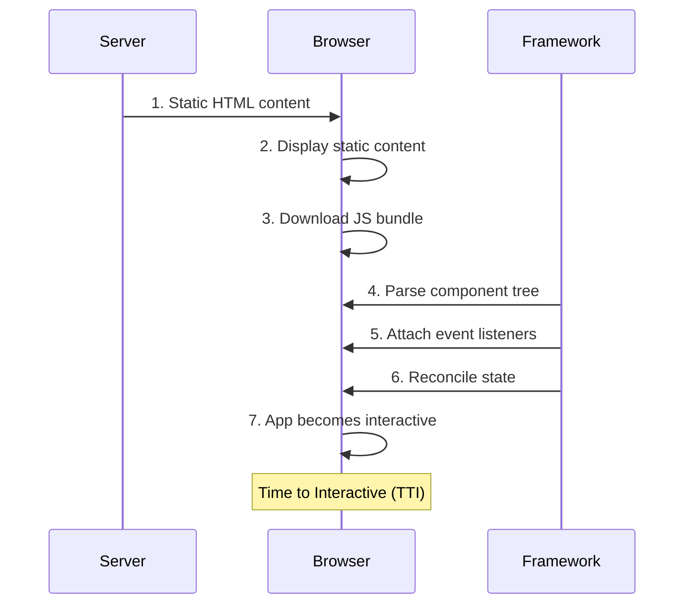
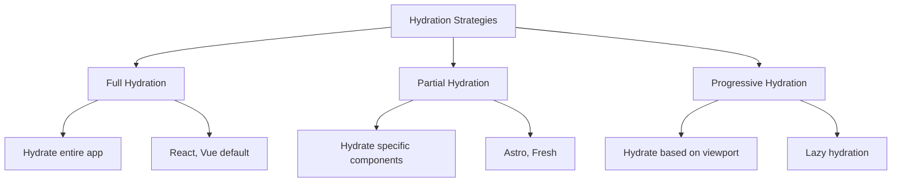

# Hydration

## Definition

it’s the process which JavaScript executes, reconciles, and makes interactive the HTML that is already in the DOM via server-side rendering (SSR).

## Process



## Strategies



```ts
// Progressive Hydration with Intersection Observer
import { lazy, Suspense } from 'react';
import { useInView } from 'react-intersection-observer';

const HeavyComponent = lazy(() => import('./HeavyComponent'));

function ProgressiveHydration() {
    const { ref, inView } = useInView({
        threshold: 0,
        triggerOnce: true,
    });
    
    return (
        <div ref={ref}>
            {inView ? (
                <Suspense fallback={<div>Loading...</div>}>
                    <HeavyComponent />
                </Suspense>
            ) : (
                <div>Placeholder content</div>
            )}
        </div>
    );
}
```
